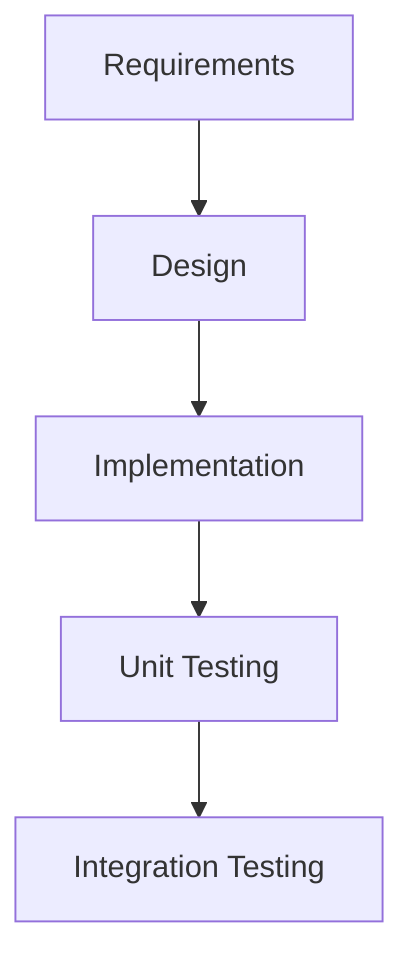
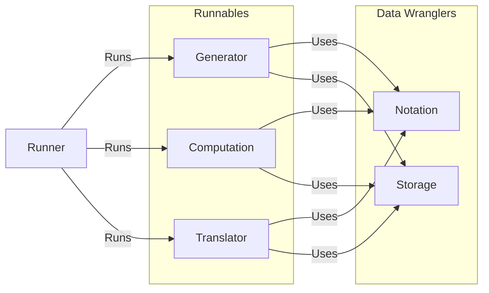

<link
  href="https://cdnjs.cloudflare.com/ajax/libs/font-awesome/6.5.1/css/all.min.css"
  rel="stylesheet"
/>

[](https://www.gnu.org/licenses/gpl-3.0)

# Tanglenomicon Core Libraries

The Tanglenomicon core libraries consists of a collection of libraries for
computation and generation of knot/tangle data. Each library should be
considered its own project with its own life-cycle however libraries are loosely
coupled by a common cmake interface.

The libraries found here are primarily C/C++ and is expected to make a selection
between the two, C modules are expected to be C++ linkable. There's no target OS
but ubuntu linux with nix is the CI OS. Each library will adhere to a common
design which allows them flexibility and platform and language agnosticism. The
design allows a library, maybe "calculate jones polynomial", to be runnable in a
jupyter notebook during undergraduate knot theory class, or wrapped in matlab
interfaces for scientific computing, or on a university cluster for high
performance use cases.

We're targeting a "write once deploy anywhere" design.

# Planning

## Tasks

Tasks will be decomposed per library. Issues/bugs will be tracked per report,
combining where it makes sense.

## Version control

Version control will be git based with research git as the source of truth. Work
items will have a branch per work item. Merging a work item will be managed by
Gitlab merge requests.

## Software Lifecycle

We're taking a feature centric waterfall approach with design, implementation,
integration, and testing phases.

Feature centric we mean work on one feature at a time, some examples for feature
scope are rational tangle generation, JSON storage, or Conway notation.

Waterfall means we complete a full life cycle for each library.



This methodology will allow us to have high traceability meaning we can track
our features through the development cycle, allowing us to justify every
decision we made in the process.

## Project Structure

Project structure will follow a fairly "normal" project structure as follows:

```
📦tanglenomicon_core
 ┣ 📂.github
 ┃ ┗ 📂workflows
 ┃ ┃ ┗ 📜\<github workflows\>
 ┣ 📂data
 ┃ ┗ 📜\<Static data files\>
 ┣ 📂docs
 ┃ ┣ 📂design
 ┃ ┃ ┗ 📜\<Design Files\>
 ┃ ┗ 📜Doxyfile
 ┣ 📂libraries \< external libraries\>
 ┃ ┗ 📜\<C/C++ libraries data files\>
 ┣ 📂source
 ┃ ┗  📂\<Module\>
 ┃    ┗ 📜\<Module Source Files\>
 ┣ 📂tests
 ┃ ┣ 📂results
 ┃ ┃ ┗ 📜.gitkeep
 ┃ ┣ 📂integration_tests
 ┃ ┃ ┗ 📂 \<integration Test Suites\>
 ┃ ┃   ┗ 📜\<Module Unit Test Source\>
 ┃ ┗ 📂unit_tests
 ┃   ┣ 📂framework
 ┃   ┃ ┗ 📜\<Unit Test Framework Source\>
 ┃   ┗ 📂 \<Unit Test Suites\>
 ┃     ┗ 📂\<Module Unit Test\>
 ┃        ┗ 📜\<Module Unit Test Source\>
 ┣ 📜.clang-format
 ┣ 📜.clang-tidy
 ┣ 📜.gitignore
 ┣ 📜CMakeLists.txt
 ┣ 📜CMakeSettings.json
 ┣ 📜README.md
 ┗ 📜requirements.txt
```

## Define a Unit: A unit in this project shall be a library

## Quality

This repository is a collection of libraries for The Tanglenomicon project. This
requires a high level of quality, with the primary design goal of libraries
never failing in an undetectable way.

### Unit testing

Every unit is expected to have a unit test suite. Unit test suites are expected
to flex every public interface of their unit. Code coverage is optional but
encouraged.

### Integration testing

Integration tests are expected for every bundled "runner".

## Requirements

Since this repository contains a collection of libraries this section will
describe the high level design for types of libraries/common use cases.

### Functional Requirements



General use case descriptions of each of these blocks can be found here:

-   [Runners](/use_cases/runners/index.md)
-   [Generators](/use_cases/generators/index.md)
-   [Translators](/use_cases/translators/index.md)
-   [Computations](/use_cases/computations/index.md)
-   [Notations](/use_cases/notations/index.md)
-   [Storage](/use_cases/storage/index.md)

A functional description for individual libraries are phrased in the following
use cases:

```{toctree}
:titlesonly:
use_cases/index.md
```

### Non-functional Requirements

Not applicable.

## Technologies

### Languages/Frameworks

The runnable and data wrangler libraries will be written in C/C++ using clang
for compiling and cmake as a build system. The runners are written with various
tooling including C/C++, python, and javascript.

Unit testing of runnable and data wrangler libraries will use the
[Unity](http://www.throwtheswitch.org/unity) and
[Cmock](http://www.throwtheswitch.org/cmock) libraries for unity testing. Test
indexing is handled by
[ctest](https://cmake.org/cmake/help/latest/module/CTest.html).

Integration testing of runners is handled whatever standard test tooling is
appropriate.

```{note}
C/C++ modules are expected to link to
their design markdown files in their header @file block.
```

#### Style Guide

The C/C++ code in this repository is expected to be formatted by the bundled
clang.tidy configuration. Doxygen comments are expected to be formatted by
clang.tidy.

### Tools

-   git
-   vscode
-   clion
-   mermaid.js
-   Unity
-   clang
-   cmake
-   ctest
-   doxygen
-   Cmock
-   WASM
-   Emscripten
-   python3
-   MyStmd
-   sphinx
-   pytest

# Design and Documentation

C/C++ code is documented with [Doxygen](https://www.doxygen.nl/), the doxygen
comments are parsed and output as xml. General documentation is recorded as
markdown files in the "docs" directory. General documentation is aggregated
using the [sphinx](https://www.sphinx-doc.org/en/master/) framework. Sphinx then
uses [breathe](https://github.com/breathe-doc/breathe) to parse doxygen xml into
general documentation.

## Units

Unit descriptions are as follows:

```{toctree}
:titlesonly:
unit_description/index.md
```
