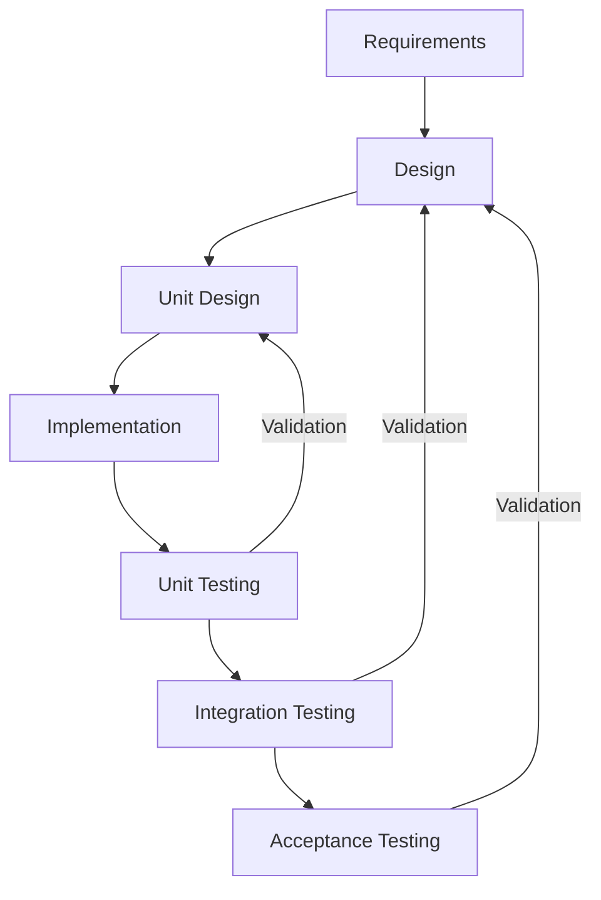
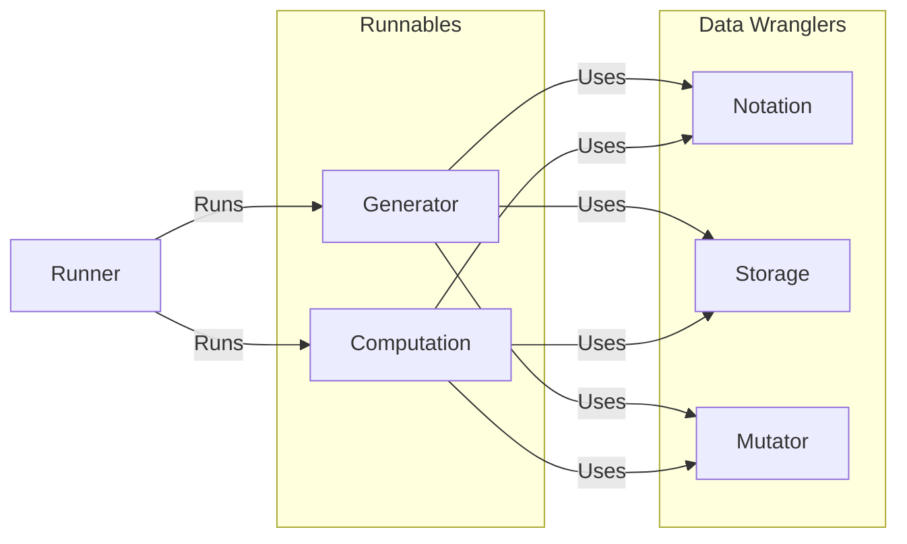

<link
  href="https://cdnjs.cloudflare.com/ajax/libs/font-awesome/6.5.1/css/all.min.css"
  rel="stylesheet"
/>

[](https://doi.org/10.5281/zenodo.17612692)

[](https://www.gnu.org/licenses/gpl-3.0)

# Tanglenomicon Core Libraries

The Tanglenomicon core libraries repository consists of a collection of libraries for computation
and generation of knot/tangle data. Each library should be considered its own project with its own
life-cycle however libraries are loosely coupled by a common CMake interface.

The libraries found here are primarily C, the C modules are expected to be C++ linkable. There's no
target OS, but Ubuntu Linux with Nix is the CI OS. Each library will adhere to a common design that
allows them flexibility and platform and language agnosticism. The design allows a library, maybe
"calculate Jones polynomial", to be runnable in a Jupyter notebook during undergraduate knot theory
class, or wrapped in MATLAB interfaces for scientific computing, or on a university cluster for
high-performance use cases.

We're targeting a "write once deploy anywhere" design.

# Planning

## Tasks

Tasks will be decomposed per library. Issues/bugs will be tracked per report, combining where it
makes sense.

## Version control

Version control will be git based with research Git as the source of truth. Work items will have a
branch per work item. Merging a work item will be managed by merge requests.

### Release Schedule

A release will be created at the completion of each feature life cycle.

#### Release Tagging

The project adopts [semantic versioning](https://semver.org) for version labels.

```
vMAJOR.MINOR.PATCH
```

Since a release is created for every feature implemented the project version may look odd `v0.20.0`
this is OKAY.

> [!note] It is required that every feature module in the project maintain its own semantic
> versioning. It is suggested to check for compatibility of used libraries at compile time.

## Software Life Cycle

We're taking a V-model approach with design, implementation, integration, and testing phases.



This methodology allows us to have high traceability through the development process. Allowing us to
justify every decision made in the process.

## Project Structure

Project structure will follow a fairly "normal" project structure as follows:

```
📦tanglenomicon_core
 ┣ 📂.github
 ┃ ┗ 📂workflows
 ┃   ┗ 📜\<github workflows\>
 ┣ 📂data
 ┃ ┗ 📜\<Static data files\>
 ┣ 📂docs
 ┃ ┣ 📜\<Sphinx files\>
 ┃ ┗ 📜Doxyfile
 ┣ 📂libraries \< external libraries\>
 ┃ ┗ 📜\<C/C++ libraries data files\>
 ┣ 📂misc
 ┃ ┗ 📜\< Single use tooling\>
 ┣ 📂source
 ┃ ┗  📂\<Module\>
 ┃    ┣ 📂source
 ┃    ┃ ┗ 📜\<Module Source Files\>
 ┃    ┣ 📂test
 ┃    ┃ ┗ 📜\<Module unit test Files\>
 ┃    ┣ 📜use-case.md
 ┃    ┗ 📜unit-description.md
 ┣ 📂tests
 ┃ ┣ 📂results
 ┃ ┃ ┗ 📜.gitkeep
 ┃ ┗ 📂integration_tests
 ┃   ┗ 📂 \<integration Test Suites\>
 ┣ 📜.clang-format
 ┣ 📜.clang-tidy
 ┣ 📜.gitignore
 ┣ 📜CMakeLists.txt
 ┣ 📜CMakeSettings.json
 ┣ 📜README.md
 ┗ 📜requirements.txt
```

## Define a Unit: A unit in this project shall be a monorepo member of the source directory

## Quality

This repository is a collection of libraries for The Tanglenomicon project. The primary quality goal
of libraries is to never fail in an undetectable way.

### Unit testing

Every unit is expected to have a unit test suite. Unit test suites are expected to flex every public
interface of that unit. Code coverage is optional but encouraged.

### Integration testing

Integration testing is not expected.

## Requirements

Since this repository contains a collection of libraries, this section will describe the high-level
design for types of libraries/common use cases.

### Functional Requirements



These common use cases along with their associated unit descriptions are found below:

#### Computation

- [Use Case](./interface/computation/use-case.md)
- [Unit Description](./interface/computation/unit-description.md)

#### Generator

- [Use Case](./interface/generator/use-case.md)
- [Unit Description](./interface/generator/unit-description.md)

#### Mutator

- [Use Case](./interface/mutator/use-case.md)
- [Unit Description](./interface/mutator/unit-description.md)

#### Notation

- [Use Case](./interface/notation/use-case.md)
- [Unit Description](./interface/notation/unit-description.md)

#### Storage

- [Use Case](./interface/storage/use-case.md)
- [Unit Description](./interface/storage/unit-description.md)

### Non-functional Requirements

Not applicable.

## Technologies

### Languages/Frameworks

The runnable and data wrangler libraries will be written in C/C++ using clang for compiling and
cmake as a build system. The runners are written with various tooling including C/C++, Python, and
JavaScript.

Unit testing of runnable and data wrangler libraries will use the
[Unity](http://www.throwtheswitch.org/unity) and [Cmock](http://www.throwtheswitch.org/cmock)
libraries for unity testing. Test indexing is handled by
[CTest](https://cmake.org/cmake/help/latest/module/CTest.html).

#### Code Style Guide

The C/C++ code in this repository shall be formatted by the bundled clang-format configuration.
Doxygen comments are expected to be formatted.

### Tools

- git
- mermaid.js
- Unity
- clang
- cmake
- CTest
- Doxygen
- Cmock
- Python
- sphinx
- Pytest

# Design and Documentation

C/C++ code is documented with [Doxygen](https://www.doxygen.nl/), the Doxygen comments shall be
parsed and output as XML. General documentation shall be recorded as markdown files in each module's
directory. Documentation shall be aggregated using the
[Sphinx](https://www.sphinx-doc.org/en/master/) framework. Sphinx shall then use
[Breathe](https://github.com/breathe-doc/breathe) to parse Doxygen XML into the general
documentation.

## Colors

Diagrams included in documentation for features (use case and unit descriptions) is expected to use
the [COLORS](https://clrs.cc) color palette.

```css
/* Colors */
.navy {
    color: #001f3f;
}
.blue {
    color: #0074d9;
}
.aqua {
    color: #7fdbff;
}
.teal {
    color: #39cccc;
}
.olive {
    color: #3d9970;
}
.green {
    color: #2ecc40;
}
.lime {
    color: #01ff70;
}
.yellow {
    color: #ffdc00;
}
.orange {
    color: #ff851b;
}
.red {
    color: #ff4136;
}
.fuchsia {
    color: #f012be;
}
.purple {
    color: #b10dc9;
}
.maroon {
    color: #85144b;
}
.white {
    color: #ffffff;
}
.silver {
    color: #dddddd;
}
.gray {
    color: #aaaaaa;
}
.black {
    color: #111111;
}
```

```

```