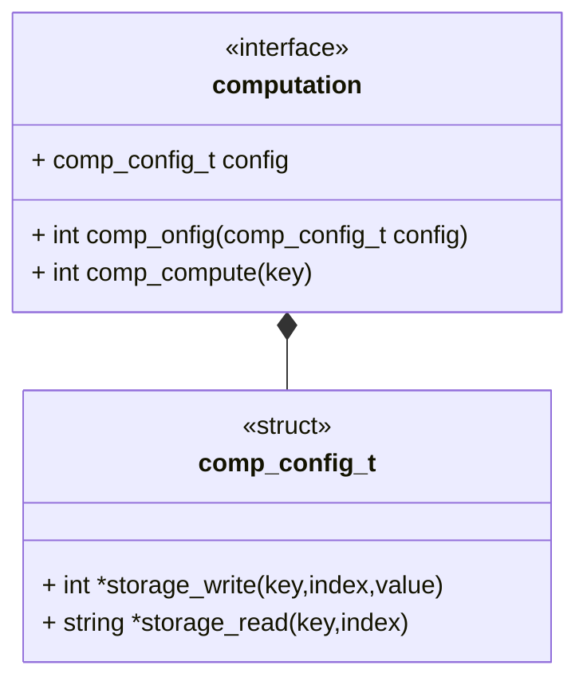

## Brief

This interface describes a generic computation module. A computation module is a runnable that computes an value for an object/s.

- [ ] Probably need a common interface for gathering objects