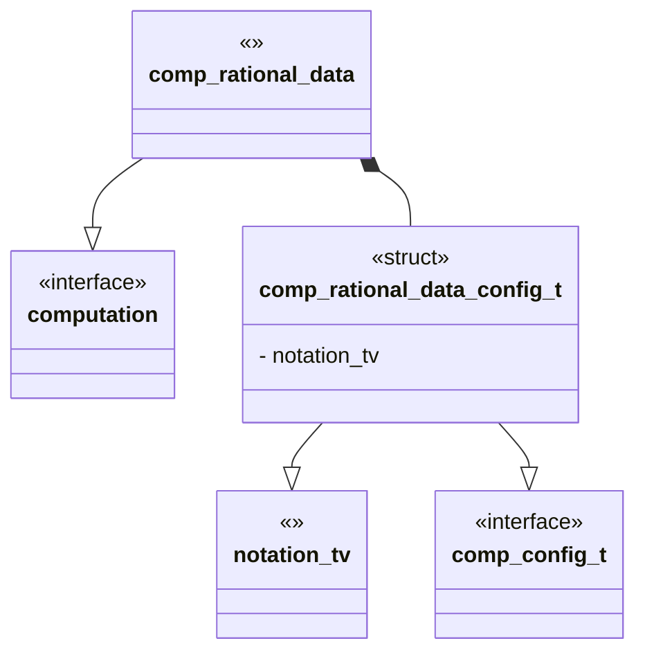

## Language

C

## Implements 

* [Computation Interface](Computations/Interface.md)

## Uses 

* [Notation Twist Vector](Notations/Twist%20Vector.md)

## External Libraries 

None

## Functionality

The rational tangle computation module computes 3 pieces of data for a rational tangle. 

### Rational Number

The rational number for a twist vector is computed by taking the twist vector as a finite continued fraction that is: 
$$\LB a\ b\ c\RB=c+\frac{1}{b+\frac{1}{a}}$$
given by [${}^{[2]}$](https://doi.org/10.48550/arXiv.math/0212011)


> [!Note] Note 
> The convention for indexing is reversed in most other places including Conway's original paper[${}^{[1]}$](https://doi.org/10.1016/B978-0-08-012975-4.50034-5)

Computing the continued fraction gives a unique rational number.

We compute with the following:
```pseudo
\begin{algorithm}
\caption{Compute Continued Fraction}
\begin{algorithmic}
	\Procedure{GetRatNum}{tv}
			\State $i \gets 1$
			\State $p_{i-1} \gets 0$
			\State $p_{i} \gets 1$
			\State $q_{i-1} \gets 1$
			\State $q_{i} \gets 0$
			\For{$a$ in tv }
        \State $p_{i+1} \gets a\cdot p_i+p_{i-1}$
        \State $q_{i+1} \gets a\cdot q_i+q_{i-1}$
				\State $i\gets i+1$
        \EndFor
      \State \Return $p_{i}, q_{i}$
	\EndProcedure
	\end{algorithmic}
\end{algorithm}
```


### Parity

The parity of a rational tangle describes it's fixed point relationships. Given the four fixed points: NW,NE,SE,SW we have the following parities: 

$$\begin{array}{ccc}
NW\to NE & &  \\
         & \to & 0  \\
SW\to SE & &  \\
\end{array}$$
or the end behavior of 

![[Media/0.svg | center | 200]]

$$\begin{array}{ccc}
NW\to SW & &  \\
         &\to & \infty  \\
NE\to SE & &  \\
\end{array}$$
or the end behavior of 

![[Media/inf.svg | center | 200]]

all other combinations have end behavior of $1$ or of the diagram 

![[Media/1.svg | center | 200]]

given a twist vector an it's associated rational number we can detect parity as 

$$\begin{array}{|c|c|c|}
p\ \%\ 2 &q\ \%\ 2&Parity\\\hline
0 &0&N/A\\\hline
0 &1& 0 \\\hline
1 &0&\infty\\\hline
1 &1& 1\\\hline
\end{array}$$
from 
[${}^{[2]}$](https://doi.org/10.48550/arXiv.math/0212011)


### Algebraic Equivalence

The *Algebraic Equivalence* class for a tangle describes the knot equivalence class of the numerator closure of the tangle. Equivalence is give as: 
[${}^{[2]}$](https://doi.org/10.48550/arXiv.math/0212011)

We can compute by, where $N$ and $D$ are from the perspective of numerator and denominator closure:

```pseudo
\begin{algorithm}
\caption{Compute Algebraic Equivalence}
\begin{algorithmic}
	\Procedure{IsAlgEQ}{$tv,tv^\prime$}
	
			\State $N_{eq}\gets $ False
			\State $Q_{eq}\gets $ False
			
			\State $p,q \gets $ GetRatNum($tv$)
			\State $p^\prime,q^\prime \gets $ GetRatNum($tv^\prime$)
			
			\State $N,D \gets $ GetAlgEQ($p,q$)
			\State $N^\prime,D^\prime \gets $ GetAlgEQ($p^\prime,q^\prime$)
			
			\If{$p=p^\prime$}
				\If{$NN^\prime\ \%\ p = 1$ or $N = N^\prime$}
				\State $N_{eq}\gets $ True
				\EndIf
			\EndIf
			
			\If{$q=q^\prime$}
			
				\If{$DD^\prime\ \%\ q = 1$ or $D = D^\prime$}
				\State $D_{eq}\gets $ True
				\EndIf
			\EndIf
			\State \Return $N_{eq}, D_{eq}$
	\EndProcedure

	\Procedure{GetAlgEQ}{$p,q$}
			\State \Return $q\ \%\ p, p\ \%\ q$
	\EndProcedure
	\end{algorithmic}
\end{algorithm}
```


# Cite

1. Conway, J.H. “An Enumeration of Knots and Links, and Some of Their Algebraic Properties.” In _Computational Problems in Abstract Algebra_, 329–58. Elsevier, 1970. [https://doi.org/10.1016/B978-0-08-012975-4.50034-5](https://doi.org/10.1016/B978-0-08-012975-4.50034-5).
2. Kauffman, Louis H., and Sofia Lambropoulou. “On the Classification of Rational Knots,” 2002. [https://doi.org/10.48550/ARXIV.MATH/0212011](https://doi.org/10.48550/ARXIV.MATH/0212011).