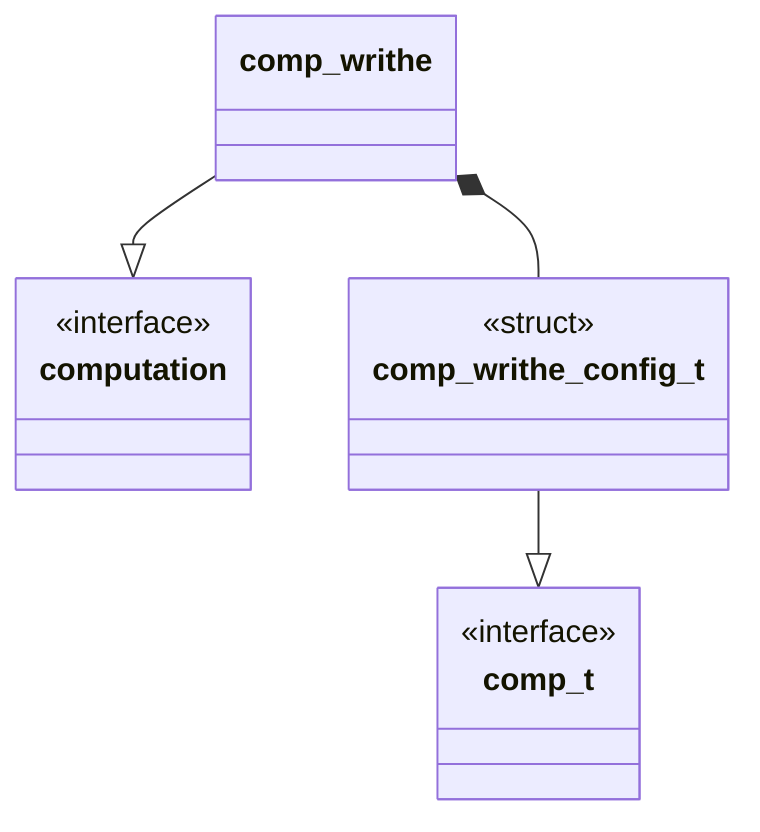

```mermaid
classDiagram

comp_writhe --|> computation 
comp_writhe_config_t --|> comp_t 
comp_writhe *-- comp_writhe_config_t

class comp_writhe_config_t {
<<struct>>
}

class computation{
<<interface>>
}

class comp_t {
<<interface>>
}


```

## Language

C

## Implements 

* [Interface](Computations/Interface.md)

## Used by 

* [Pd-To-Conway](Translators/Pd-To-Conway.md)

## Functionality

Computes the writhe of the given data. 