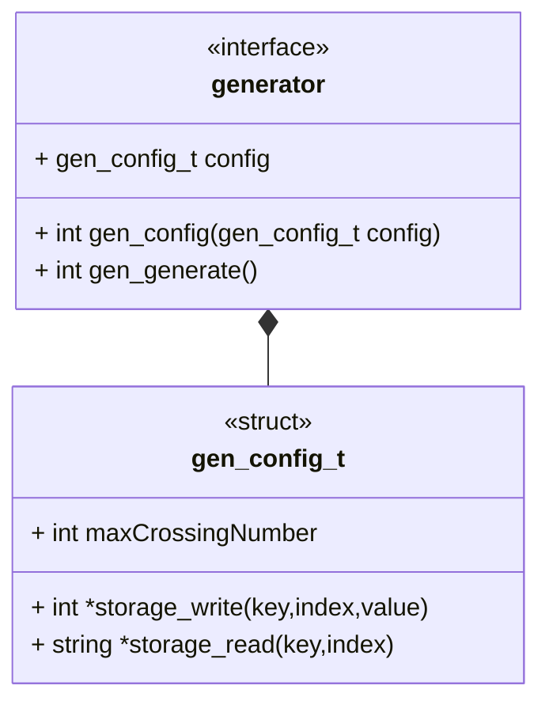

```mermaid
classDiagram
generator *-- gen_config_t
class generator{
<<interface>>
+ gen_config_t config
+ int gen_config(gen_config_t config)
+ int gen_generate()
}

class gen_config_t {
<<struct>>
+ int maxCrossingNumber
+ int *storage_write(key,index,value)
+ string *storage_read(key,index)
}


```