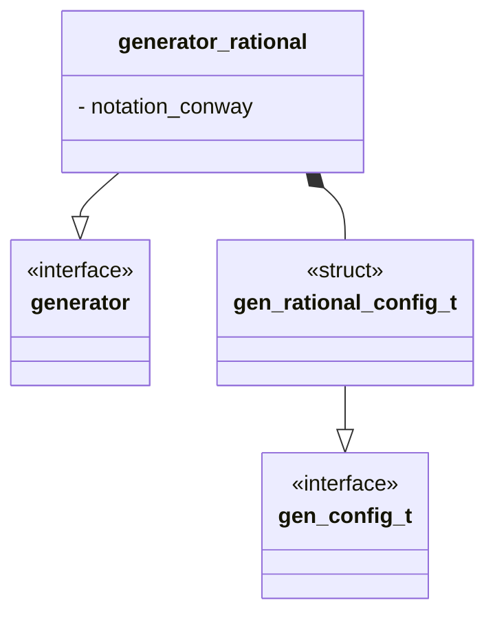

```mermaid
classDiagram

generator_rational --|> generator 
gen_rational_config_t --|> gen_config_t 
generator_rational *-- gen_rational_config_t

class generator{
<<interface>>
}

class generator_rational{
- notation_conway

}

class gen_rational_config_t {
<<struct>>


}

class gen_config_t {
<<interface>>

}


```

## Language

C

## Implements 

* [Interface](Generators/Interface.md)

## Libraries 

## Functionality