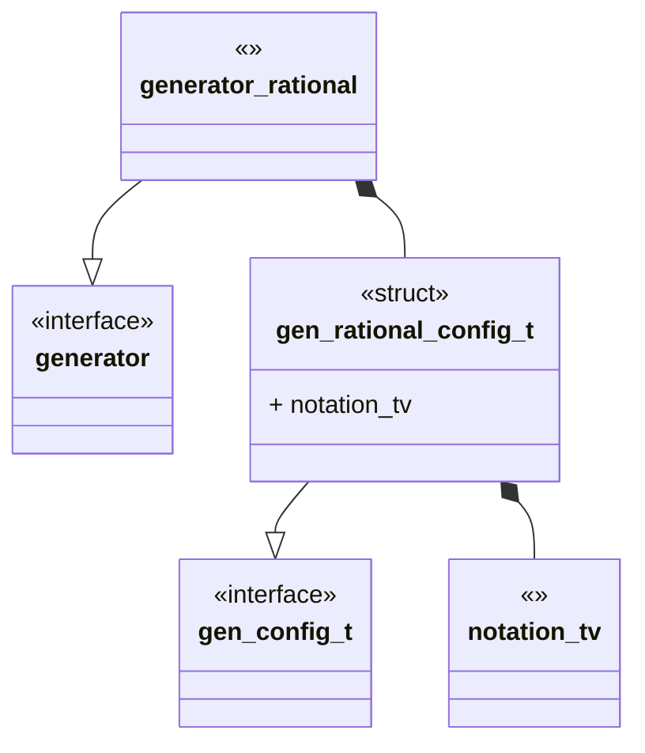
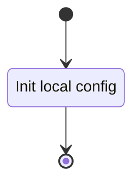
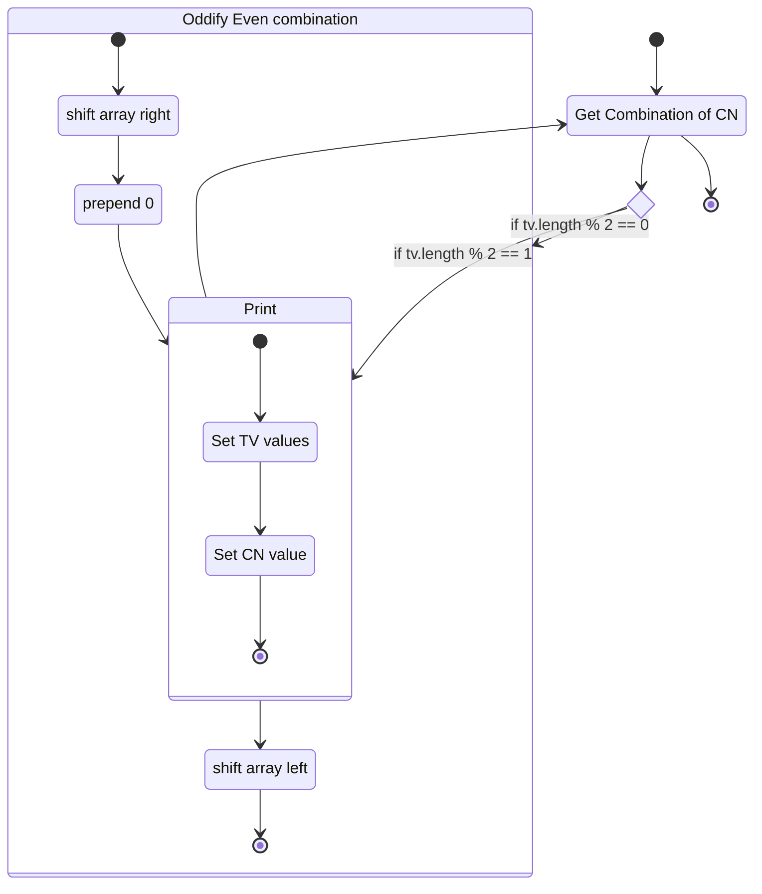

## Language

C

## Implements 

* [Generator Interface](Generators/Interface.md)

## Uses 
* [Notation Twist Vector](Notations/Twist%20Vector.md)

## Libraries 

N/A

## Functionality

A rational tangle is given by alternating NE,SE and SE,SW twisting of the $0$ tangle. A canonical combinatorial description of a rational tangle can be given by the [Twist Vector](Notations/Twist%20Vector.md).

This module generates twist vectors and in doing so rational tangles. A normal flows go as:

### Config

### Generate

# Cite

1. Conway, J.H. “An Enumeration of Knots and Links, and Some of Their Algebraic Properties.” In _Computational Problems in Abstract Algebra_, 329–58. Elsevier, 1970. [https://doi.org/10.1016/B978-0-08-012975-4.50034-5](https://doi.org/10.1016/B978-0-08-012975-4.50034-5).
2. Kauffman, Louis H., and Sofia Lambropoulou. “On the Classification of Rational Knots,” 2002. [https://doi.org/10.48550/ARXIV.MATH/0212011](https://doi.org/10.48550/ARXIV.MATH/0212011).