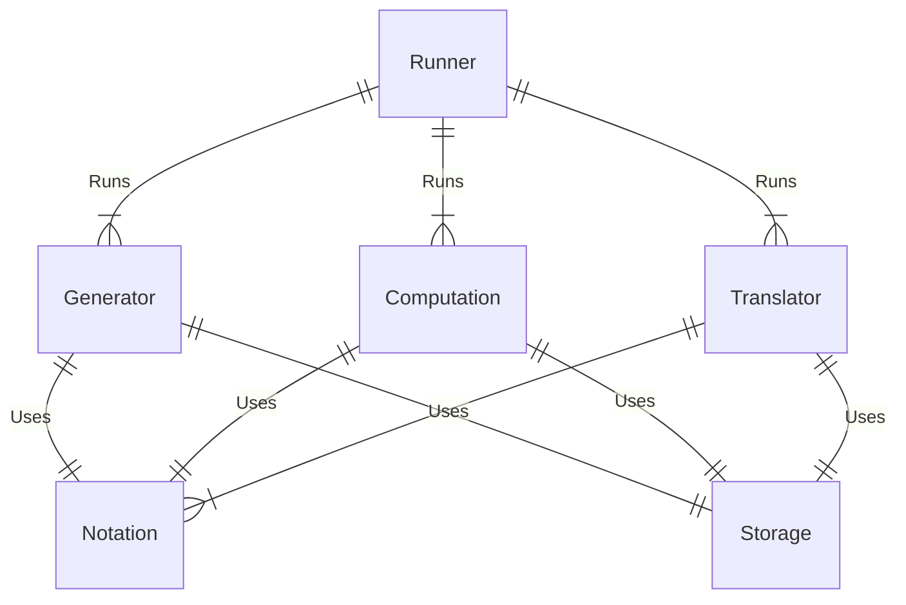

Design documentation for the tanglenomicon project.

## Runners

A runner is a human/machine interface layer. This abstracts the routines in lower layers for a user to interact with. This could be a CLI interface, python bindings, a Mathematica wrapper, etc. 

### Definitions 

- [CLI](Runners/CLI.md)

## Module types

### Runnables 

#### Generators 

Generators create new data of a defined type. These might look like a module that generates rational tangles up to a crossing number or tangle closures of a specific type. They may use one or more Computations, Notations, or Translators. 

#### Computation 

Computations compute a value for a given data. These might look like computing a polynomial of a link, or a computing the writhe of a tangle. 

### Data wranglers 

#### Notations 

Notations define a notational convention for a link/tangle. They describe a method for converting to and from a string representation of a link/tangle and struct describing that link/tangle.

#### Translators

Translators define a conversion between two Notations. An example might be a translator from [PD](Notations/PD.md) to [Conway](Notations/Conway.md) notation or it's opposite Conway to PD.

#### Storage

A storage module defines a storage interface for the application. The main inter-module type is string
and the calling module is responsible for en/decoding the string. The interfaces are defined with serializable storage in mind. 

