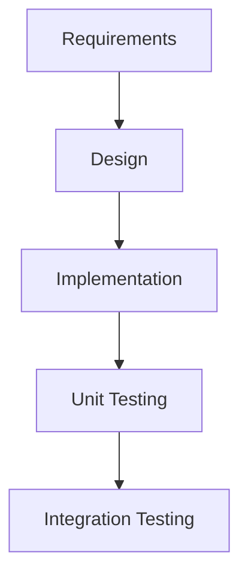
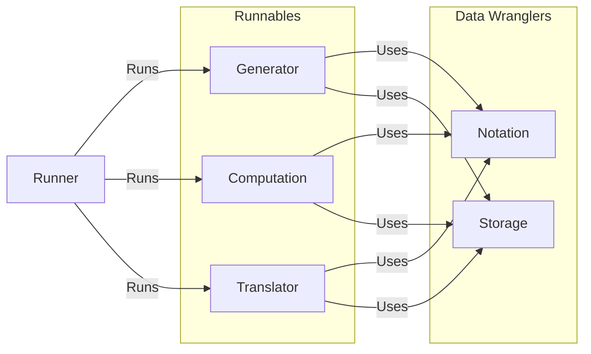

# Overview and Philosophy 

The tanglenomicon describes a tool for computing on tangles. The design is indented to allow flexibility, that is to be platform and language agnostic. We want a feature, maybe "calculate jones polynomial", to be runnable in a jupyter notebook during undergraduate knot theory class, or wrapped in matlab interfaces for scientific computing, or on a university cluster for high performance use cases. We're targeting a "write once deploy anywhere" design. 

While the design is platform and language agnostic the core implementation for the tanglenomicon project is written in a mix of C and C++. Each module is expected to make a selection, C modules are expected to be C++ linkable. There's no target system but ubuntu linux is the CI OS.

# Tanglenomicon

## Infra

### Build

#### Compiler

The project primarily targets clang. The CI uses both clang and GNU compiler.

#### Make System

The project uses [cmake](https://cmake.org/) as it's make system.

### Testing

Tests are run by [ctest](https://cmake.org/cmake/help/latest/module/CTest.html).

#### Unit

The project uses [Unity](http://www.throwtheswitch.org/unity) and [Cmock](http://www.throwtheswitch.org/cmock) for unity testing.

#### Integration

Integration/system testing is done with [pytest](https://docs.pytest.org/en/7.3.x/).

### Process

#### Software Lifecycle 

We're taking a feature centric waterfall approach with design, implementation, integration, and testing phases. 

Feature centric we mean work on one feature at a time, some examples for feature scope are  rational tangle generation, JSON storage, or Conway notation. 

Waterfall means we complete a full life cycle for each feature. 




This methodology will allow us to have high traceability meaning we can track our features through the development cycle, allowing us to justify every decision we made in the process.

##### Version Control (VC)

The project uses git as it's primary VC system. We use git pull requests for merging onto the ```main```. Tests are expected to be passing for a pull request to be approved.

##### Continuous Integration (CI) 

The project uses GitHub actions for CI.

##### Style

A style format is defined as a clang format file. Files are checked against clang.tidy on pull request.

##### Directory Map
```
📦tanglenomicon_core
 ┣ 📂.github
 ┃ ┗ 📂workflows
 ┃ ┃ ┗ \<github workflows\>
 ┣ 📂data
 ┃ ┗ \<Static data files\>
 ┣ 📂docs
 ┃ ┣ 📂design
 ┃ ┃ ┗ \<Design Files\>
 ┃ ┗ 📜Doxyfile
 ┣ 📂libraries
 ┃ ┗ \<C/C++ libraries data files\>
 ┣ 📂source
 ┃ ┗  📂\<Module\>
 ┃    ┗ \<Module Source Files\>
 ┣ 📂tests
 ┃ ┣ 📂results
 ┃ ┃ ┗ 📜.gitkeep
 ┃ ┗ 📂unit_tests
 ┃   ┣ 📂framework
 ┃   ┃ ┗ \<Unit Test Framework Source\>
 ┃   ┗ 📂 \<Unit Test Suites\>
 ┃     ┗ 📂\<Module Unit Test\>
 ┃        ┗ \<Module Unit Test Source\>
 ┣ 📜.clang-format
 ┣ 📜.clang-tidy
 ┣ 📜.gitignore
 ┣ 📜CMakeLists.txt
 ┣ 📜CMakeSettings.json
 ┣ 📜README.md
 ┗ 📜requirements.txt
```

### Documentation

#### Code

C code is documented with [Doxygen](https://www.doxygen.nl/) comments. Python is documented with numpy style docstrings.

#### Design

This document uses [markdown](https://www.markdownguide.org/) files in an [obsidian](https://obsidian.md/) vault. Diagrams are written as [mermaid.js](https://mermaid.js.org/).

#### Generation

Doxygen comments are parsed and output as xml. Python docstrings are parsed automatically by [sphinx](https://www.sphinx-doc.org/en/master/). Sphinx then uses [breathe](https://github.com/breathe-doc/breathe) to parse doxygen xml into a sphinx documents. C modules are expected to link to their design .md file in their header @file block.

Tooling as described in [here](https://devblogs.microsoft.com/cppblog/clear-functional-c-documentation-with-sphinx-breathe-doxygen-cmake/)

### Deployment 

#### Web Server
We will use Nginx as the webserver of the UIowa deployment. 

#### Frontend Framework
We will use HTML5/CSS3 with the tailwind framework along side jquery for the frontend frameworks for the UIowa deployment. 

#### Backend Framework 
We will use Python with the Flask framework for the UIowa deployment. 

#### Database System
The design doesn't couple a specific DBS/storage solution to the implementation. For the Iowa deployment of the tanglenomicon we will be using MongoDB as the DBS for the UIowa deployment. 

## Block Diagram
  




### Runners

A runner is a human/machine interface layer. This abstracts the routines in lower layers for a user to interact with. This could be a CLI interface, python bindings, a Mathematica wrapper, etc.

#### Definitions

- [CLI](Runners/CLI.md)

### Module types

#### Runnables

##### Generators

Generators create new data of a defined type. These might look like a module that generates rational tangles up to a crossing number or tangle closures of a specific type. They may use one or more Computations, Notations, or Translators.

##### Computation

Computations compute a value for a given data. These might look like computing a polynomial of a link, or a computing the writhe of a tangle.

##### Translators

Translators define a conversion between two Notations. An example might be a translator from [PD](Notations/PD.md) to [Conway](Notations/Conway.md) notation or it's opposite Conway to PD.

#### Data wranglers

##### Notations

Notations define a notational convention for a link/tangle. They describe a method for converting to and from a string representation of a link/tangle and struct describing that link/tangle.


##### Storage

A storage module defines a storage interface for the application. The main inter-module type is string
and the calling module is responsible for en/decoding the string. The interfaces are defined with serializable storage in mind.


