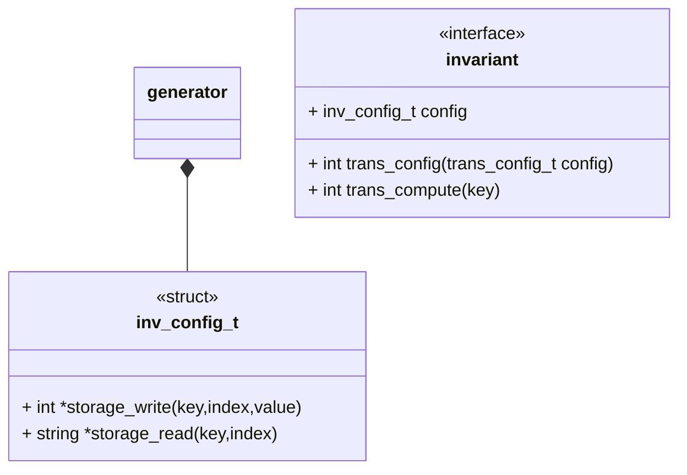

```mermaid
classDiagram
generator *-- inv_config_t
class invariant{
<<interface>>
+ inv_config_t config
+ int trans_config(trans_config_t config)
+ int trans_compute(key)
}

class inv_config_t {
<<struct>>
+ int *storage_write(key,index,value)
+ string *storage_read(key,index)
}


```

## Brief

This interface describes a generic invariant module. A invariant module is a runnable that computes an invariant for objects.

- [ ] Probably need a common interface for gathering objects