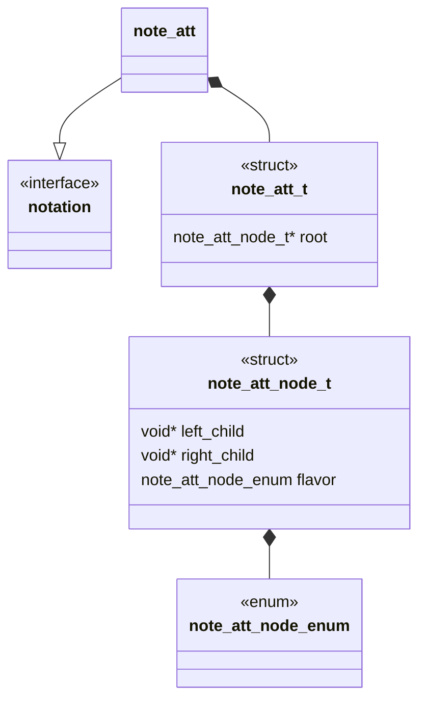
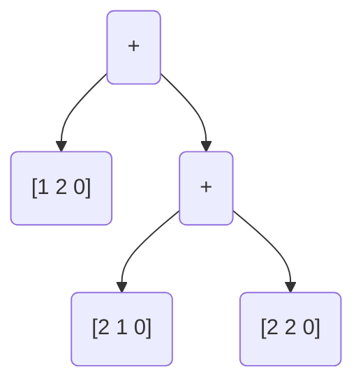

## Language

C

## Implements

* [Notations Interface](Notations/Interface.md)

## Uses

N/A

## Libraries

N/A

## Functionality

A algebraic tangle is any tangle generated from the two basic operations $+$ and $\vee$ on the four basic tangles ($0,\ \pm1,\ \infty$). To interpret the algebraic statement as a binary tree we will represent the generating statement in polish notation and read the statement to a binary operation tree. 


```ad-example


Algebraically:
$$[1 2 0]+[2 1 0]+[2 2 0]$$

att "encoded":
$$+[1 2 0]+[2 1 0][2 2 0]$$


att "decoded":



### Data Structure Description

```ad-note
It is important to note that we assume the minimal sub tangles of a tree are rational. 
```

### Encoding

To encode the data to a string we need only traverse the tree and report with a depth first preorder. 


### Decoding

To decode a string to a tree we again interpret to a tree with depth first preorder


# Cite

1. Caudron, Alain. Classification des noeuds et des enlacements. France, Univ. de Paris-Sud, Department de Math., 1982.
2. N. Connolly, "Classification and tabulation of 2-string tangles: the astronomy of subtangle decompositions," Doctor of Philosophy, University of Iowa, 2021. doi: 10.17077/etd.005978.
