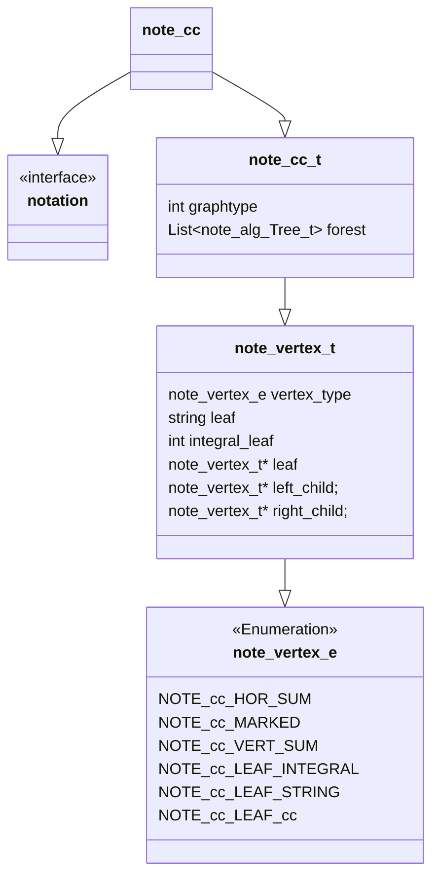

## Description 

This defines notation object for the combined "Caudron-Conway" notation. The top level is the Conway notation for polyhedral knots. Each element of the conway polyhedra is an algebraic knot defined as Caudron's binary operation tree, with operations $+$ horizontal sum and $\vee$ vertical sum. 

## Language

C

## Implements

* [Interface](Notations/Interface.md)

## Used by

* [Rational](Generators/Rational.md)
* [Pd-To-cc](Translators/Pd-To-cc.md)

## Cautions

We need to be very careful about not having a memory leaks.

## Design Description 

### note_cc_t
- [ ] TODO note_cc_t
### note_vertex_t
- [ ] TODO note_vertex_t
### note_vertex_e
- [ ] TODO note_vertex_e