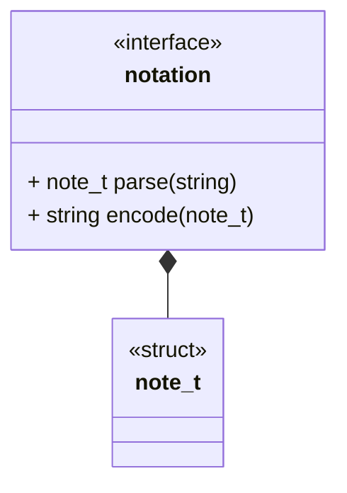

## Brief

This interface describes a generic notation module. A notation module sits between a storage module and an upper layer (Computation, Generator, etc.). Notation module will define a struct that encodes the notational data and two IO functions. 