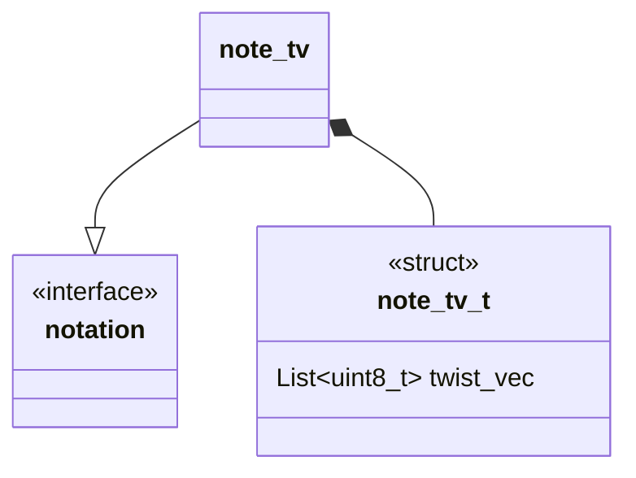

## Description 
- [ ] TODO Description

## Language

C

## Implements 

* [Interface](Notations/Interface.md)

## Used by 

* [Rational](Generators/Rational.md)
* [Pd-To-Conway](Translators/Pd-To-Conway.md)

## Functionality
- [ ] TODO Functionality