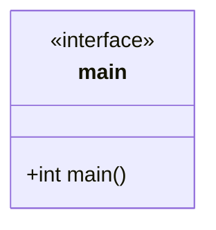

## Language

C++

## Libraries 

Uses [cxxopts](https://github.com/jarro2783/cxxopts) for command line arguments. 

## Uses 

- [JSON](Storage/JSON.md)
- [Screen](Storage/Screen.md)
- [SQLite](Storage/SQLite.md)
- [Rational](Generators/Rational.md)
- [Keyboard (read only)](Storage/Keyboard%20(read%20only).md)

## Functionality

Main calling routine. 