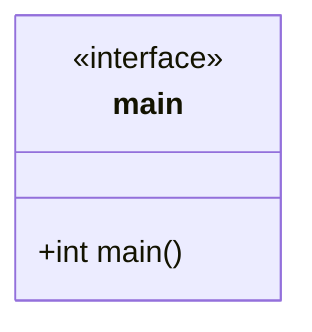

```mermaid
classDiagram

class main{
<<interface>>
 +int main()
}
```

## Language

C++

## Libraries 

Uses [cxxopts](https://github.com/jarro2783/cxxopts) for command line arguments. 

## Functionality

Main calling routine. 