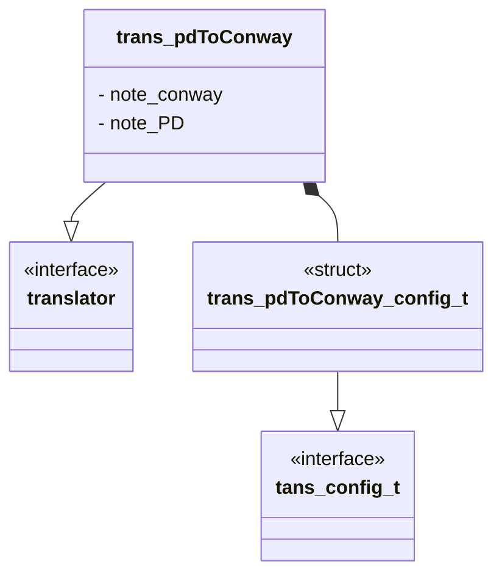

```mermaid
classDiagram

trans_pdToConway --|> translator 
trans_pdToConway_config_t --|> tans_config_t 
trans_pdToConway *-- trans_pdToConway_config_t

class translator{
<<interface>>
}

class trans_pdToConway{
- note_conway
- note_PD

}

class trans_pdToConway_config_t {
<<struct>>


}

class tans_config_t {
<<interface>>

}


```

## Language

C

## Implements 

* [Interface](Translators/Interface.md)

## Libraries 

## Uses 

* [PD](Notations/PD.md)
* [Conway](Notations/Conway.md)

## Functionality