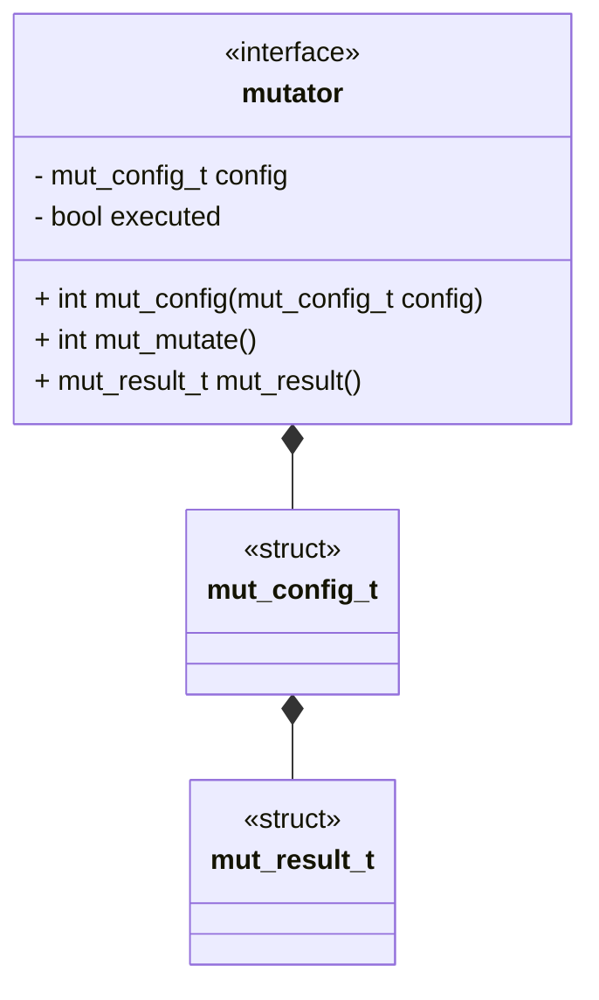
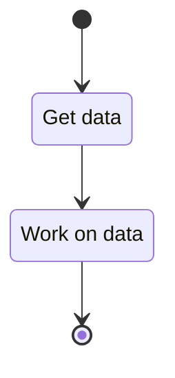

# Unit Description

## Functionality

### Public Structures

#### Mutator Configuration Structure

The mutator configuration structure defines the collection of data the component needs for a single
run. Setting a configuration should be considered equivalent to instantiating a class in a
high-level language. However, in this case, there is only ever a single active instance of the
class.

### Public Functions

#### Configuration Function

The function will take a configuration as input and set the local configuration instance to that
input. The function returns a flag indicating if the function was successful. This function can be
considered analogous to the `init` function of a class in a high-level language.

#### Mutate Function

When this function is invoked, the mutator process begins. The actual internal functionality is
specific to the specific mutator. The function returns a flag indicating if the function was
successful.

The flow for a mutator is modeled by the following state machine:

