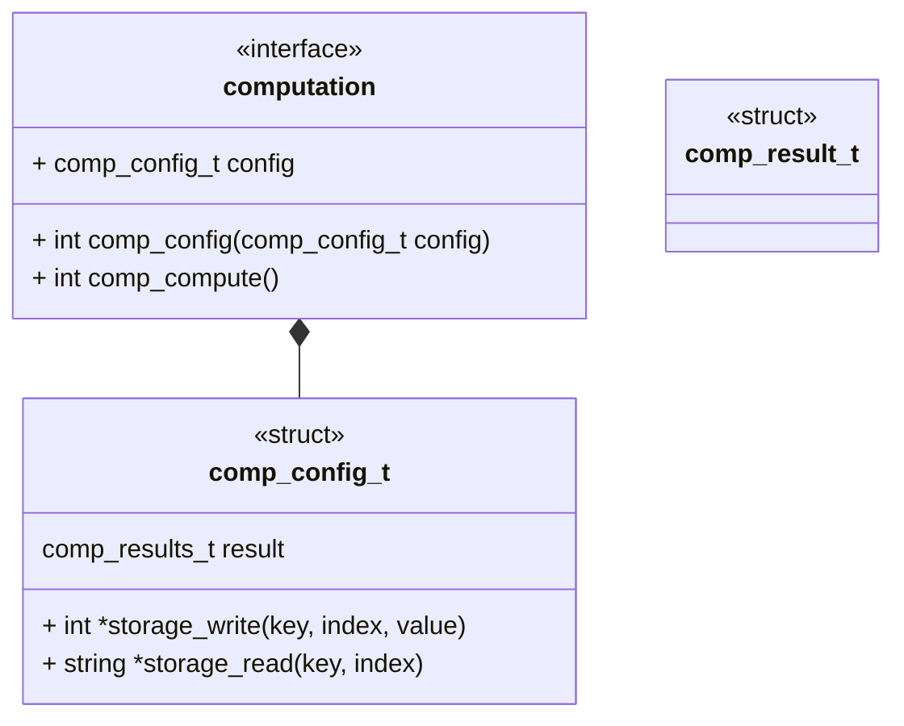

# Unit Description: Computation Interface



# Functional Description

A computation library shall have a configuration data structure, the config
structure shall minimally contain storage interface (read and write) and a
result struct. Beyond required members, the members of this structure are
largely unique to the particular library. The implementation of the computation
component fully defines the result structure.

A computation library shall have a "set" function, this function will take a
configuration as input and configure the instance to that input.

A computation library shall have a compute function, when called this function
carries out the computation on supplied data.

The compute function is an atomic operation, meaning a single operation is
executed with a single output produced.

```{raw} latex
    \newpage
```
