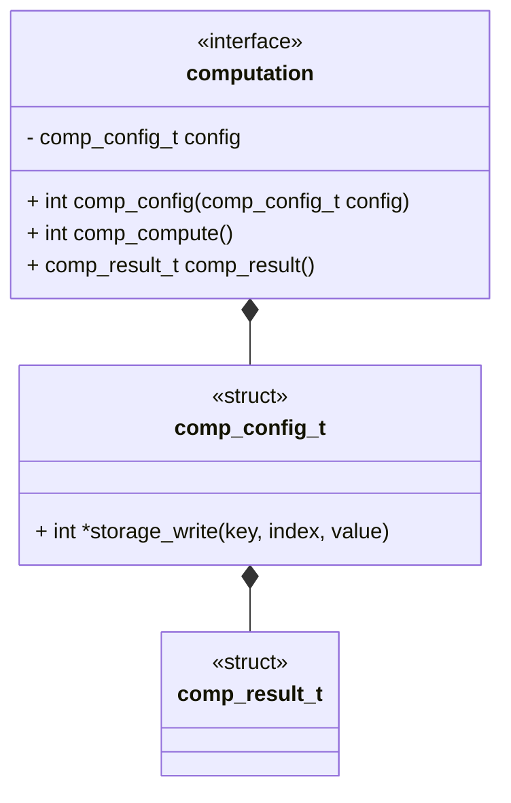
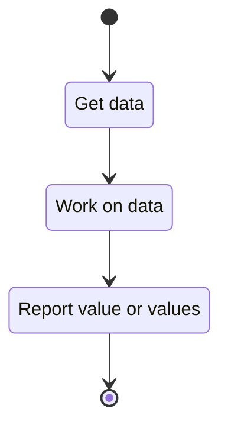

# Unit Description: Computation Interface



## Functionality

### Public Structures

#### Computation Config Structure

The computation config structure defines the collection of data the component
needs for a single run. Setting a config should be considered equivalent to
instantiating a class in a high-level language. However, in this case, there is
only ever a single active instance of the class.

#### Computation Result Structure

The computation result structure defines the collection of data the component
will produce in a single run. This is used as an alternative to the write
interface, allowing the component to be used internally in other computation or
generator components.

### Public Functions

#### Config Function

The function will take a configuration as input and set the local config
instance to that input. The function returns a flag indicating if the function
was successful. This function can be considered analogous to the `init` function
of a class in a high-level language.

#### Compute Function

When this function is invoked, the computation process begins. The actual
internal functionality is specific to the specific computation. The function
returns a flag indicating if the function was successful.

The flow for a computation is modeled by the following state machine:



#### Result Function

When this function is invoked, the result of the computation process is
reported. The actual internal functionality is specific to the specific
computation.

```{raw} latex
    \newpage
```
