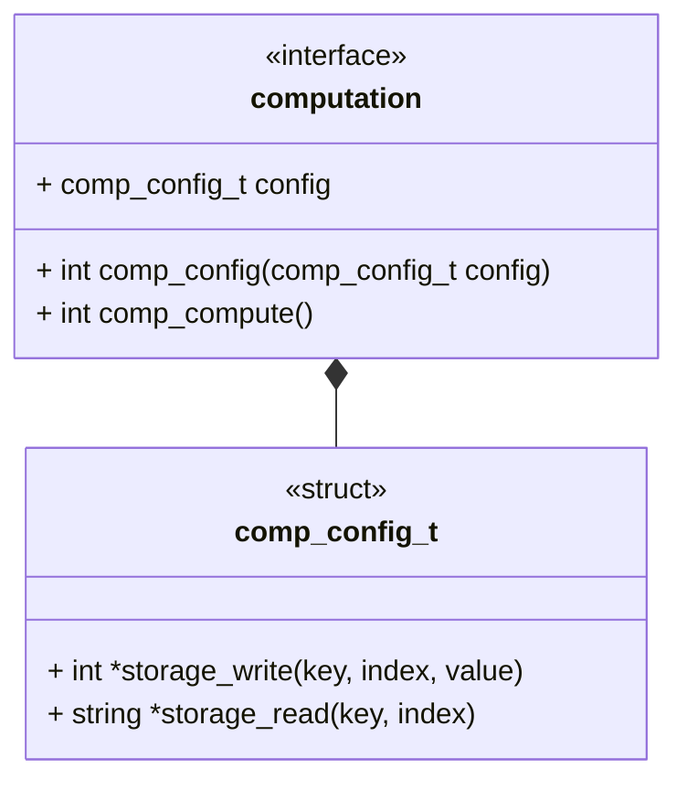

# @@@TODO Unit Description: Computation Interface


```mermaid
classDiagram
    computation *-- comp_config_t
    class computation {
        <<interface>>
        + comp_config_t config
        + int comp_config(comp_config_t config)
        + int comp_compute()
    }

    class comp_config_t {
        <<struct>>
        + int *storage_write(key, index, value)
        + string *storage_read(key, index)
    }


```

```{raw} latex
    \newpage
```
