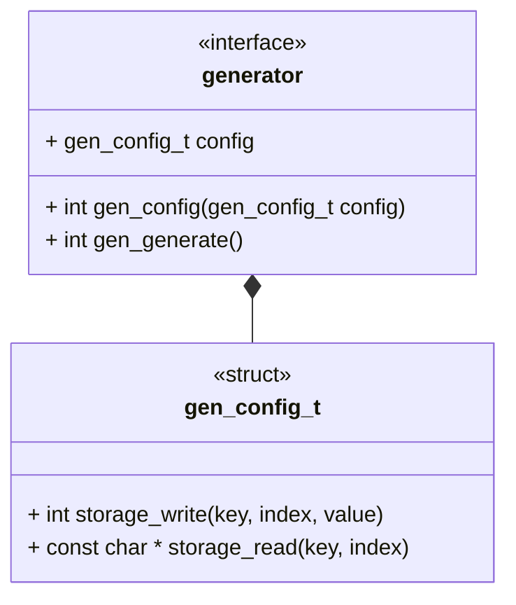

# Unit Description: Generator Interface



# Functional Description

A generator library shall have a configuration data structure, the config
structure shall minimally contain storage interface (read and write). Beyond
required members, the members of this structure are largely unique to the
particular library.

A generator library shall have a "set" function, this function will take a
configuration as input and configure the instance to that input.

A generator library shall have a generate function, when called this function
carries out the generation from supplied data.

The generate function is not an atomic operation, meaning more than a single
operation is executed with more than a single output produced.

```{raw} latex
    \newpage
```
