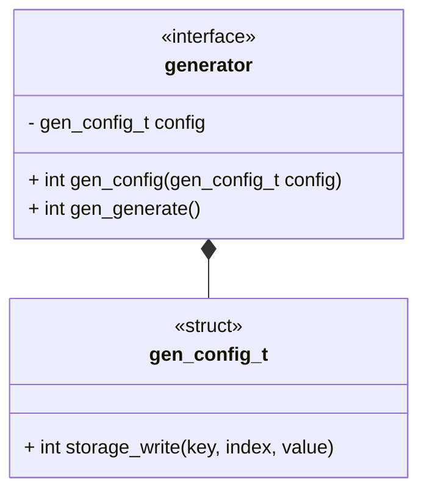
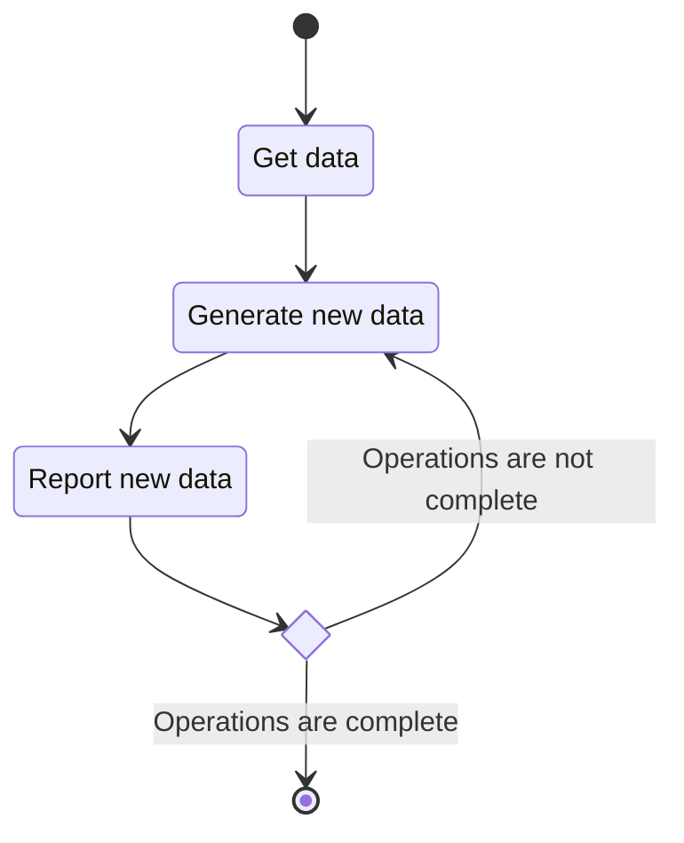

# Unit Description: Generator Interface



## Functionality

### Public Structures

#### Generator Config Structure

The generator config structure defines the collection of data the component
needs for a single run. Setting a config should be considered equivalent to
instantiating a class in a high-level language. However, in this case, there is
only ever a single active instance of the class.

### Public Functions

#### Config Function

The function will take a configuration as input and set the local config
instance to that input. The function returns a flag indicating if the function
was successful. This function can be considered analogous to the `init` function
of a class in a high-level language.

#### Generate Function

When this function is invoked, the generation process begins. The actual
internal functionality is specific to the specific generator. The function
returns a flag indicating if the function was successful.

The flow for a generator is modeled by the following state machine:



```{raw} latex
    \newpage
```
