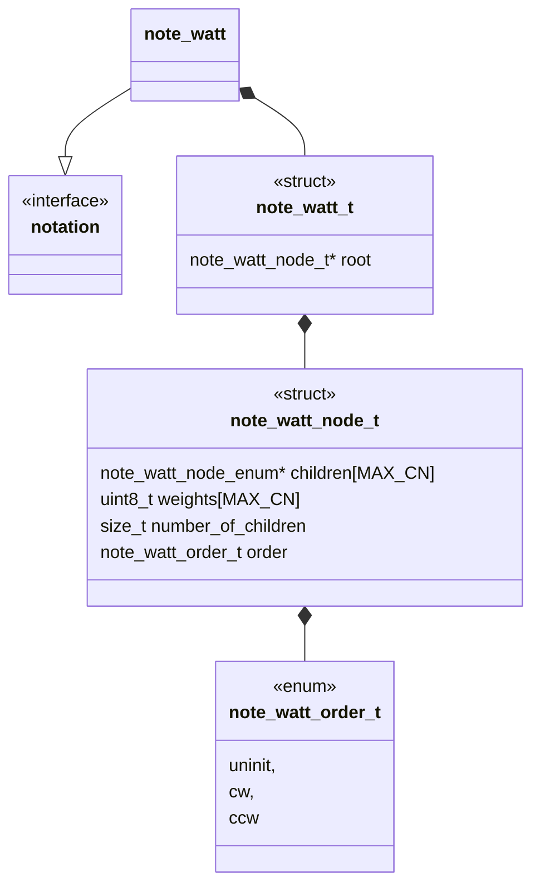
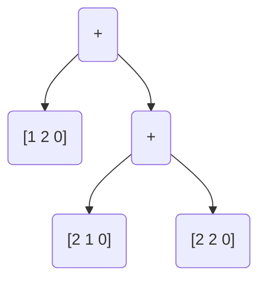

# @@@TODO Unit Description: Weighted Arborescent Tangle Tree Notation



## Language

C

## Implements

* [Notations Interface](interface.md)

## Uses

* [Notations Twist Vector](twist_vector.md)

## Libraries

N/A

## Functionality

An arborescent tangle is a tangle built from the plumbing calculus described in
Bonahon

```{note}


Algebraically:
$$[1 2 0]+[2 1 0]+[2 2 0]$$

att "encoded":
$$+[1 2 0]+[2 1 0][2 2 0]$$


att "decoded":


### Data Structure Description

```{note}
It is important to note that we assume the minimal sub tangles of a tree are rational.
```

### Encoding

To encode the data to a string we need only traverse the tree and report with a
depth first preorder.

### Decoding

To decode a string to a tree we again interpret to a tree with depth first
preorder

## Cite

1. Caudron, Alain. Classification des noeuds et des enlacements. France, Univ.
   de Paris-Sud, Department de Math., 1982.
2. N. Connolly, "Classification and tabulation of 2-string tangles: the
   astronomy of subtangle decompositions," Doctor of Philosophy, University of
   Iowa, 2021. doi: 10.17077/etd.005978.
