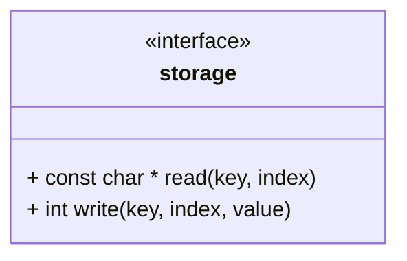

# Unit Description: Storage Interface

## Class Diagram



## Functionality

### Public Functions

#### Read Function

The read function takes in a key index pair, then reads the value at key:index from the data store
and returns the value.

#### Write Function

The write function takes in a key, index, and value tuple and writes the value to the data store at
key:index. The function then returns an integer status indicator.

```{raw} latex
    \newpage
```
