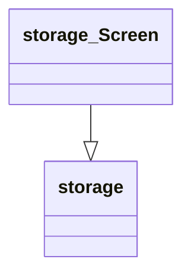

# @@@TODO Unit Description: Screen Storage


```mermaid
classDiagram
    storage_Screen --|> storage
```

## Language

C++

## Implements

[Interface](../storage/interface.md)

## Libraries

## Functionality

```{raw} latex
    \newpage
```
