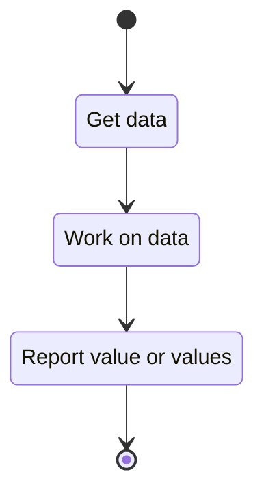

# Use Case: Computation Interface

## General Flow:

The flow for a generic computation is modeled as:



## Brief

A computation module satisfies the need for a component type that carries out an
atomic operation. Meaning, one thing goes in, and one thing comes out. Example
use-cases that can be implemented as a computation component are:

- Computing the Jones polynomial of an object.
- Translating between two notation types.
- Applying a Reidemeister move on an object.
- Computing the distance between two tangles.
- Computing rational number of a rational tangle.

```{raw} latex
    \newpage
```
