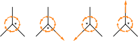
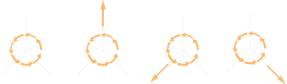
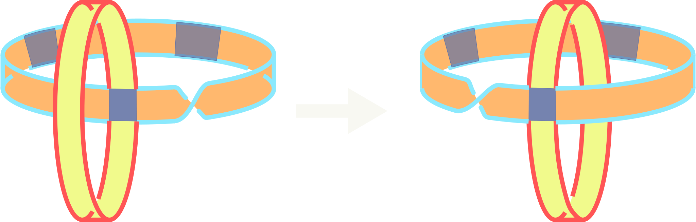
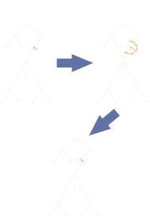
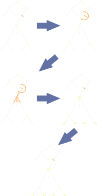
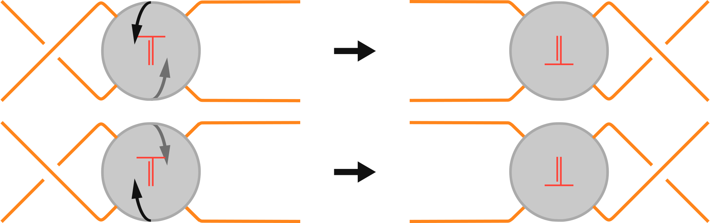
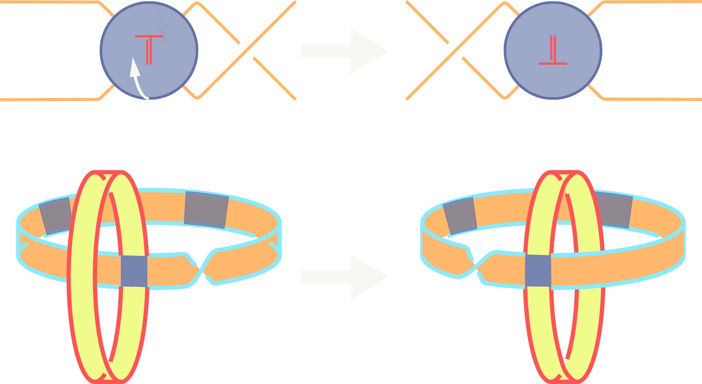

# Use Case: Computing the F3 move on a WATT

## Functionality

### Mathematical Description

When plumbing a WATT, we adopted the convention that child bands, when plumbed,
will point _out_, meaning away from the center of the parent. Said another way
the distance from the center point of the parent to any point on the child band
is at least the distance to any point on the parent band. With this convention
in mind we can consider the $F_3^\prime$ move.

```{prf:definition}
:label: UC-C-f3-D-F3

The _$F_3^\prime$_ move on a weighted arborescent tangle tree replaces $\frac{\,}{\,} \frac{\,}{\,} \frac{\,}{\,}\frac{a}{\,}\frac{\,}{\,}\frac{\,}{\,}$ by $\frac{\,}{\,} \frac{\,}{\,} \frac{\,}{\,}\frac{\,}{a}\frac{\,}{\,}\frac{\,}{\,}$and, if $a$ is odd, reverse the cyclic order of weights and bonds at all vertices of the subgraph - - lying at odd distance from the vertex shown.
{cite:p}`bonahonNewGeometricSplittings2016`
```

The definition tells us that the $F_3^\prime$ move shifts a weight $w$ ($w$ half
turn crossings on a band) across an edge (plumbing square on a band), as we'll
see, this impacts the child band associated with the crossed edge as well as all
descendants. The action of a $F_3^\prime$ on a WATT, and the impacted
descendants can be seen in {prf:ref}`UC-C-f3-E-F3_ON_TREE`.

```{prf:example} $F_3^\prime$ move on a tree
:label: UC-C-f3-E-F3_ON_TREE


```

#### $F_3^\prime$ on bands

We can now shift our focus to the impact of the $F_3^\prime$ move on the band
model. As described, the $F_3^\prime$ move shifts a crossing across a plumbing
square by a half turn, in the opposite direction of twist of the crossing to be
shifted. When this is carried out, for a single crossing, the child band is
inverted so it lays inside the parent band. This inversion gives the cyclic
order reversal described in {prf:ref}`UC-C-f3-D-F3`. The carrying out of a
$F_3^\prime$ move on a pair of plumbed bands can be seen in
{prf:ref}`UC-C-f3-E-FLYPE_BND`.

```{prf:example} $F_3^\prime$ on a band model
:label: UC-C-f3-E-FLYPE_BND

```

#### $F_3^\prime$ impact on descendants

We will now approach how to understand the odd depth (zero indexed with parent
band at index $0$), cyclic order reversal described in {prf:ref}`UC-C-f3-D-F3`.
First, imagine a WATT, realized as plumbed bands, with one
[essential vertex](../../notations/weighted_arborescent_tangle_tree.md#essential-vertices)
with a $+1$ weight and $3$ edges, one of which that is adjacent to the weight is
a [stick](../../notations/weighted_arborescent_tangle_tree.md#sticks) of length
$4$.

```{prf:example} Cyclic order reversal
:label: UC-C-f3-E-COR

```

Now, carry out a $F_3^\prime$ on the weight across the stick. This will invert
the immediate child band (index 1) on the stick, however descending the index 2
child the remains in the same orientation as it started, relative to the ambient
space, this action can be seen in {prf:ref}`UC-C-f3-D-F3` where red bounded
yellow bands (odd index) are inverted, and white bounded green bands remain in
the same orientation, relative to the ambient orientation.

We're now in a position where we can process more complex examples, consider the
WATT in {prf:ref}`UC-C-f3-E-F3E` and {prf:ref}`UC-C-f3-E-F3O`, the two trees
agree in all but a single vertex, our object vertex marked in orange, where a
weight has been modified from $-2$ to $-3$, we will first walk through
{prf:ref}`UC-C-f3-E-F3E`.

```{note}
When we apply a $F_3^\prime$ move we can choose to shift weights in either
clockwise or anti-clockwise, relative to the ambient space,
the choice only impacts the the edges that are shifted over.
As a convention we will, in general, choose to carry out $F_3^\prime$ moves so
that only child (in the ordered sense of
[WATT](../../notations/weighted_arborescent_tangle_tree.md)) vertices are
modified. This sub-trees impacted are indicated by orange arrows in
{prf:ref}`UC-C-f3-E-F3_ON_TREE`, {prf:ref}`UC-C-f3-E-F3E` and
{prf:ref}`UC-C-f3-E-F3O`.
```

With this first example our object weight is even, to show $F_3^\prime$ will
impact only the object vertex we begin by shifting our weight $1$ crossing at a
time. We saw above that when we shift a single weight the cyclic order of the
child band and some of it's descendants are reversed. On our first shift we have
the local picture $\frac{\,\,}{\,\,}\frac{-1}{-1}\frac{\,\,}{\,\,}$, with the
descendants impacted as expected. On the second shift, we now have the full
weight shifted, we again reverse the orders, note that the same descendants that
were reverse are again reversed and in their original order. With our shifting
complete we have our original tree sans the shifted object vertex. The full
process can be seen in {prf:ref}`UC-C-f3-E-F3E`.

```{prf:example} $F_3$ on a WATT with even weight
:label: UC-C-f3-E-F3E

```

#### $F_3^\prime$ as a flype

We now turn our attention to the odd case seen in {prf:ref}`UC-C-f3-E-F3O`. We
again shift $1$ crossing at a time, after shifting $2$ crossings, we find
ourselves in the state $\frac{\,\,}{\,\,}\frac{-1}{-2}\frac{\,\,}{\,\,}$ with
our tree agreeing, other than our object vertex, with the tree we started with.
After shifting our final crossing we

```{prf:example} $F_3$ on a WATT with odd weight
:label: UC-C-f3-E-F3O

```

Now that we're on firm footing with the arborescent construction for the
$F_3^\prime$ move we can pivot to a more foundational knot theoretic
description. The translation of crossings across child bands models the
traditional _flype_ move ({prf:ref}`UC-C-f3-E-FLYPE`), of "Tait Flyping
Conjecture" {cite:p}`taitKnotsIIIII1900` fame.

```{prf:example} Flype
:label: UC-C-f3-E-FLYPE

```

To see the coincidence of $F_3^\prime$ and flype we need to view the plumbed
child band as a tangle $T$, we can then carry out the $F_3^\prime$ over this
tangle. Tracking the parts of this operation we can see clearly in
{prf:ref}`UC-C-f3-E-FLYPE_AND_BND` the coincidence.

```{prf:example} Flype and $F_3^\prime$
:label: UC-C-f3-E-FLYPE_AND_BND

```

## Bibliography

```{bibliography}
   :filter: docname in docnames
```

```{raw} latex
    \newpage
```
