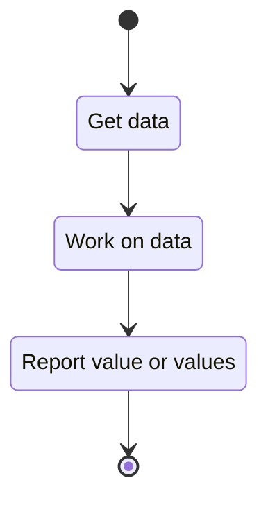

# @@@TODO Use Case: Computation Interface

## Goal:

This interface describes the public interfaces of a generic computation module.
The flow for a generic computation is modeled as



## Functional description:

A computation library shall have a configuration data structure, the config
structure shall minimally contain storage interface (read and write). Beyond
required members the members of this structure are largely unique to the
particular library.

A computation library shall have a "set" function, this function will take a
configuration as input and configure the instance to that input.

A computation library shall have a compute function, when called this function
carries out the computation on supplied data.

## Todo and enhancements

-   [ ] Probably need a common interface for gathering objects

```{raw} latex
    \newpage
```
