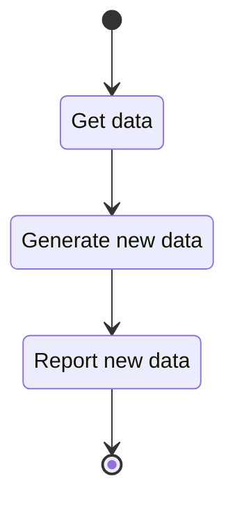

# Use Case: Generator Interface

## General Flow:

The flow for a generic generator is modeled as:



## Brief

A generator module satisfies the need for a component type that carries out an
non-atomic operations. Meaning, one thing goes in, and many things comes out.
Example use-cases that can be implemented as a generator component are:

- Generating all rational tangles.
- Generating all tangles related to a tangle by crossing change.

```{raw} latex
    \newpage
```
