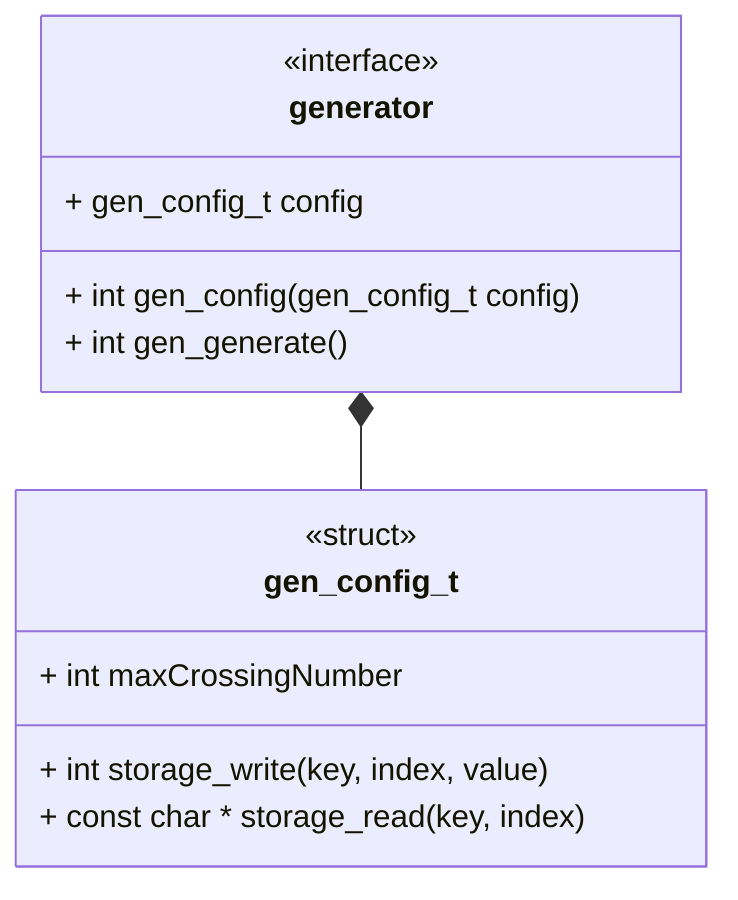

# Use Case: Generator Interface



## Brief

This interface describes a generic generator module. A generator module is a
runnable that generates objects of a specific class up to a crossing number.

```{raw} latex
    \newpage
```
