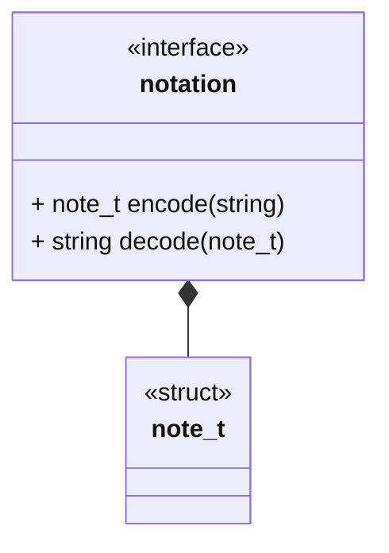
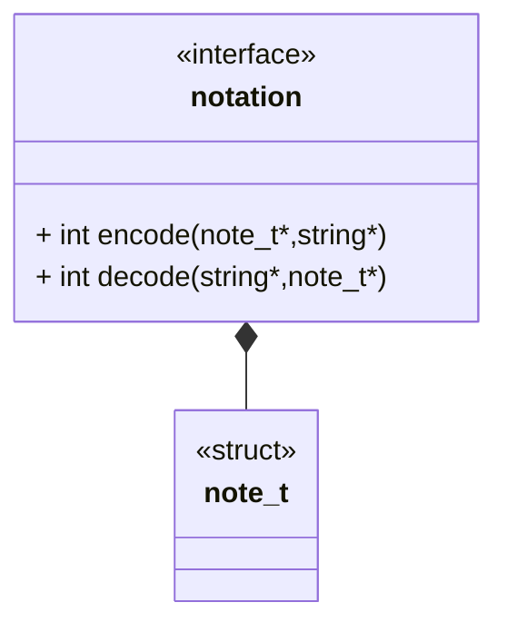

# Use Case: Notation Interface



## C Style Interface

The C interface takes the source $\to$ destination convention in the arguments.



## Brief

This interface describes a generic notation module. A notation module sits
between a storage module and an upper layer (Computation, Generator, etc.).
Notation module will define a struct that encodes the notational data and two IO
functions.

### Encoding

Takes a data structure and encodes it as its string representation.

### Decoding

Takes a string and decodes it as its data structure representation.

```{raw} latex
    \newpage
```
