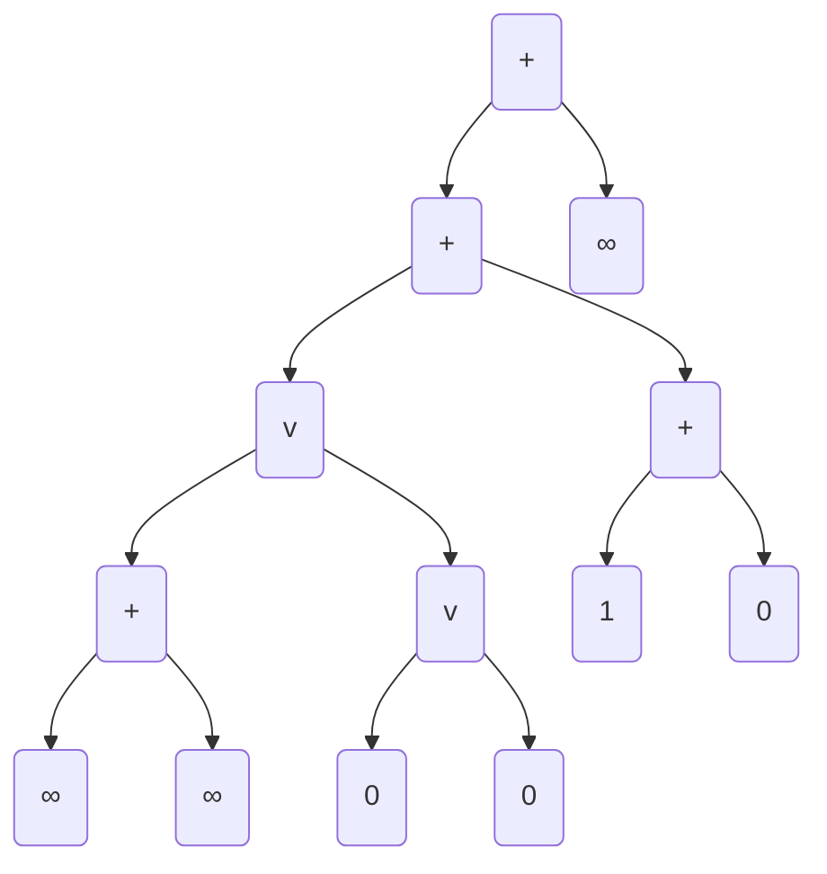

# Use Case: Algebraic Tangle Tree Notation

## Functionality

An algebraic tangle is any tangle generated from an "algebraic" statement built
from the two binary operations $+$ and $\vee$ on the four basic tangles ($0,\
\pm1,\ \infty$).

```{prf:example}

$$\LP\LP\infty+\infty\RP\vee\LP 0\vee0\RP\RP+\LP1+0\RP+\infty$$
```

Since each of $+$ and $\vee$ are binary operations we can interpret these
algebraic statements as binary trees where each non-leaf vertex corresponds to an
operation and each leaf a basic tangle, we call these algebraic tangle trees.
The concept of a algebraic tree decomposition was given first by Caudron
{cite:p}`caudron1982classification` and then further refined by Connolly
{cite:p}`connollyClassificationTabulation2string2021`.

````{prf:example}


````


To simplify the combinatorics we can substitute rational tangles (as) twist
vectors for the basic tangles and record the tree as a string in polish notation

````{prf:example}


Algebraically:

$$[1 2 0]+\LP[2 1 0]+[2 2 0]\RP$$

In polish notation:

$$+[1 2 0]+[2 1 0][2 2 0]$$

As a algebraic tangle tree
att "decoded":
   ```mermaid
   flowchart TD
   id0("+")-->id1("[1 2 0]")
   id0("+")-->id2("+")
   id2("+")-->id3("[2 1 0]")
   id2("+")-->id4("[2 2 0]")
   ```
````

## Bibliography

```{bibliography}
   :filter: docname in docnames
```