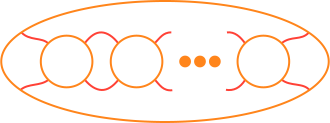
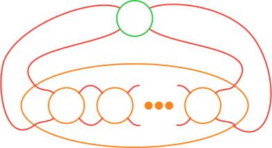
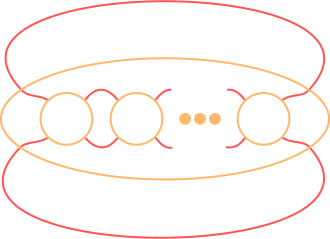
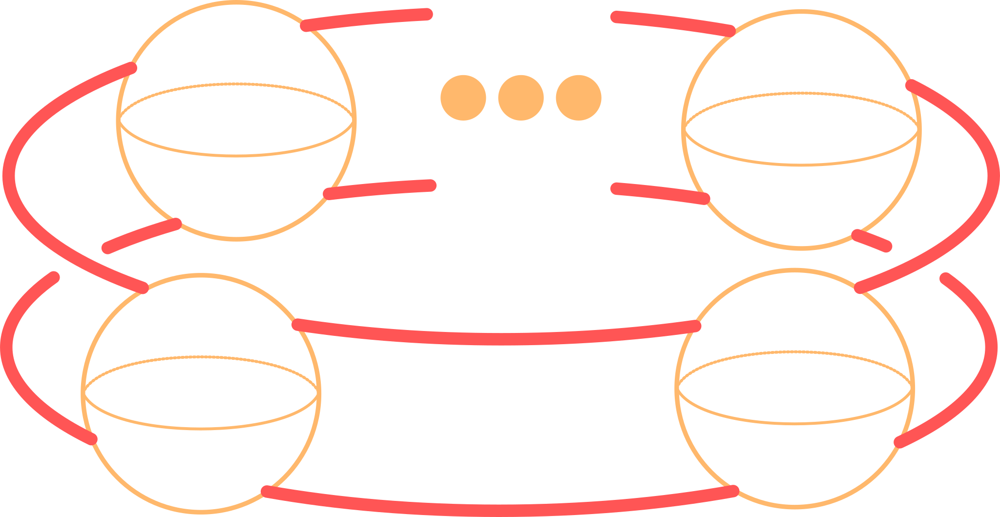

# Use Case: Weighted Arborescent Tangle Tree Notation

## Mathematical description

A construction for what they call "arborescent tangles" is given by Bonahon and
Siebenmann {cite:p}`bonahonNewGeometricSplittings2016`. The tangle construction
is a modification of their construction for the "arborescent knots(links)" of
which a brief exposition is given here.

### Arborescent part of a knot

For clarity and ease of digestion we will forgo the rigorous definition of the
arborescent part of a knot ({cite:p}`bonahonNewGeometricSplittings2016` Chapter
3). And intuitive understanding for the arborescent part of a knot is, the
collection of conway circles of the following form

```{prf:example} An arborescent vignette
:label: watt-example-1

```

A knot may have an arborescent part and a non-arborescent part, as an example we
can fill the green Conway circle below with any vignette not of the previous
type.

```{prf:example} The arborescent and non-arborescent part of a knot
:label: watt-example-2

```

```{Note}
:class: dropdown

When the green conway circle above is filled in with the basic $0$ tangle we
recover a numerator closure of a tanlge.




```

We are now prepared to give an informal definition for an arborescent knot:

```{prf:definition}
An arborescent knot is a knot where there exists a presentation with the
arborescent part of the knot as the entire knot.
```

```{Note}
:class: dropdown

The arborescent presentation may not be minimal.
```

#### Notation for arborescent knots

Drawing these vignette with fillings is a tedious and difficult process. We will
now describe a methodology for notating an arborescent knot.

##### Band Construction

Taking the arborescent part of a knot as shown in {prf:ref}`watt-example-1` we
can modify the planer projection by instead considering it as a
three-dimensional object. We take the conway circles as conway 2 spheres and the
strands between conway circles to lay on two circles connecting the spheres as
seen in the schematic below.

```{prf:example} A tree with assosiated bands
:label: watt-example-3

```

A straight forward rearrangement from here realized the red strands as the top
and bottom boundary of a cylinder and the conway spheres as oriented
quadrilateral patches. With this band construction we can model the insertion of
an arborescent vignette into one of the conway spheres as a form of Murasugi sum
(plumbing) along the quadrilateral.

##### Plumbing bands

We can now describe the plumbing operation on bands. Given two bands with two
plumbing squares, each square can be locally oriented as below

```{prf:example} Two bands
:label: watt-example-4


```

We call the green band's plumbing square orientations red $x$ and orange $y$,
similarly for the pink band $x^\prime$ and $y^\prime$. When we plumb the bands
we glue the bands together along their plumbing squares with the condition that
the orientations agree, where $x\to y^\prime$ and $y\to x^\prime$.

```{prf:example} Plumbed bands
:label: watt-example-5

```

We've so far only modeled recursive inclusions of arborescent vignettes, meaning
our Conway spheres are empty. To complete our band construction as knots we can
add a series of half-twists into our bands, giving us a model for the final
insertions of integral tangles into our Conway spheres.

```{prf:example} Two twisted bands
:label: watt-example-6


```

##### Weighted Arborescent Trees

In the previous section we gave phrasing for arborescent vignette insertions as
band plumbings. We will now give the recipie for band plumbings as a method for
building arborescent knots. To start we need a method for prescribing relative
positioning of bands, we require that each band knows:

1. How many children the band has.
2. Where a child is plumbed relative to it's siblings.
3. How many half twists are on the band.
4. Where a half twists sit relative to the child bands.

We need a data structure that encodes relative positional data, the most obvious
would be a graph, particularly a tree, we will need to modify the general
definition of a tree slightly for our purposes. We let the vertex of a graph
represent a band giving us an encoding scheme for requirements one and two by
taking the edges as plumbing squares and fixing a cyclic order on the edges
giving relative position. Now, for three and four our first reaction may be to
assign a weight to the vertex, this neglects the issues of "where" the twists
live relative to the plumbing squares (imagine moving the twists "over" one band
in the purple image above). To encode three and four we must modify our
definition of a graph, we start by considering the local picture around a
vertex, taking each edge as a "bond" (half edge). A graph under this local view
may be split as

```{prf:example} A tree split into local verticies
:label: watt-example-7

```

with a local picture around a vertex

```{prf:example} The local view of a vertex
:label: watt-example-8
{w=200px}
```

In this local view we notice that for a vertex of valence $n$ the plane is split
(like a pie) into $n$ pieces. We can assign a weight to each of these local
slices around a vertex, satisfying our need to track the relative positions of
twists and plumbing squares.

```{prf:example} A tree with assosiated bands
:label: watt-example-9

```

and gluing along edges yields bands as in

```{prf:example} Bands plumbed
:label: watt-example-10

```

##### Arborescent Tangles

Our construction to this point has been concerned exclusively with the notation
for knots, we will now give a modification of this notation for tangles. A tree,
as in {prf:ref}`watt-example-9`, can be modified to represent a tangle by
allowing a "free" bond (half edge) be attached to a vertex, that is, to allow
one band to have a non-plumbed plumbing square.

```{prf:example} Bands plumbed
:label: watt-example-11

```

##### Special Branches

In this section, we will describe a number of special branches found as portions
of weighted arborescent trees.

###### Rings

We will now describe a special subtree of the Consider a branch of a weighted
arborescent tree locally appearing as {prf:ref}`watt-example-17`.

```{prf:example} Ring graph
:label: watt-example-17

```

Now, resolving the plumbing, we arrive at bands as in
{prf:ref}`watt-example-12`.

```{prf:example} Plumbed ring bands
:label: watt-example-12

```

We should notice that the boundary of these plumbed bands has three components
when taking the free bond as a conway sphere) as seen in
{prf:ref}`watt-example-13`, the three components being denoted by the colors;
red, pink, and orange.

```{prf:example} Ring boundary
:label: watt-example-13

```

With an obvious flype and inversion of the conway sphere given by the free bond,
we can arrange our plumbed bands into the standard tangle projection seen in
{prf:ref}`watt-example-14`. This tangle projection tells us that the branch in
{prf:ref}`watt-example-11` is one of the zero or infinity tangle with a ring
around the two tangle strings.

```{prf:example} Ring Tangle
:label: watt-example-14

```

When this plumbing construction is used in practice, tree with ring branches
appear frequently, often with multiple branches as seen in the
{prf:ref}`watt-example-15`. This leaves us in a clunky notational situation, as
the rings only impact data local to the ring branch.

```{prf:example} Typical tree
:label: watt-example-15

```

We want a way to simplify our notation where rings are concerned, to do so we
simply forget any branches that form ring tangles. We instead note the count of
number of ring branches at each vertex, augmenting the vertex with the count, as
shown in {prf:ref}`watt-example-16`, we call such a tree "abbreviated."

```{prf:example} Abreviated
:label: watt-example-16

```

#### Essential vertices

Again, we take a local picture of a vertex, it's useful to partition vertices of
a tree into two classes, essential vertices and non-essential vertices. We
define an essential vertex as any vertex with valence greater than $3$ or ring
number greater than $1$. A vertex is called non-essential if it has valence
$0,1,2$ and no rings.

We see in {prf:ref}`watt-example-18` essential vertices in orange nad
non-essential in red.

```{prf:example} Abreviated
:label: watt-example-18

```

#### Sticks

The next branch class we are going to define are the sticks of a tree. To see
the sticks we first take a tree $\Gamma$. Let $\LS e_i\RS$ be the set of
essential vertices of $\Gamma$ including their bond. We call the collection
branches $\Gamma_s=\Gamma \setminus \LS e_i\RS$ the sticks of $\Gamma$ with
every connected component of $\Gamma_s$ being a stick.

As an example, consider the tree seen in {prf:ref}`watt-example-18`, the sticks
of which can be seen in {prf:ref}`watt-example-19`.

```{prf:example} Sticks of a tree
:label: watt-example-19

```

By definition a stick of a tree has 0,1,2 bonds, we call a stick with; 0 bonds
closed, 1 bond half-open, and 2 bonds open. Bonahon and Seibenman prove a
correspondence between sticks and rational tangles
{cite:p}`bonahonNewGeometricSplittings2016` particularly when a stick is open it
takes the form of the vignette seen in {prf:ref}`watt-example-21` where each
free bond forms a boundary component.

```{prf:example} Rational Vignette
:label: watt-example-21

```

## Linearization Strategy

We're now in a position we can describe a linearization strategy for our
weighted arborescent trees. With compatibility in mind, we will consider all
trees to be encoded as an abbreviated tree but not requiring a tree to actually
be abbreviated. We will make two assumptions on presentation of the tree,
weights for all vertices of valence 2 fall on the "same" side of the cyclic
order, we will give analogy to a compass in our encoding, select one of 001-179
or 181-359. When hand encoding this assumption shouldn't be to cumbersome, but
if the encoding of arbitrarily weighted two vertices is desired, simply encodes
the vertex as essential. The second assumption we will make on trees is that all
trees are assumed to be connected. If trees with multiple components are
desired, a modification must be made to the code base to interpret multiple root
vertices, this should be simple but out of scope for this project. It's worth
saying here that these requirements allow linearization of degenerate trees such
at the tree seen in {prf:ref}`watt-example-20`.

```{prf:example} Degenerate tree
:label: watt-example-20

```

Let $\Gamma$ be an arborescent tree, and arbitrarily select a vertex from
$\Gamma$ as the root {prf:ref}`watt-example-22`, we will consider the root
vertex as essential.

```{Note}
:class: dropdown

The selection of a root of a knot is arbitrary making this linearization
non-unique.
```

Starting from the root, a depth-first pre-order gives a linearization of the
vertices. Unfortunately, this fails to maintain the local structures and
particular embedding of a tree. To maintain local data, we will add four pieces
of additional data $\LP\RP,\LA\RA,\LS\RS,\text{ and }\LB\RB$, where $\LP\RP$
corresponds to an essential vertex with no ring number, $\LA\RA$ is a vertex
with ring number, $\LS\RS$ is a open stick, and $\LB\RB$ is a twist vector for a
rational tangle. We will also describe a mechanism to enforce cyclic order to
our linearization. By taking root as essential, we start the description of the
linearization with the root as the object vertex.

```{prf:example} Rooted tree
:label: watt-example-22

```

We carry out the linearization by first appending $\LP\RN$ or$\LA\RN$ depending
on if the object vertex has ring number, we then note the ring number, if any.
Next, we traverse the child vertices We will order the traversal of the children
by taking the bond connecting to the parent as 000 on a compass and traverse
children anti-clockwise, that is from $000\to270\to180\to90\to000$. While
traversing in this order, if a weight is found in a local region, we note it
before continuing to the next child {prf:ref}`UC-N-WATT-E-COMPASS`.

```{prf:example} Compass
:label: UC-N-WATT-E-COMPASS

```

If a child is essential, we start the process from the beginning with the child
vertex as the root of the branch. If the child is not essential, we continue
traversing until we reach a vertex of valence one or an essential vertex. If we
reach a vertex of valence one we have traversed a half open stick and we append
that stick as the twist vector for the corresponding rational tangle. However,
if we arrive at an essential vertex we have traversed a open stick. In this case
we append $\LS\RN$ followed by the twist vector for the open stick, we then
carry out the algorithm again from the beginning with the essential vertex as
the root of a new branch. When we have exhausted the children for the object
vertex we close our linearization for that vertex with the matching $\LN\RP$ or
$\LN\RS$, and return to the parent linearization until all parents have been
exhausted. An example of a tree encoded with this strategy can be seen in
{prf:ref}`watt-example-23`.

```{prf:example} Encoded tree
:label: watt-example-23

```

## Bibliography

```{bibliography}
   :filter: docname in docnames
```

```{raw} latex
    \newpage
```