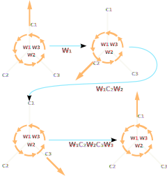

# Use Case: Weighted Planar Tree Notation

## Mathematical description

#### Notation for arborescent knots

##### Bands and Plumbing Squares

Our first step in describing a notation for the arborescent knots
{cite:p}`bonahonNewGeometricSplittings2016` is describing a plumbing operation
on bands. A band with a plumbing square is a band $S^1x[0,1]$, along with an
oriented square on the band such that two of the sides of the square intersect
the boundary of the band. Two examples of bands with plumbing squares can be
seen in {prf:ref}`UC-N-APN-E-4`, note in the pink band the square should be
viewed as looking through the surface of the band. That is a half rotation of
the band will yield a plumbing square matching the green band.

```{prf:example} Two bands
:label: UC-N-APN-E-4


```

##### Plumbing bands

We will now glue the bands seen {prf:ref}`UC-N-APN-E-4` together with an
operation called plumbing. Consider the orientation given in green band's
plumbing square. We will call the red arrow $x$ and the orange arrow $y$,
similarly for the pink band $x^\prime$ and $y^\prime$.

We plumb the bands together along their plumbing squares with the requirement
that the orientation labels are mapped $x\to y^\prime$ and $y\to x^\prime$.
Finally, we then forget the boundaries of the plumbing square, leaving only the
joined boundaries of the bands. The result of plumbing as well as a local
picture for plumbing can be seen in {prf:ref}`UC-N-APN-E-5`.

<!-- prettier-ignore-start -->

````{prf:example} Plumbed bands
:label: UC-N-APN-E-5

```{list-table}
:widths: 50 50
:width: 100%

*   -   
    -   
```
````
<!-- prettier-ignore-end -->

To complete our band construction for knots prior to plumbing we add a series of
half-twists into our bands with plumbing squares, seen in
{prf:ref}`UC-N-APN-E-6` and {prf:ref}`UC-N-APN-E-25`. When forming the half
twists we have two options for direction, we call one positive and one negative.
A positive twist results in the "closer" boundary component having a positive
slope, negative likewise. It is important to note that the twists appear in
unique regions of the band which are determined by relative position of plumbing
squares.

<!-- prettier-ignore-start -->
`````{list-table}
:width: 100%

*   -   ````{prf:example}
        :label: UC-N-APN-E-6
        ```{image} ../media/bands/arbor_band_with_twist.svg
            :width: 20em
            :align: center
        ```
        <br/><br/>
        Band with two negative half twists<br/> and three plumbing squares.
        ````
    -   ````{prf:example}
        :label: UC-N-APN-E-25
        ```{image} ../media/bands/arbor_band_with_twist_2.svg
            :width: 20em
            :align: center
        ```
        <br/><br/>
         Band with three positive half twists <br/>and one plumbing square.
        ````
`````
<!-- prettier-ignore-end -->

It's Combining these half twisted bands together with plumbing yields objects
similar to those seen in {prf:ref}`UC-N-APN-E-10`. We require that no sequence
of plumbing forms a cycle. Finally, turning {prf:ref}`UC-N-APN-E-10` into a knot
is as simple as forgetting the two cell leaving only the boundary, seen in
{prf:ref}`UC-N-APN-E-24`.

<!-- prettier-ignore-start -->
````{list-table}
:widths: 50 50
:width: 100%

*   -   ```{prf:example} Bands plumbed
        :label: UC-N-APN-E-10
        
        ```
    -   ```{prf:example} An arborescent knot
        :label: UC-N-APN-E-24
        
        ```
````
<!-- prettier-ignore-end -->

##### Weighted Planar Trees

We now develop a combinatorial recipe for constructing knots from a collection
of plumbing bands. This recipe will take the form of a tree, in the graph
theoretic sense, structure describing the collection of plumbing bands and how
they are plumbed together. Before we begin constructing this combinatorial
notation we need to define some labels for relative positions of bands in the
smooth setting. This language will be reused when we transition to the more
combinatorial setting.

```{prf:definition} Relationships of Bands
:label: apn-def-1
Given a band $B$ with plumbing squares, we call the set $C$ of bands
plumbed to $B$ the **children** of $B$. Additionally, for $c\in C$ we call $B$
the **parent** of $c$ and the collection of $C-\LS c \RS$ the
**siblings of $C$**.
```

Our goal is to take arborescent knots in the smooth setting built form plumbed
bands and distill the essential information into a combinatorial context. The
essential information we need to encode from the smooth setting is as follows:

-   The parent child relationship of bands
-   The relative positions of plumbing squares and twists on a band

Tackling first the encoding of parent child relationships. There are many
combinatorial structures that can encode data similar to our required. Perhaps
the most commonly used structure that can encode this data is an abstract graph,
and since our data is acyclic specifically an abstract tree. The data for the
parent child relationships can be encoded by mapping bands to vertices and
plumbing relationships to edges.

Unfortunately, since an abstract tree doesn't maintain an order for child
vertices it fails for the second piece of essential information. To solve this
problem we will define a modified version of an abstract tree, the **rooted
plane tree**.

```{prf:definition} Rooted Plane Tree
:label: apn-def-1

A **rooted plane tree** is an abstract tree with imbued with a strict total
order on the vertices. We call the least vertex the **root** of the tree.
```

The set of vertices in a tree is discrete, so we can order the set with positive
integer labels. Observe that in a rooted plane tree for each vertex $v$ the
children of $v$ have an order inherited from the total order. For convenience,
we will now place a convention on the order of a rooted plane tree. Let $\Gamma$
be a rooted plane tree, $r$ be the root of $\Gamma$, and $v_i\neq r$ be a
vertex, with parent $p$. Further assume $v_i$ has order $i$, $p$ has order $j$
and the children $c_1,\,\cdots,\,c_n$ of $v$ have order $k_1,\,\cdots,\,k_n$. We
require that an order on a rooted plane tree satisfy the following:

-   $r$ has order $1$
-   $j<i<k_1<\cdots k_n$

With this order requirement a non-root vertex has a clear cyclic order starting
from the parent vertex and increasing. This yields a unique embedding of
$\Gamma$ into the plane.

The additional structure of rooted plane trees gives us a method for encoding
relative positions of plumbing squares. The final data we need to record is the
position and count of half twists relative to plumbing squares. We start by
considering the local picture around a vertex {prf:ref}`UC-N-APN-E-8` consisting
of a vertex and a collection of bonds (half-edges) associated to plumbing
squares.

````{prf:example} The local view of a vertex
:label: UC-N-APN-E-8
```{image} ../media/bands/arbor_graph_split_local.svg
            :width: 20em
            :align: center
```
````

We observed earlier that the half twists on a band must lay in a unique region
determined by position relative to plumbing squares. This placement can be
recreated in a rooted plane tree by annotating the local view of a vertex in
{prf:ref}`UC-N-APN-E-8` with an integer placed in the spaces between bonds. The
relationship between a plumbing band and a weighted vertex in a rooted plane
tree can be seen in {prf:ref}`UC-N-APN-E-7`.

````{prf:example} The local view of a vertex with weight
:label: UC-N-APN-E-7
```{image} ../media/bands/arbor_graph_split_local_with_band.svg
            :align: center
```
````

We can see a full example of a tree with its associated plumbed construction in
{prf:ref}`UC-N-APN-E-27`. We call this fully realized combinatorial recipe a
**Weighted Planar tree**.

<!-- prettier-ignore-start -->

````{prf:example} Weighted Planar Trees and Plumbed Bands
:label: UC-N-APN-E-27

```{list-table}
:widths: 50 50
:width: 100%

*   -   
    -   
```
````
<!-- prettier-ignore-end -->

##### Weighted Planar Tangle Trees

Our construction to this point has been concerned exclusively with the notation
for knots, we will now give a modification of this notation for tangles. A tree,
as in {prf:ref}`UC-N-APN-E-9`, can be modified to represent a tangle by allowing
a "free" bond be attached to a vertex, that is, to allow one band to have a
non-plumbed plumbing square. We can realize the non-plumbed square a Conway
circle for a two string tangle.

````{prf:example} Plane tree and plumbed bands
:label: UC-N-APN-E-11

```{list-table}
:widths: 50 50
:width: 100%

*   -   
    -   
```
````

##### Anatomy of a tree

In this section, we will describe a number of special portions of weighted
planar trees.

###### Rings

We will now describe a special subtree of a weighted planar tree locally
appearing as {prf:ref}`UC-N-APN-E-17`.

```{prf:example} Ring graph
:label: UC-N-APN-E-17

```

Now, resolving the plumbing, we arrive at bands as in {prf:ref}`UC-N-APN-E-12`.

```{prf:example} Plumbed ring bands
:label: UC-N-APN-E-12

```

Notice that the boundary of these plumbed bands has three components as seen in
{prf:ref}`UC-N-APN-E-13`.

```{prf:example} Ring boundary
:label: UC-N-APN-E-13

```

With an obvious flype and inversion of the Conway circle given by the
non-plumbed square, we can arrange our plumbed bands into the standard tangle
projection seen in {prf:ref}`UC-N-APN-E-14`. This tangle projection tells us
that the subtree in {prf:ref}`UC-N-APN-E-11` is one of the zero or infinity
tangle with a ring.

```{prf:example} Ring Tangle
:label: UC-N-APN-E-14

```

In practice trees with ring subtrees appear frequently, often with multiple
subtrees attached to a single vertex as seen in the {prf:ref}`UC-N-APN-E-15`.
This leaves us in a clunky notational situation, as the rings only impact data
local to the ring subtree.

```{prf:example} Typical tree
:label: UC-N-APN-E-15

```

To simplify our notation where rings are concerned, we simply forget any
subtrees that form ring tangles. We instead note the count of number of ring
subtrees at each vertex, augmenting the vertex with the count, as shown in
{prf:ref}`UC-N-APN-E-16`, we call such a tree "abbreviated."

```{prf:example} Abreviated
:label: UC-N-APN-E-16

```

#### Essential vertices

Shifting away from special subtrees for a moment we again consider a local
picture of a vertex. It is useful during computation on weighted planar trees to
partition vertices into two classes, essential vertices and non-essential
vertices.

```{prf:definition} Essential vertex
:label: apn-def-2
We define an **essential vertex** as any vertex with valence
greater than $3$ or ring number greater than $1$. A vertex is called
non-essential if it has valence $0,1,2$ and no rings.
```

```{prf:definition} Non-essential vertex
:label: apn-def-3
A vertex is called
non-essential if it has valence $0,1,2$ and no rings.
```

We see in {prf:ref}`UC-N-APN-E-18` essential vertices in orange and
non-essential in red.

```{prf:example} Abreviated
:label: UC-N-APN-E-18

```

#### Sticks

The final important portion in the anatomy of a tree is to describe the sticks
of a tree.

```{prf:definition} Sticks of a weighted planar tree
:label: apn-def-1
Let $\Gamma$ be a weighted planar tree and $\LS e_i\RS$ be the set of essential
vertices of $\Gamma$ including their bonds. We call the collection subtrees
$\Gamma_s=\Gamma \setminus \LS e_i\RS$ the **sticks** of $\Gamma$ and every
connected component of $\Gamma_s$ a **stick**.
```

As an example, consider the tree seen in {prf:ref}`UC-N-APN-E-18`, the sticks of
which can be seen in {prf:ref}`UC-N-APN-E-19`.

```{prf:example} Sticks of a tree
:label: UC-N-APN-E-19

```

By construction a stick of a tree has 0,1, or 2 free bonds, we call a stick
with; 0 free bonds closed, 1 free bond half-open, and 2 free bonds open.

<!-- prettier-ignore-start -->
:::{seealso} Correspondence between sticks and rational tangles
:class: dropdown

Bonahon and Seibenman prove a correspondence between sticks and rational tangles
{cite:p}`bonahonNewGeometricSplittings2016` particularly when a stick is open it
takes the form of the vignette seen below where each free bond forms a boundary
component.


:::
<!-- prettier-ignore-end -->

## Linearization Strategy

The weighted planar trees we have developed thus far is a useful tool for work
on arborescent knots by human or machine. Unfortunately, the weighted planar
trees as we have seen them so far are difficult to store in a computer database.
We will rectify this by introducing a linearization strategy for weighted planar
trees. We make an assumption on presentation of our weighted planar trees, that
weights for all vertices of valence 2 fall in the second order position.

### Linearizing a vertex

We start by describing the linearization of a single vertex. Let $\Gamma$ be a
weighted plane tree and $\Gamma_v$ be a vertex $v$ of $\Gamma$ along with its
bonds and weights, see {prf:ref}`UC-N-APN-E-30`. A total order can be on the
bonds of $v$ so that the order of bonds aligns with the order of children of $v$
in $\Gamma$, by convention the lowest index child is the parent of $v$. When
realizing the $\Gamma_v$ in the plane we let $c_1$ point up.

````{prf:example} The local view of a vertex
:label: UC-N-APN-E-30
```{image} ../media/bands/arbor_graph_split_local_1.svg
            :width: 20em
            :align: center
```
````

The order of children induces a cyclic order in the plane starting with the
parent bond, in the up position. Leveraging this, our strategy for linearizing
$\Gamma_v$ is to follow the cyclic order listing the weights and children in
sequence. We can think of this as an arm sweeping out from the parent bond
picking off the data of each weight as it sweeps through, this can be seen in
{prf:ref}`UC-N-UC-N-APN-E-COMPASS`.

```{prf:example}
:label: UC-N-UC-N-APN-E-COMPASS

```

### Walking the tree

To expand the local method to capture the whole weighted planar tree we need a
method to move from $\Gamma_v$ to a child while recording this decent. We will
descend the tree in a depth-first order. We will annotate our local
linearization with four sets of delimiters that delimit the change in depth in
the tree, that is moving from parent to child. Each delimiter also communicates
extra information about the subtree it is delimiting. The four sets of
delimiters are as follows:

-   $\LP\RP$: Corresponds to an essential vertex with no ring number.
-   $\LA\RA$: Corresponds to an essential vertex with ring number.
-   $\LS\RS$: Corresponds to an open stick. This is an optional delimiter.
-   $\LB\RB$: Corresponds to a half open stick and is interpreted as a twist
    vector for a rational tangle.

We will now walk through an example of the linearization process. Let $\Gamma$
be a weighted planar tree, and $v$ an arbitrarily select a vertex from $\Gamma$
as the root {prf:ref}`UC-N-APN-E-22`, we will consider the root vertex as
essential. Starting from the root we descend the tree in a depth-first order,
this makes the root our first **object vertex**.

```{prf:example} Rooted tree
:label: UC-N-APN-E-22

```

```{Note}
:class: dropdown

The selection of a root of a knot is arbitrary making this linearization
non-unique.
```

Appending $\LP\RN$ or$\LA\RN$ depending on if the object vertex has ring number,
we then note the ring number, if any. Next, we sweep out the local picture as
discussed in previously. However, when we encounter a child bond we descend to
the child. If the child is essential, we start the process from the beginning
with the child vertex as the root of the subtree. If the child is not essential,
we continue traversing until we reach a vertex of valence one or an essential
vertex. If we reach a vertex of valence one we have traversed a half open stick,
and we append that stick as the twist vector for the corresponding rational
tangle. However, if we arrive at an essential vertex we have traversed an open
stick. In this case, if we are using the optional delimiter append $\LS\RN$
followed by the twist vector for the open stick, we then carry out the algorithm
again from the beginning with the essential vertex as the root of a new subtree.
If we are not using the optional delimiter we traverse the open stick from its
root pretending each vertex is essential.


When we have exhausted the children for the object vertex we close our
linearization for that vertex with the matching $\LN\RP$ or $\LN\RS$, and return
to the parent linearization until all parents have been exhausted. An example of
a tree encoded with this strategy can be seen in {prf:ref}`UC-N-APN-E-23`.

```{prf:example} Encoded tree with and without optional delimiter
:label: UC-N-APN-E-23

```

## Bibliography

```{bibliography}
   :filter: docname in docnames
```
