# Use Case: Weighted Planar Tree Notation

## Mathematical description

#### Notation for arborescent knots

##### Bands and Plumbing Squares

Our first step in describing a notation for the arborescent knots
{cite:p}`bonahonNewGeometricSplittings2016` is describing a plumbing operation
on bands. A band with a plumbing square is a band $S^1x[0,1]$, along with an
oriented square on the band such that two of the sides of the square intersect
the boundary of the band. Two examples of bands with plumbing squares can be
seen in {prf:ref}`apn-example-4`, note in the pink band the square should be
viewed as looking through the surface of the band. That is a half rotation of
the band will yield a plumbing square matching the green band.

```{prf:example} Two bands
:label: apn-example-4


```

##### Plumbing bands

We will now glue the bands seen {prf:ref}`apn-example-4` together with an
operation called plumbing. Consider the orientation given in green band's
plumbing square. We will call the red arrow $x$ and the orange arrow $y$,
similarly for the pink band $x^\prime$ and $y^\prime$.

We plumb the bands together along their plumbing squares with the requirement
that the orientation labels are mapped $x\to y^\prime$ and $y\to x^\prime$.
Finally, we then forget the boundaries of the plumbing square, leaving only the
joined boundaries of the bands. The result of plumbing as well as a local
picture for plumbing can be seen in {prf:ref}`apn-example-5`.

<!-- prettier-ignore-start -->

````{prf:example} Plumbed bands
:label: apn-example-5

```{list-table}
:widths: 50 50
:width: 100%

*   -   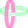
    -   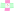
```
````
<!-- prettier-ignore-end -->

To complete our band construction for knots prior to plumbing we add a series of
half-twists into our bands with plumbing squares, seen in
{prf:ref}`apn-example-6` and {prf:ref}`apn-example-25`. When forming the half
twists we have two options for direction, we call one positive and one negative.
A positive twist results in the "closer" boundary component having a positive
slope, negative likewise. It is important to note that the twists appear in
unique regions of the band which are determined by relative position of plumbing
squares.

<!-- prettier-ignore-start -->
`````{list-table}
:width: 100%

*   -   ````{prf:example}
        :label: apn-example-6
        ```{image} ../media/bands/arbor_band_with_twist.svg
            :width: 20em
            :align: center
        ```
        <br/><br/>
        Band with two negative half twists<br/> and three plumbing squares.
        ````
    -   ````{prf:example}
        :label: apn-example-25
        ```{image} ../media/bands/arbor_band_with_twist_2.svg
            :width: 20em
            :align: center
        ```
        <br/><br/>
         Band with three positive half twists <br/>and one plumbing square.
        ````
`````
<!-- prettier-ignore-end -->

It's Combining these half twisted bands together with plumbing yields objects
similar to those seen in {prf:ref}`apn-example-10`. We require that no sequence
of plumbing forms a cycle. Finally, turning {prf:ref}`apn-example-10` into a
knot is as simple as forgetting the two cell leaving only the boundary, seen in
{prf:ref}`apn-example-24`.

<!-- prettier-ignore-start -->
````{list-table}
:widths: 50 50
:width: 100%

*   -   ```{prf:example} Bands plumbed
        :label: apn-example-10
        
        ```
    -   ```{prf:example} An arborescent knot
        :label: apn-example-24
        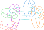
        ```
````
<!-- prettier-ignore-end -->

##### Weighted Planar Trees

We now develop a combinatorial recipe for constructing knots from a collection
of plumbing bands. This recipe will take the form of a tree, in the graph
theoretic sense, structure describing the collection of plumbing bands and how
they are plumbed together. Before we begin constructing this combinatorial
notation we need to define some labels for relative positions of bands in the
smooth setting. This language will be reused when we transition to the more
combinatorial setting.

```{prf:definition} Relationships of Bands
:label: apn-def-1
Given a band $B$ with plumbing squares, we call the set $C$ of bands
plumbed to $B$ the **children** of $B$. Additionally, for $c\in C$ we call $B$
the **parent** of $c$ and the collection of $C-\LS c \RS$ the
**siblings of $C$**.

```

Our goal is to take arborescent knots in the smooth setting built form plumbed
bands and distill the essential information into a combinatorial context. The
essential information we need to encode from the smooth setting is as follows:

-   The parent child relationship of bands
-   The relative positions of plumbing squares and twists on a band

Tackling first the encoding of parent child relationships. There are many
combinatorial structures that can encode data similar to our required. Perhaps
the most commonly used structure that can encode this data is an abstract graph,
and since our data is acyclic specifically an abstract tree. The data for the
parent child relationships can be encoded by mapping bands to vertices and
plumbing relationships to edges.

Unfortunately, since an abstract tree doesn't maintain an order for child
vertices it fails for the second piece of essential information. To solve this
problem we will define a modified version of an abstract tree, the **rooted
plane tree**.

```{prf:definition} Rooted Plane Tree
:label: apn-def-1

A **rooted plane tree** is an abstract tree with imbued with a strict total
order on the vertices. We call the least vertex the **root** of the tree.
```

The set of vertices in a tree is discrete, so we can order the set with positive
integer labels. Observe that in a rooted plane tree for each vertex $v$ the
children (along with a potential parent) of $v$ have an order inherited from the
total order. The additional structure of rooted plane trees gives us a method
for encoding relative positions of plumbing squares. The final data we need to
record is the position and count of half twists relative to plumbing squares. We
start by considering the local picture around a vertex {prf:ref}`apn-example-8`
consisting of a vertex and a collection of bonds (half-edges) associated to
plumbing squares.

````{prf:example} The local view of a vertex
:label: apn-example-8
```{image} ../media/bands/arbor_graph_split_local.svg
            :width: 20em
            :align: center
```
````

We observed earlier that the half twists on a band must lay in a unique region
determined by position relative to plumbing squares. This placement can be
recreated in a rooted plane tree by annotating the local view of a vertex in
{prf:ref}`apn-example-8` with an integer placed in the spaces between bonds. The
relationship between a plumbing band and a weighted vertex in a rooted plane
tree can be seen in {prf:ref}`apn-example-7`.

````{prf:example} The local view of a vertex with weight
:label: apn-example-7
```{image} ../media/bands/arbor_graph_split_local_with_band.svg
            :align: center
```
````

We can see a full example of a tree with its associated plumbed construction in
{prf:ref}`apn-example-27`. We call this fully realized combinatorial recipe a
**Weighted Planar tree**.

<!-- prettier-ignore-start -->

````{prf:example} Weighted Planar Trees and Plumbed Bands
:label: apn-example-27

```{list-table}
:widths: 50 50
:width: 100%

*   -   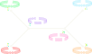
    -   
```
````
<!-- prettier-ignore-end -->

##### Weighted Planar Tangle Trees

Our construction to this point has been concerned exclusively with the notation
for knots, we will now give a modification of this notation for tangles. A tree,
as in {prf:ref}`apn-example-9`, can be modified to represent a tangle by
allowing a "free" bond be attached to a vertex, that is, to allow one band to
have a non-plumbed plumbing square. We can realize the non-plumbed square a
Conway circle for a two string tangle.

````{prf:example} Plane tree and plumbed bands
:label: apn-example-11

```{list-table}
:widths: 50 50
:width: 100%

*   -   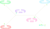
    -   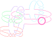
```
````

##### Anatomy of a tree

In this section, we will describe a number of special portions of weighted
planar trees.

###### Rings

We will now describe a special subtree of a weighted planar tree locally
appearing as {prf:ref}`apn-example-17`.

```{prf:example} Ring graph
:label: apn-example-17
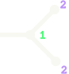
```

Now, resolving the plumbing, we arrive at bands as in {prf:ref}`apn-example-12`.

```{prf:example} Plumbed ring bands
:label: apn-example-12

```

We should notice that the boundary of these plumbed bands has three components
as seen in {prf:ref}`apn-example-13`, the three components being denoted by the
colors; red, pink, and orange.

```{prf:example} Ring boundary
:label: apn-example-13

```

With an obvious flype and inversion of the Conway circle given by the free bond,
we can arrange our plumbed bands into the standard tangle projection seen in
{prf:ref}`apn-example-14`. This tangle projection tells us that the branch in
{prf:ref}`apn-example-11` is one of the zero or infinity tangle with a ring
around the two tangle strings.

```{prf:example} Ring Tangle
:label: apn-example-14

```

When this plumbing construction is used in practice, tree with ring branches
appear frequently, often with multiple branches as seen in the
{prf:ref}`apn-example-15`. This leaves us in a clunky notational situation, as
the rings only impact data local to the ring branch.

```{prf:example} Typical tree
:label: apn-example-15
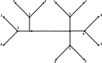
```

We want a way to simplify our notation where rings are concerned, to do so we
simply forget any branches that form ring tangles. We instead note the count of
number of ring branches at each vertex, augmenting the vertex with the count, as
shown in {prf:ref}`apn-example-16`, we call such a tree "abbreviated."

```{prf:example} Abreviated
:label: apn-example-16
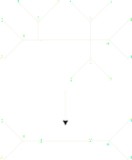
```

#### Essential vertices

Again, we take a local picture of a vertex, it's useful to partition vertices of
a tree into two classes, essential vertices and non-essential vertices. We
define an essential vertex as any vertex with valence greater than $3$ or ring
number greater than $1$. A vertex is called non-essential if it has valence
$0,1,2$ and no rings.

We see in {prf:ref}`apn-example-18` essential vertices in orange nad
non-essential in red.

```{prf:example} Abreviated
:label: apn-example-18
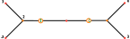
```

#### Sticks

The next branch class we are going to define are the sticks of a tree. To see
the sticks we first take a tree $\Gamma$. Let $\LS e_i\RS$ be the set of
essential vertices of $\Gamma$ including their bond. We call the collection
branches $\Gamma_s=\Gamma \setminus \LS e_i\RS$ the sticks of $\Gamma$ with
every connected component of $\Gamma_s$ being a stick.

As an example, consider the tree seen in {prf:ref}`apn-example-18`, the sticks
of which can be seen in {prf:ref}`apn-example-19`.

```{prf:example} Sticks of a tree
:label: apn-example-19
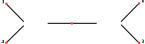
```

By definition a stick of a tree has 0,1,2 bonds, we call a stick with; 0 bonds
closed, 1 bond half-open, and 2 bonds open. Bonahon and Seibenman prove a
correspondence between sticks and rational tangles
{cite:p}`bonahonNewGeometricSplittings2016` particularly when a stick is open it
takes the form of the vignette seen in {prf:ref}`apn-example-21` where each free
bond forms a boundary component.

```{prf:example} Rational Vignette
:label: apn-example-21

```

## Linearization Strategy

We're now in a position we can describe a linearization strategy for our
weighted planar trees. With compatibility in mind, we will consider all trees to
be encoded as an abbreviated tree but not requiring a tree to actually be
abbreviated. We will make two assumptions on presentation of the tree, weights
for all vertices of valence 2 fall on the "same" side of the cyclic order, we
will give analogy to a compass in our encoding, select one of 001-179 or
181-359. When hand encoding this assumption shouldn't be to cumbersome, but if
the encoding of arbitrarily weighted two vertices is desired, simply encodes the
vertex as essential. The second assumption we will make on trees is that all
trees are assumed to be connected. If trees with multiple components are
desired, a modification must be made to the code base to interpret multiple root
vertices, this should be simple but out of scope for this project. It's worth
saying here that these requirements allow linearization of degenerate trees such
at the tree seen in {prf:ref}`apn-example-20`.

```{prf:example} Degenerate tree
:label: apn-example-20
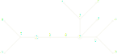
```

Let $\Gamma$ be an planar tree, and arbitrarily select a vertex from $\Gamma$ as
the root {prf:ref}`apn-example-22`, we will consider the root vertex as
essential.

```{Note}
:class: dropdown

The selection of a root of a knot is arbitrary making this linearization
non-unique.
```

Starting from the root, a depth-first pre-order gives a linearization of the
vertices. Unfortunately, this fails to maintain the local structures and
particular embedding of a tree. To maintain local data, we will add four pieces
of additional data $\LP\RP,\LA\RA,\LS\RS,\text{ and }\LB\RB$, where $\LP\RP$
corresponds to an essential vertex with no ring number, $\LA\RA$ is a vertex
with ring number, $\LS\RS$ is a open stick, and $\LB\RB$ is a twist vector for a
rational tangle. We will also describe a mechanism to enforce cyclic order to
our linearization. By taking root as essential, we start the description of the
linearization with the root as the object vertex.

```{prf:example} Rooted tree
:label: apn-example-22
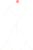
```

We carry out the linearization by first appending $\LP\RN$ or$\LA\RN$ depending
on if the object vertex has ring number, we then note the ring number, if any.
Next, we traverse the child vertices We will order the traversal of the children
by taking the bond connecting to the parent as 000 on a compass and traverse
children anti-clockwise, that is from $000\to270\to180\to90\to000$. While
traversing in this order, if a weight is found in a local region, we note it
before continuing to the next child {prf:ref}`UC-N-apn-E-COMPASS`.

```{prf:example} Compass
:label: UC-N-apn-E-COMPASS

```

If a child is essential, we start the process from the beginning with the child
vertex as the root of the branch. If the child is not essential, we continue
traversing until we reach a vertex of valence one or an essential vertex. If we
reach a vertex of valence one we have traversed a half open stick and we append
that stick as the twist vector for the corresponding rational tangle. However,
if we arrive at an essential vertex we have traversed a open stick. In this case
we append $\LS\RN$ followed by the twist vector for the open stick, we then
carry out the algorithm again from the beginning with the essential vertex as
the root of a new branch. When we have exhausted the children for the object
vertex we close our linearization for that vertex with the matching $\LN\RP$ or
$\LN\RS$, and return to the parent linearization until all parents have been
exhausted. An example of a tree encoded with this strategy can be seen in
{prf:ref}`apn-example-23`.

```{prf:example} Encoded tree
:label: apn-example-23
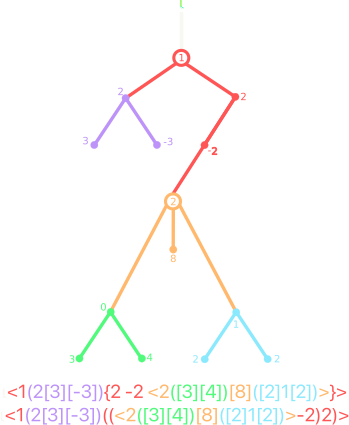
```

## Bibliography

```{bibliography}
   :filter: docname in docnames
```
