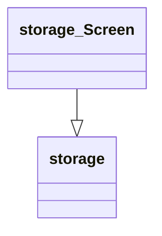

# @@@TODO Use Case: Screen Storage

```mermaid
classDiagram
    storage_Screen --|> storage
```

## Language

C++

## Implements

[Interface](../storage/interface.md)

## Libraries

## Functionality