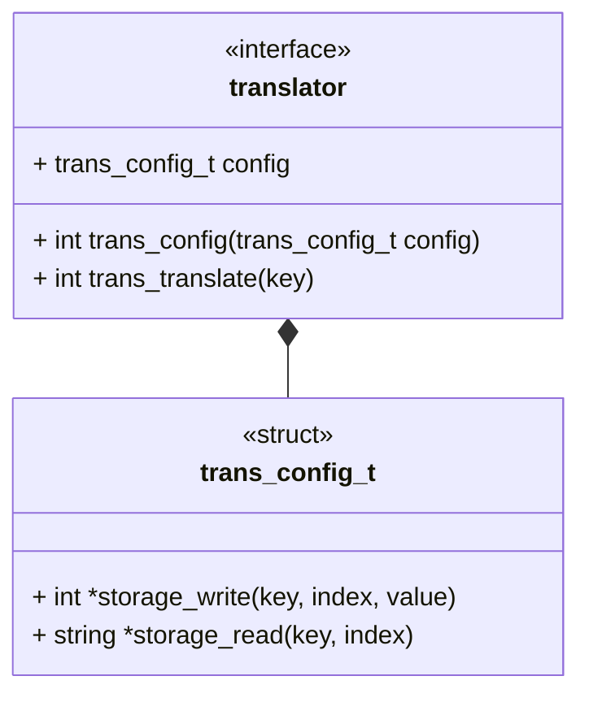

# @@@TODO Use Case: Translator Interface



## Brief

This interface describes a generic storage module to be consumed by generation
modules. The main data type on the interfaces is a `string`. We pick string
since anything in LTS needs to be human consumable.


```{raw} latex
    \newpage
```