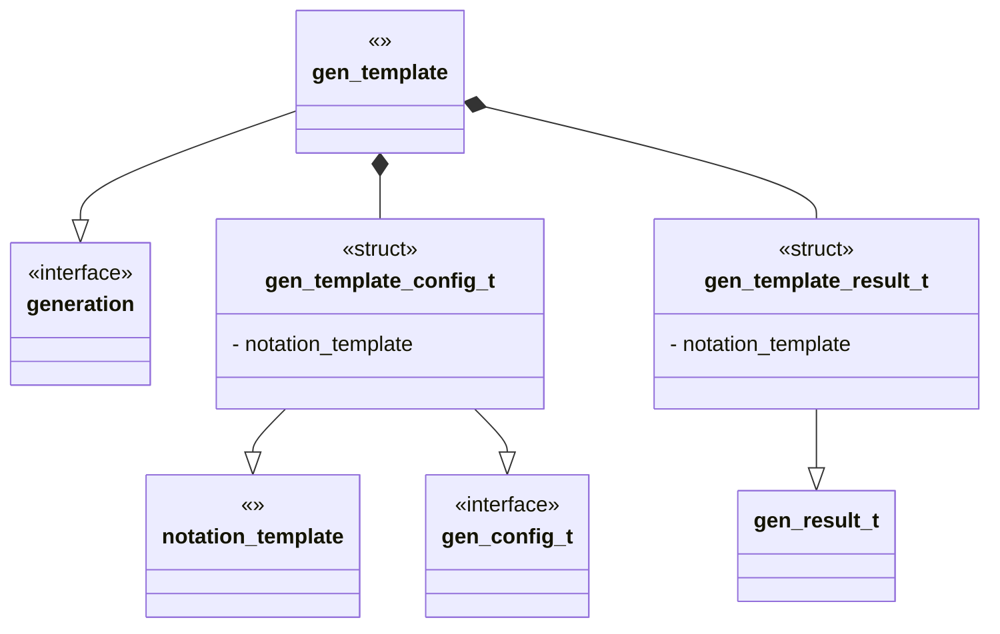

# Unit Description

```{note}
A block diagram for the component under development
```



## Language

```{note}
A description of the language the feature is implemented in.
```

## Implements

```{note}
A list of interfaces implemented by the feature.
```

- [generation Interface](../../docs/unit_description/generation-interface.md)

## Uses

```{note}
A list of components and libraries used by the feature.
```

## External Libraries

```{note}
A list of external components and libraries used by the feature.
```

## Functionality

### Public

#### Structures

##### config structure

```
A struct description of the generation config.
```

##### result structure

```
A struct description of the generation config.
```

#### Functions

##### gen_config function

```{note}
A function description for the config interface.
```

##### gen_generate function

```{note}
A function description for the compute interface.
```

### Private

#### Structures

```
A list of private structures for the notation.
```

#### Function

```{note}
A list of function descriptions for private functions.
```

## Validation

```{note}
This section contains the unit level test description for the component. Each
test that will be implemented should be described here. This should happen at
the same time you are describing the functionality above, NOT after implementing
the features.
```

### Public interface #1

#### Positive Tests

```{note}
A list of positive test cases for the public interface. A positive test
validates that the good path works. Feed the interface good input and expect
good output.
```

##### Test #1

```{note}
A description of the goal of the unit test and how it will be carried out.
```

###### Inputs:

```{note}
A list/description of input for the test.
```

###### Expected Output:

```{note}
A description of what output is expected to be for the test.
```

#### Negative Tests

```{note}
A list of negative test cases for the public interface. A negative test
validates that the bad path works. Feed the interface bad input and expect
correct error handling. This might include boundary checking a list or malformed
input strings.
```

##### Test #2

```{note}
A description of the goal of the unit test and how it will be carried out.
```

###### Inputs:

```{note}
A list/description of input for the test.
```

## Doxygen Documentation

```{doxygenfile} template.h

```

```{doxygenfile} template.c

```

## Bibliography

```{bibliography}
   :filter: docname in docnames
```

```{raw} latex
    \newpage
```
