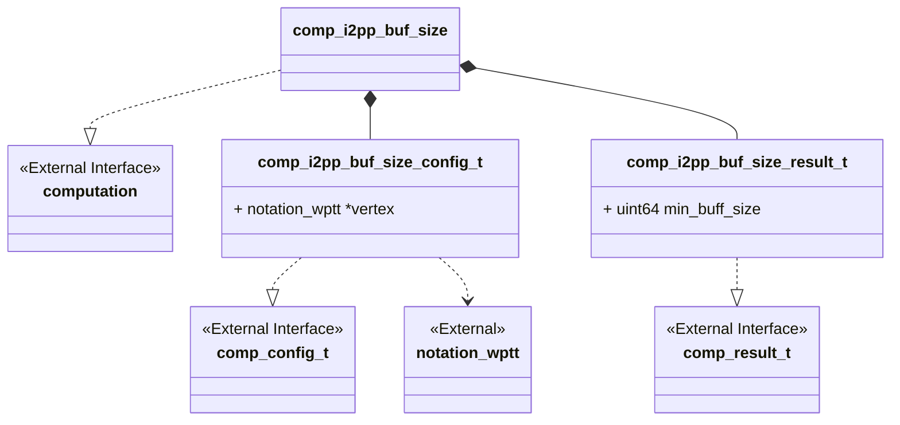
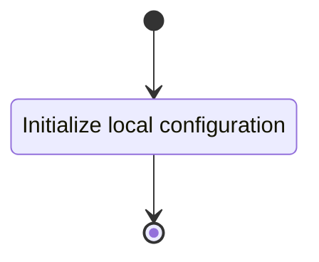
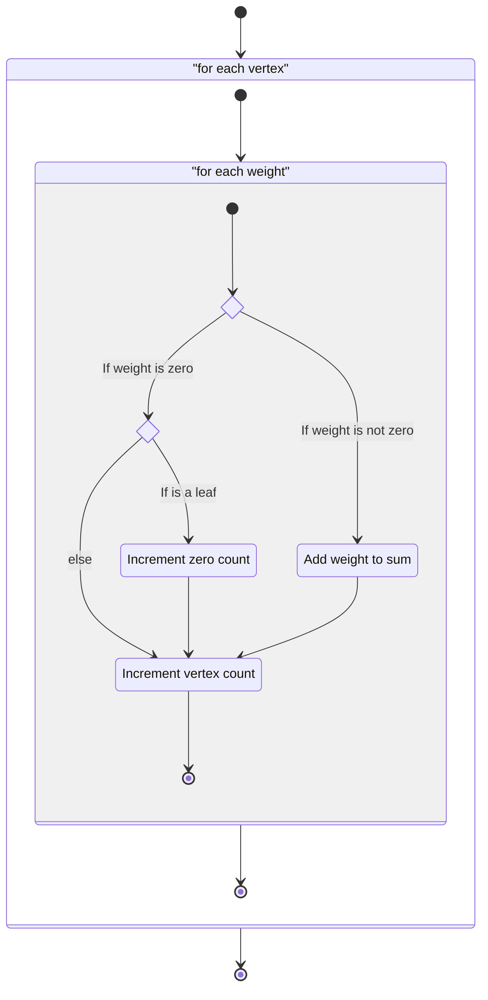

# Unit Description

## Class Diagram

## Language

C

## Implements

- [Computation Interface][interface-computation]

## Uses

- [Notation Weighted Planar Tangle Tree][note-wptt]

## Libraries

None

## Functionality

### Public Structures

#### Configuration Structure

The configuration structure contains the data needed for computing the canonicity of a vertex of an
input arborescent tangle.

This includes:

- A pointer to a ITT.

#### Result Structure

The result structure contains the minimum required size of buffer for the tree.

### Public Functions

#### Configuration Function

The configuration function sets the local configuration variable of the computation.

This process is described in the following state machines:

#### Compute Function

The compute function determines the minimum size of buffer needed for converting the ITT to a PL
path. The function may contain sub-machines that can be broken out into functions in the
implementation. The walk the tree function should be implemented with a stack-base iterative
approach.

This process is described in the following state machines:

#### Result Function

When this function is invoked, the result of the vertex canonicity computation process is reported.

## Validation

### Configuration Function

#### Positive Tests

> [!test-card] "Valid Configuration"
>
> A valid configuration for the computation is passed to the function.
>
> **Inputs:**
>
>   - A valid configuration.
>
> **Expected Output:**
>
>    A positive response.

#### Negative Tests

> [!test-card] "Null Configuration"
>
> A null configuration for the computation is passed to the function.
>
> **Inputs:**
>
>   - A null configuration.
>
> **Expected Output:**
>
>    A negative response.

> [!test-card] "Null Configuration Parameters"
>
> A configuration with null parameters is passed to the function.
>
> **Inputs:**
>
>   - A configuration with null ITT.
>
> **Expected Output:**
>
>    A negative response.

### Compute Function

#### Positive Tests

> [!test-card] "A valid configuration with null write interface"
>
> A valid configuration is set for the component with null write. The computation is executed and
> returns successfully.
>
> **Inputs:**
>
>   - A valid configuration is set.
>
> **Expected Output:**
>
>   - A positive response.

> [!test-card] "Identified vertex is canonical"
>
> A valid configuration with write function is set for the component. The computation executes and
> returns successfully.
>
> **Inputs:**
>
>   - Set a valid configuration the following trees:
>     - $\iota\LB 0\RB$
>     - $\iota\LB 0\ 0\RB$
>     - $\iota\LB 4\RB$
>     - $x\LB 4\RB$
>     - $\iota\LP\LP\LB 0\RB\LB 0\RB\RP\LP\LB0\RB\LB0\RB\RP\RP$
>     - $\iota\LP3\LP3\LB 3\RB3\LB 3\RB3\RP3\LP3\LB3\RB3\LB3\RB3\RP3\RP$
>     - $\iota\LP\LP\LB 3 \RB\LB 3 \RB 3 \RP\LP\LB 3 \RB\LB 3 \RB 3 \RP 3 \RP$
>
> **Expected Output:**
>
>   - A positive response.
>   - The following sizes:
>     - $\iota\LB 0\RB\to 10$
>     - $\iota\LB 0\ 0\RB\to 20$
>     - $\iota\LB 4\RB\to 22$
>     - $x\LB 4\RB\to 22$
>     - $\iota\LP\LP\LB 0\RB\LB 0\RB\RP\LP\LB0\RB\LB0\RB\RP\RP \to 82$
>     - $\iota\LP3\LP3\LB 3\RB3\LB 3\RB3\RP3\LP3\LB3\RB3\LB3\RB3\RP3\RP \to 222$
>     - $\iota\LP\LP\LB 3 \RB\LB 3 \RB 3 \RP\LP\LB 3 \RB\LB 3 \RB 3 \RP 3 \RP \to 150$

#### Negative Tests

> [!test-card] "Not Configured"
>
> The compute interface is called before configuration.
>
> **Inputs:**
>
>   - None.
>
> **Expected Output:**
>
>    A negative response.

### Result Function

#### Positive Tests

> [!test-card] "A valid configuration and computation"
>
> A valid configuration is set for the component. The computation is executed and returns
> successfully. The resulting values are correct when read from the result interface.
>
> **Inputs:**
>
>   - Set a valid configuration the following trees:
>     - $\iota\LB 0\RB$
>     - $\iota\LB 0\ 0\RB$
>     - $\iota\LB 4\RB$
>     - $x\LB 4\RB$
>     - $\iota\LP\LP\LB 0\RB\LB 0\RB\RP\LP\LB0\RB\LB0\RB\RP\RP$
>     - $\iota\LP3\LP3\LB 3\RB3\LB 3\RB3\RP3\LP3\LB3\RB3\LB3\RB3\RP3\RP$
>     - $\iota\LP\LP\LB 3 \RB\LB 3 \RB 3 \RP\LP\LB 3 \RB\LB 3 \RB 3 \RP 3 \RP$
>
> **Expected Output:**
>
>   - A positive response.
>   - The following sizes:
>     - $\iota\LB 0\RB\to 10$
>     - $\iota\LB 0\ 0\RB\to 20$
>     - $\iota\LB 4\RB\to 22$
>     - $x\LB 4\RB\to 22$
>     - $\iota\LP\LP\LB 0\RB\LB 0\RB\RP\LP\LB0\RB\LB0\RB\RP\RP \to 82$
>     - $\iota\LP3\LP3\LB 3\RB3\LB 3\RB3\RP3\LP3\LB3\RB3\LB3\RB3\RP3\RP \to 222$
>     - $\iota\LP\LP\LB 3 \RB\LB 3 \RB 3 \RP\LP\LB 3 \RB\LB 3 \RB 3 \RP 3 \RP \to 150$

#### Negative Tests

> [!test-card] "Computation not executed"
>
> The result interface is called before compute has been run.
>
> **Inputs:**
>
>   - None.
>
> **Expected Output:**
>
>    A negative response.
