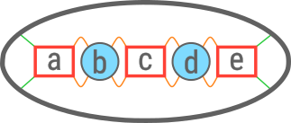

## Mathematical Description

To align with the goal of libraries containing no memory allocation we must pass to the ITT to PL
Path library a buffer of points for the PL path. We now describe how the buffer should be sized for
the strategy used by the ITT to PL path library. Specifically (and briefly):

1. Weights are rendered as:
    1. Successive sums of basic $\pm 1$ tangles.
    1. Single $\infty$ or $0$ leaf tangles.
1. Subtangle sums are connected with the addition of up to two path segments.
1. Subtangle fixed points align with the bounding box of that tangle.

> [!theorem]
>
> The number of linear segments needed to render an ITT with the method used in the ITT to PL path
> library is bounded by:
>
> $$ L \leq S_I + S_C $$
>
> where $S_I$ are the path segments which are members of integral subtangles and $S_C$ are the path
> segments which connect subtangles.

To complete the proof of this we start with a proposition allowing us to classify segments of a PL
path into the two classes.

> [!proposition]
>
> The segments of a PL path of an ITT as rendered with the strategy used in the ITT to PL path
> library must be either a portion an integral component of the tangle or a segment connecting two
> subtangles.
>

> [!proof]
>
> Clear from construction.

With this we bound each of the classes of segment, starting with the segments that are
integral components.

> [!lemma]
>
> The number of segments $S_I$ of a PL path for an ITT (rendered with the strategy used by the ITT
> to PL path library) which are part of integral components is bounded as:
>
>$$ S_I \leq 4\LP \#\LP W_0\RP+\sum_i^{m}\abs{w_i}\RP $$
>
> Where $W=\LS w_i \RS_{i=0}^{m-1}$ are the set of $m$ weights of the ITT and
> $W_0=\LS w_i | w_i \in W\text{ and }w_i = 0\text{ and } w_i \text{ is the weight of a leaf}\RS$ is
> the set of zero weights.

> [!proof]
>
> To bound the number of segments contained in an integral component we first note that by
> construction each basic tangle contributes $4$ segments to the PL path. It's easy to see that each
> nonzero integral tangle contains $\abs{w_i}$ basic $\pm 1$ tangles. Each of these $\pm1$ tangles
> containing 4 segments for at total of $4\abs{w_i}$ segments contributed from each nonzero weight.
>
> Weights that contribute a zero crossing subtangle contribute $4$ segments. We accumulate the
> nonzero weights and count the zero leaf weights to form the desired upper bound on integral
> components.

Having bounded the integral segments we now approach the connective segments. We start by relating
the number of vertices in a tree to the subtangles (subtrees) of that tree. This will allow us to
build our bound recursively to a closed form.

> [!proposition]
>
> Let $V$ be the set of vertices of an ITT, $v_i$ be the $i^{\text{th}}$ vertex, and $V_i^c$ be the
> set of children of $v_i$.
>
> $$ 1+\sum_i \#\LP V_i^c\RP = \#\LP V\RP $$

> [!proof]
>
> Proceed by induction, with a base case of a horizontal integral tangle. Assume for induction the
> result holds for all trees of $n$ vertices. Grafting an integral tangle at any point yields a tree
> with $n+1$ vertices with the appropriate sum.

Now we are prepared to bound the connective components.

> [!lemma]
>
> The number of segments $S_C$ of a PL path for an ITT (rendered with the strategy used by the ITT
> to PL path library) which connects subtangles is bounded as:
>
> $$ S_C \leq 4\LP 2\#\LP V\RP-1\RP$$
>
> Where $V$ is the set of vertices of the ITT.

> [!proof]
>
> We start by examining a vignette with subtangles and weights excised
>
> 
>
> /// caption
>
> A vignette with subtangles $b$ and $d$ in blue circles and weights $a$, $c$, and $e$ in red
> squares.
>
> ///
>
> When we examine each excised component we note that each has two segments attached to the left
> side. We also see that the final weight also has two on the right. This allows us to effectively
> count the connective segments found inside a vignette as $2\LP \#\LP V^c\RP+\#\LP W_i\RP+1\RP$.
> Where $W_i$ is the set of weights of the vignette and $V^c$ is the set of children of the
> vignette. This can be slightly simplified by noticing that for any vignette
> $\#\LP V^c\RP+1 = \#\LP W_i\RP$, yielding $4\LP\#\LP V^c\RP+1\RP$ as the count of connective
> segments for an empty vignette.
>
> Next we sum over the all vignettes in the ITT and simplify to the desired result:
>
> $$\begin{aligned}S_C&\leq 4\sum_i\LP\#\LP V_i^c\RP+1\RP\\
> &=4\LP\sum_i V_i^c +\sum_i 1\RP\\
> &=4\LP\LP\sum_i V_i^c\RP +\#\LP V\RP\RP\\
> &=4\LP 2\#\LP V\RP-1\RP\\
> \end{aligned}$$
>

> [!theorem]
>
> The number of linear segments $L$ needed to render an ITT with the method is bounded by:
>
> $$ L \leq S_I + S_C $$

> [!proof]
>
> Apply the above two lemmas as required.

We have now bounded the number of linear segments needed for a PL rendering of an ITT.
Unfortunately, we are not done when we build a PL path we do so out of points, with implicit
segments between them. As such we must actually bound the points, we will do so now.

> [!lemma]
>
> The number of path components $C$ of an ITT is bounded by:
>
> $$ C \leq 2\#\LP V\RP$$
>
> Where $V$ is the set of vertices of the ITT.

> [!proof]
>
> Proceed by induction with an integral tangle as the base case. In this case there are exactly two
> interval path components of the tangle satisfying our relation. For the inductive case assume the
> relation holds for all trees with $V$ vertices. Grafting an additional vertex caps off, by $+$ or
> $\vee$, at most two path components. This is one for each interval component of the grafted
> vertex giving the desired result.

> [!theorem]
>
> The number of points $P$ needed to realize the linear segments rendering an ITT with the method
> is bounded by:
>
> $$ P \leq 2\#\LP V \RP + S_I + S_C $$

> [!proof]
>
> It's clear that in each path component (interval or $S^1$) of the tangle the number of points
> required is one more than the number of segments. So in all we need one point for each linear
> segment plus $\#\LP C\RP$ extra points where $C$ is the number of path components. The above lemma
> gives us the desired bound.
