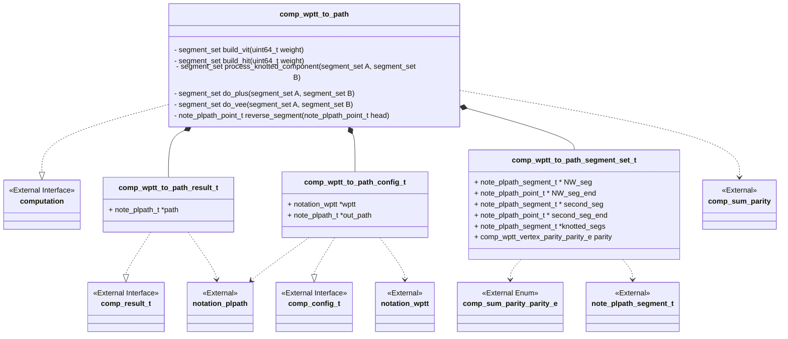
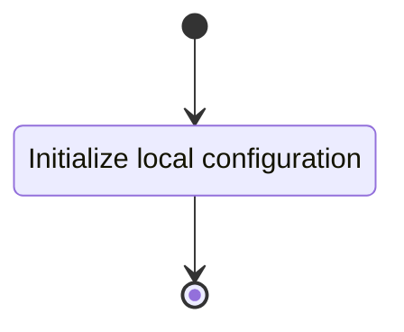
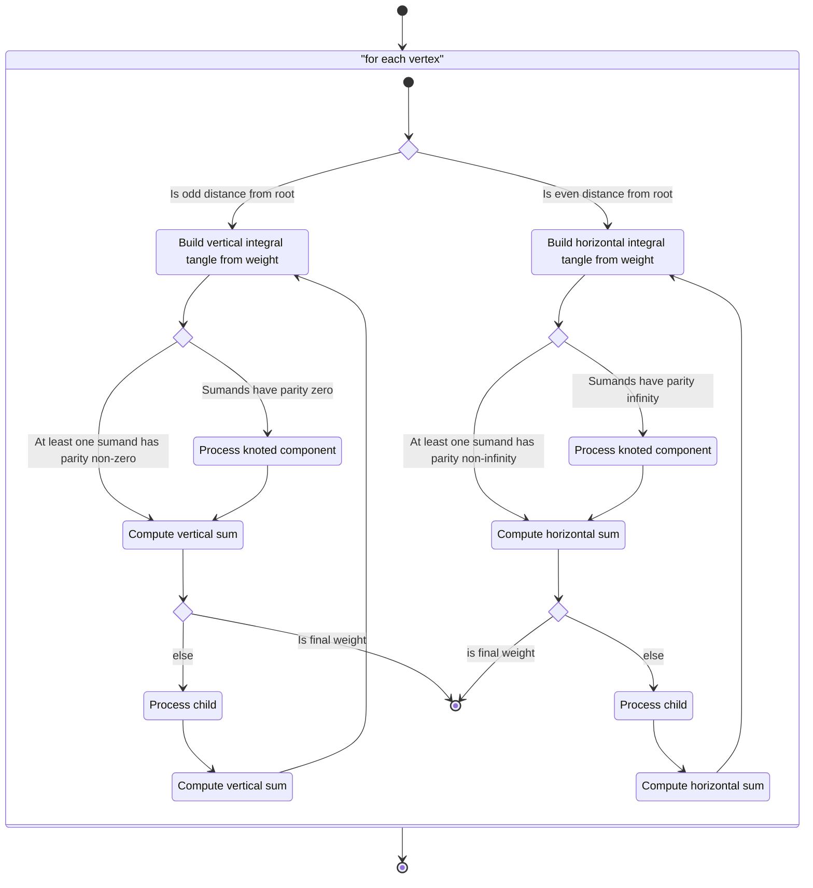
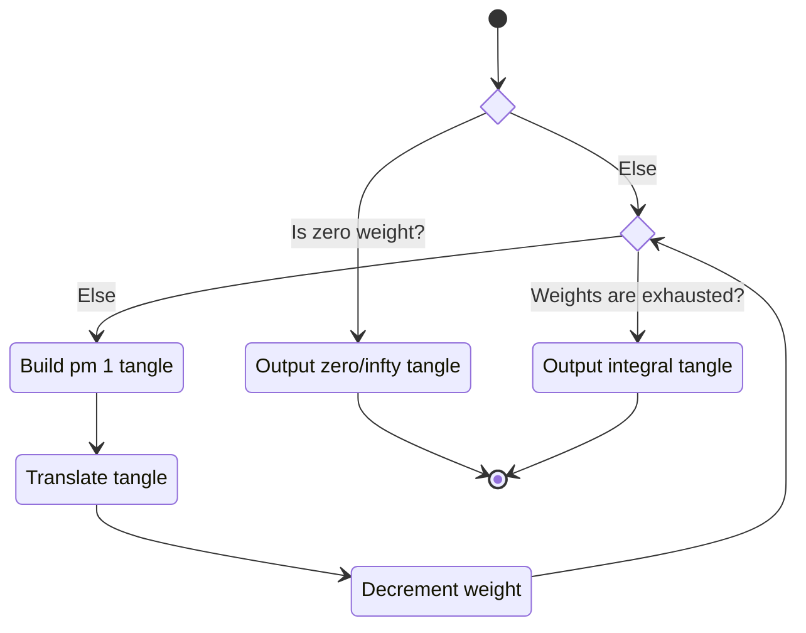
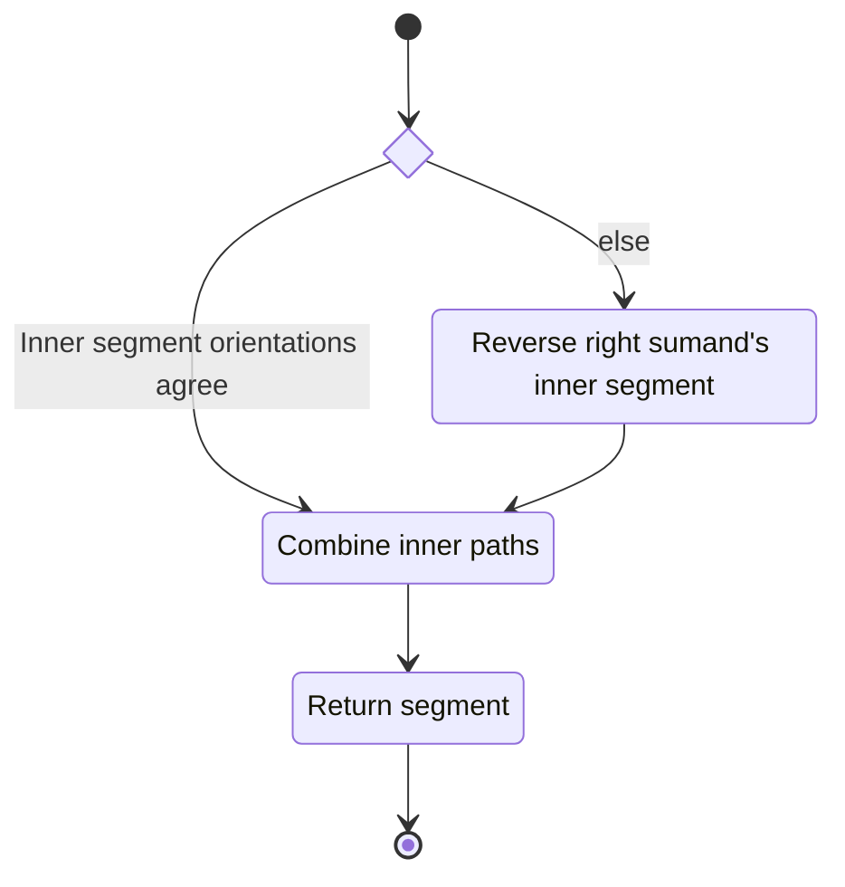
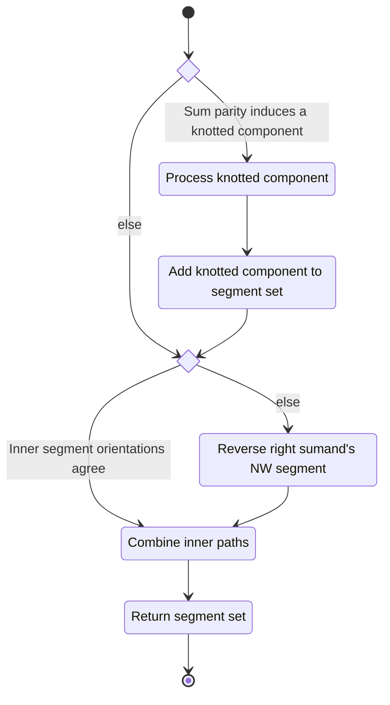

# Unit Description

## Class Diagram

## Language

C

## Implements

- [Computation Interface][interface-computation]

## Uses

- [Notation Weighted Planar Tangle Tree][note-wptt]
- [Notation PL Path][note-plpath]
- [Computation Parity of Tangle Sums][comp-sum_parity]

## Libraries

None

## Functionality

### Public Structures

#### Configuration Structure

The configuration structure contains the data needed for computing a PL path for an input ITT.

This includes:

- A pointer to the ITT tree.
- A pointer to the output location to where the PL path will be stored.

#### Result Structure

The result structure contains a pointer to the output PL path.

> [!warning]
>
> The pointer found in the result should be checked for consistency with the configured pointer.

### Private Structures

#### Segment Set

A segment contains:

- A segment defined to start at the NW corner of the tangle.
- A pointer to the end of the NW segment.
- A second segment starting at either the $SW$ or $NE$ corner depending on a configured parity for
    the tangle.
- A pointer to the end of the second segment.
- A segment list containing all internal knotted components.

| Tangle Parity | Second Segment Start |
| ------------- | -------------------- |
| $\chi$        | SW                   |
| $0$           | SW                   |
| $\infty$      | NE                   |

### Public Functions

#### Configuration Function

The configuration function sets the local configuration variable of the computation.

This process is described in the following state machines:

#### Compute Function

The compute function carries out the arborescent tangle vertex canonicity computation. The function
may contain submachines that can be broken out into functions in the implementation. The walk the
tree function should be implemented with a stack-based iterative approach.

This process is described in the following state machines:

#### Result Function

When this function is invoked, the result of the vertex canonicity computation process is reported.

### Private Functions

#### Build Horizontal/Vertical Integral Tangle

Since the building process is identical, except the gluing direction, between horizontal and
vertical tangles we're going to work in the abstract case.

#### Process Knotted Component

Similar to the building of integral tangles the processing of internal knotted components by a $+$
and $\vee$ is largely identical, as such we will work in the abstract case.

#### Do Tangle Sum

Similar to the building of integral tangles the processing of $+$ and $\vee$ is largely identical,
as such we will work in the abstract case.

#### Reverse Segment

Standard linked list reversal can be done on the segment list.

## Validation

### Configuration Function

#### Positive Tests

> [!test-card] "Valid Configuration"
>
> A valid configuration for the computation is passed to the function.
>
> **Inputs:**
>
>   - A valid configuration.
>
> **Expected Output:**
>
>    A positive response.

#### Negative Tests

> [!test-card] "Null Configuration"
>
> A null configuration for the computation is passed to the function.
>
> **Inputs:**
>
>   - A null configuration.
>
> **Expected Output:**
>
>    A negative response.

> [!test-card] "Null Configuration Parameters"
>
> A configuration with various null parameters is passed to the function.
>
> **Inputs:**
>
>   - A configuration with null tree.
>
> **Expected Output:**
>
>    A negative response.

### Compute Function

#### Positive Tests

> [!test-card] "A valid configuration with write interface"
>
> A valid configuration is set for the component with write interface configured. The computation is
> executed and returns successfully.
>
> **Inputs:**
>
>   - A valid configuration is set with the following trees:
>     - $i[0]$
>     - $i[0\ 0]$
>     - $i[1]$
>     - $i[-1]$
>     - $i([0][0\ 0])$
>     - $i([0][-1])$
>     - $i([0][0])$
>     - $i([-1][0\ 0])$
>     - $i([-1][-1])$
>     - $i([-1][0])$
>     - $i([0\ 0][0\ 0])$
>     - $i([0\ 0][-1])$
>     - $i([0\ 0][0])$
>     - $i([-3][3\ 0])$
>     - $i([-3][-2])$
>     - $i([-3][2\ 0])$
>     - $i([-2][3\ 0])$
>     - $i([-2][-2])$
>     - $i([-2][2\ 0])$
>     - $i([3\ 0][3\ 0])$
>     - $i([3\ 0][-2])$
>     - $i([3\ 0][2\ 0])$
>     - $i(([0][0\ 0]))$
>     - $i(([0][-1]))$
>     - $i(([0][0]))$
>     - $i(([-1][0\ 0]))$
>     - $i(([-1][-1]))$
>     - $i(([-1][0]))$
>     - $i(([0\ 0][0\ 0]))$
>     - $i(([0\ 0][-1]))$
>     - $i(([0\ 0][0]))$
>     - $i(([-3][3\ 0]))$
>     - $i(([-3][-2]))$
>     - $i(([-3][2\ 0]))$
>     - $i(([-2][3\ 0]))$
>     - $i(([-2][-2]))$
>     - $i(([-2][2\ 0]))$
>     - $i(([3\ 0][3\ 0]))$
>     - $i(([3\ 0][-2]))$
>     - $i(([3\ 0][2\ 0]))$
>
> **Expected Output:**
>
>   - A positive response with the appropriate path. The output can be inspected by hand.

> [!test-card] "A valid configuration with null write interface"
>
> A valid configuration is set for the component with null write. The computation is executed and
> returns successfully.
>
> **Inputs:**
>
>   - A valid configuration is set with the following trees:
>     - $i[0]$
>     - $i[0\ 0]$
>     - $i[1]$
>     - $i[-1]$
>     - $i([0][0\ 0])$
>     - $i([0][-1])$
>     - $i([0][0])$
>     - $i([-1][0\ 0])$
>     - $i([-1][-1])$
>     - $i([-1][0])$
>     - $i([0\ 0][0\ 0])$
>     - $i([0\ 0][-1])$
>     - $i([0\ 0][0])$
>     - $i([-3][3\ 0])$
>     - $i([-3][-2])$
>     - $i([-3][2\ 0])$
>     - $i([-2][3\ 0])$
>     - $i([-2][-2])$
>     - $i([-2][2\ 0])$
>     - $i([3\ 0][3\ 0])$
>     - $i([3\ 0][-2])$
>     - $i([3\ 0][2\ 0])$
>     - $i(([0][0\ 0]))$
>     - $i(([0][-1]))$
>     - $i(([0][0]))$
>     - $i(([-1][0\ 0]))$
>     - $i(([-1][-1]))$
>     - $i(([-1][0]))$
>     - $i(([0\ 0][0\ 0]))$
>     - $i(([0\ 0][-1]))$
>     - $i(([0\ 0][0]))$
>     - $i(([-3][3\ 0]))$
>     - $i(([-3][-2]))$
>     - $i(([-3][2\ 0]))$
>     - $i(([-2][3\ 0]))$
>     - $i(([-2][-2]))$
>     - $i(([-2][2\ 0]))$
>     - $i(([3\ 0][3\ 0]))$
>     - $i(([3\ 0][-2]))$
>     - $i(([3\ 0][2\ 0]))$
>
> **Expected Output:**
>
>   - A positive response with the appropriate path. The output can be inspected by hand.

#### Negative Tests

> [!test-card] "Not Configured"
>
> The compute interface is called before configuration.
>
> **Inputs:**
>
>   - None.
>
> **Expected Output:**
>
>    A negative response.

### Result Function

#### Positive Tests

> [!test-card] "A valid configuration with processed"
>
> A valid configuration is set for the component. The computation is executed and
> returns successfully. The result interface is accessed successfully.
>
> **Inputs:**
>
>   - A valid configuration is set with the following trees:
>     - $i[0]$
>     - $i[0\ 0]$
>     - $i[1]$
>     - $i[-1]$
>     - $i([0][0\ 0])$
>     - $i([0][-1])$
>     - $i([0][0])$
>     - $i([-1][0\ 0])$
>     - $i([-1][-1])$
>     - $i([-1][0])$
>     - $i([0\ 0][0\ 0])$
>     - $i([0\ 0][-1])$
>     - $i([0\ 0][0])$
>     - $i([-3][3\ 0])$
>     - $i([-3][-2])$
>     - $i([-3][2\ 0])$
>     - $i([-2][3\ 0])$
>     - $i([-2][-2])$
>     - $i([-2][2\ 0])$
>     - $i([3\ 0][3\ 0])$
>     - $i([3\ 0][-2])$
>     - $i([3\ 0][2\ 0])$
>     - $i(([0][0\ 0]))$
>     - $i(([0][-1]))$
>     - $i(([0][0]))$
>     - $i(([-1][0\ 0]))$
>     - $i(([-1][-1]))$
>     - $i(([-1][0]))$
>     - $i(([0\ 0][0\ 0]))$
>     - $i(([0\ 0][-1]))$
>     - $i(([0\ 0][0]))$
>     - $i(([-3][3\ 0]))$
>     - $i(([-3][-2]))$
>     - $i(([-3][2\ 0]))$
>     - $i(([-2][3\ 0]))$
>     - $i(([-2][-2]))$
>     - $i(([-2][2\ 0]))$
>     - $i(([3\ 0][3\ 0]))$
>     - $i(([3\ 0][-2]))$
>     - $i(([3\ 0][2\ 0]))$
>
> **Expected Output:**
>
>   - A positive response with the appropriate path. The output can be inspected by hand.

#### Negative Tests

> [!test-card] "Computation not executed"
>
> The result interface is called before compute has been run.
>
> **Inputs:**
>
>   - None.
>
> **Expected Output:**
>
>    A negative response.
