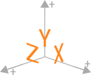

## Mathematical Description

Definitionally, a tangle is a collection of $S^1$ and intervals in $\R^3$ or $S^3$. In practice, we
encode tangles as planar diagrams with over/under crossings. In computational contexts these
diagrams are encoded into a convenient combinatorial form, in the case of an arborescent tangle
these are the ITT. For some research contexts, particularly those where physical models are needed,
the PL path is useful.

A ITT can be converted to a PL path in a number of different ways. For example, we could leverage
the necklace model given by Bonahon and Siebenmann[@bonahonNewGeometricSplittings2016]. This method
has the benefit of being easily manipulated by Möbius transformations. Unfortunately, the method of
Bonahon and Siebenmann is quite complex, in the interest of effort we will describe here a slightly
more convenient method. This method, when compared to the Bonahon and Siebenmann construction, is
hard to modify mathematically but quite easy to work with computationally.

When we render a ITT diagrammatically we see that one clear choice for building blocks are the
basic and integral tangles, seen in different colors below. The integral tangles correspond to the
weights of a ITT.

/// caption

The ITT $((2[3][-3])[4])$ rendered diagrammatically.

///

The tangle algebraic operations $+$ $\vee$ that allow us to combine the basic tangles into integral
tangles will form the backbone of our methodology. To begin we define PL encodings for the four
basic tangles in the following coordinate system:

/// caption

The coordinate system used for the encoding of tangles as PL paths.

///

| Tangle   | Image                   | Component One                       | Component Two                       |
| -------- | ----------------------- | ----------------------------------- | ----------------------------------- |
| $0$      |      | $(-1,1,0)\to(0,0.5,0)\to(1,1,0)$    | $(-1,-1,0)\to(0,-0.5,0)\to(1,-1,0)$ |
| $\infty$ |  | $(-1,1,0)\to(-0.5,0,0)\to(-1,-1,0)$ | $(1,1,0)\to(0.5,0,0)\to(1,-1,0)$    |
| $1$      |     | $(-1,1,0)\to(0,0,-1)\to(1,-1,0)$    | $(-1,-1,0)\to(0,0,1)\to(1,1,0)$     |
| $-1$     |     | $(-1,1,0)\to(0,0,1)\to(1,-1,0)$     | $(-1,-1,0)\to(0,0,-1)\to(1,1,0)$    |

To build an integral tangle from these basic tangles we start with a $\pm1$ tangle. Now taking a
second $\pm1$ tangle we translate it so the left endpoints of the second tangle align with the right
of the initial tangle (or bottom and top for $\vee$). Finally, we combine paths where they coincide.
In some cases the operations will "cap off" an internal knotted component, locations where
components are capped off are determined based on the [parity][comp-wptt_vertex_parity] of the
operands.

> [!example]
>
> ### $1+1$
> To build an integral $2$ tangle we start with two copies of the strands
> $(-1,1,0)\to(0,0,-1)\to(1,-1,0)$ and $(-1,-1,0)\to(0,0,1)\to(1,1,0)$. We then translate the second
> set of strands over by two units in $x$ resulting in the paths $(1,1,0)\to(2,0,-1)\to(3,-1,0)$ and
> $(1,-1,0)\to(2,0,1)\to(3,1,0)$. Combining the four path components then yields:
>
>| Tangle | Image               | Component One                                                                              | Component Two                                                                               |
>| ------ | ------------------- | ------------------------------------------------------------------------------------------ | ------------------------------------------------------------------------------------------- |
>| $2$    |  | $\begin{aligned}(-1,1,0)&\to(0,0,-1)\\&\to(1,-1,0)\\&\to(2,0,1)\\&\to(3,1,0)\end{aligned}$ | $\begin{aligned}(-1,-1,0)&\to(0,0,1)\\&\to(1,1,0)\\&\to(2,0,-1)\\&\to(3,-1,0)\end{aligned}$ |
>
> ### $\infty+\infty$
>
> To build an integral $\infty + \infty$ tangle we start with two copies of the strands
> $(-1,1,0)\to(-0.5,0,0)\to(-1,-1,0)$ and $(1,1,0)\to(0.5,0,0)\to(1,-1,0)$. We then translate the
> second set of strands over by two units in $x$ resulting in the paths
> $(1,1,0)\to(1.5,0,0)\to(1,-1,0)$ and $(3,1,0)\to(2.5,0,0)\to(3,-1,0)$. Combining the four path
> components then yields:
>
>| Tangle           | Image                                  | Component One                                                       | Component Two                                                    | Bonus Component (Red)                                                                        |
>| ---------------- | -------------------------------------- | ------------------------------------------------------------------- | ---------------------------------------------------------------- | -------------------------------------------------------------------------------------------- |
>| $\infty +\infty$ |  | $\begin{aligned}(-1,1,0)&\to(-0.5,0,0)\\&\to(-1,-1,0)\end{aligned}$ | $\begin{aligned}(3,1,0)&\to(2.5,0,0)\\&\to(3,-1,0)\end{aligned}$ | $\begin{aligned}(1,1,0)&\to(0.5,0,0)\\&\to(1,-1,0)\\&\to(1.5,0,0)\\&\to(1,1,0)\end{aligned}$ |

To extend this method to the general arborescent is straight forward, requiring only two changes.
First that we track the width and heights of tangles being built allowing us to accurately translate
components of paths. Next we must track or compute the parity of components so we can cap off
internally knotted components.

## Computational Description

No special consideration.
