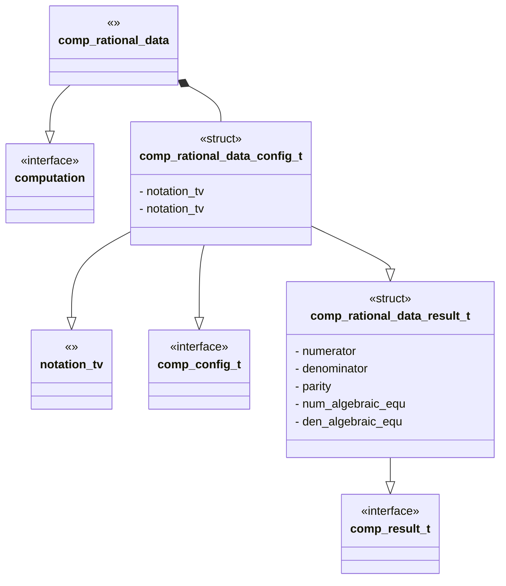

# Unit Description

```mermaid
classDiagram
    comp_rational_data --|> computation
    comp_rational_data_config_t --|> notation_tv
    comp_rational_data_config_t --|> comp_config_t
    comp_rational_data_config_t --|> comp_rational_data_result_t
    comp_rational_data_result_t --|> comp_result_t
    comp_rational_data *-- comp_rational_data_config_t

    class computation {
        <<interface>>
    }

    class comp_rational_data {
<<>>
}

class notation_tv{
<<>>
}

class comp_rational_data_config_t {
<<struct>>
- notation_tv
- notation_tv

}

class comp_rational_data_result_t {
<<struct>>
- numerator
- denominator
- parity
- num_algebraic_equ
- den_algebraic_equ
}

class comp_config_t {
<<interface>>

}
class comp_result_t {
<<interface>>

}


```

## Language

C

## Implements

- [Computation Interface][interface-computation]

## Uses

- [Notation Twist Vector][note-twist_vector]

## External Libraries

None
