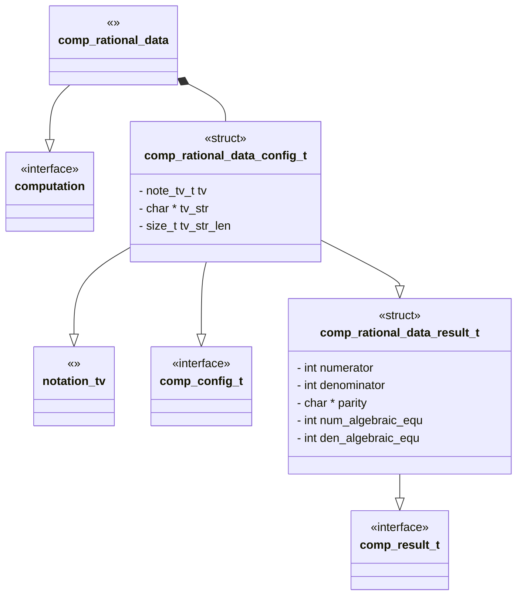
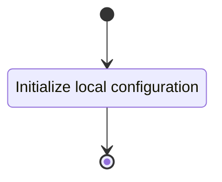
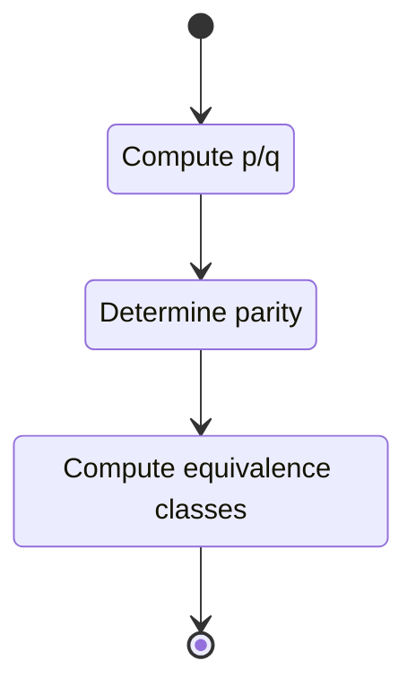

# Unit Description

## Language

C

## Implements

- [Computation Interface][interface-computation]

## Uses

- [Notation Twist Vector][note-twist_vector]

## Libraries

None

## Functionality

### Public Structures

#### Configuration Structure

The configuration structure contains the data needed for computing the rational data for a rational
tangle.

This includes:

- A pointer to a twist vector.
- A pointer to string buffer for output.
- A string buffer length.

#### Result Structure

The result structure contains:

- The numerator (p) for the rational number (p/q) of the tangle.
- The denominator (q) for the rational number (q/p) of the tangle.
- A string indicating the parity of the tangle.
- The value of p % q
- The value of q % p

### Public Functions

#### Configuration Function

The configuration function sets the local configuration variable of the computation.

This process is described in the following state machines:

#### Compute Function

This process is described in the following state machines:

#### Result Function

When this function is invoked, the results of the computation is reported.

## Validation

### Configuration Function

#### Positive Tests

> [!test-card] "Valid Configuration"
>
> A valid configuration for the computation is passed to the function.
>
> **Inputs:**
>
>   - A valid configuration.
>
> **Expected Output:**
>
>    A positive response.

#### Negative Tests

> [!test-card] "Null Configuration"
>
> A null configuration for the computation is passed to the function.
>
> **Inputs:**
>
>   - A null configuration.
>
> **Expected Output:**
>
>    A negative response.

> [!test-card] "Null Configuration Parameters"
>
> A configuration with null parameters is passed to the function.
>
> **Inputs:**
>
>   - A configuration with null tv.
>   - A configuration with null buffer.
>
> **Expected Output:**
>
>    A negative response.

### Compute Function

#### Positive Tests

> [!test-card] "A valid configuration"
>
> A valid configuration is set for the component. The computation is executed and
> returns successfully.
>
> **Inputs:**
>
>   - A valid configuration is set with:
>     - Even/Odd
>     - Odd/Odd
>     - Odd/Even
>
> **Expected Output:**
>
>   - A positive response.

#### Negative Tests

### Result Function

#### Positive Tests

> [!test-card] "A valid configuration"
>
> A valid configuration is set for the component. The computation is executed and
> returns successfully.
>
> **Inputs:**
>
>   - A valid configuration is set with:
>     - Even/Odd
>     - Odd/Odd
>     - Odd/Even
>
> **Expected Output:**
>
>   - A positive response.

#### Negative Tests
