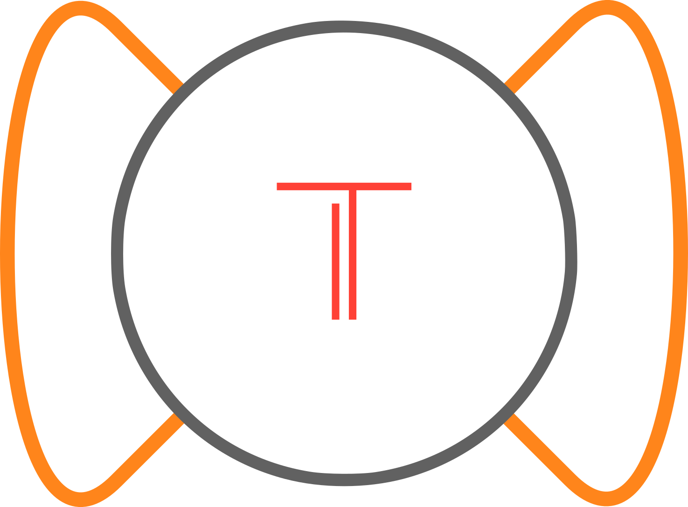
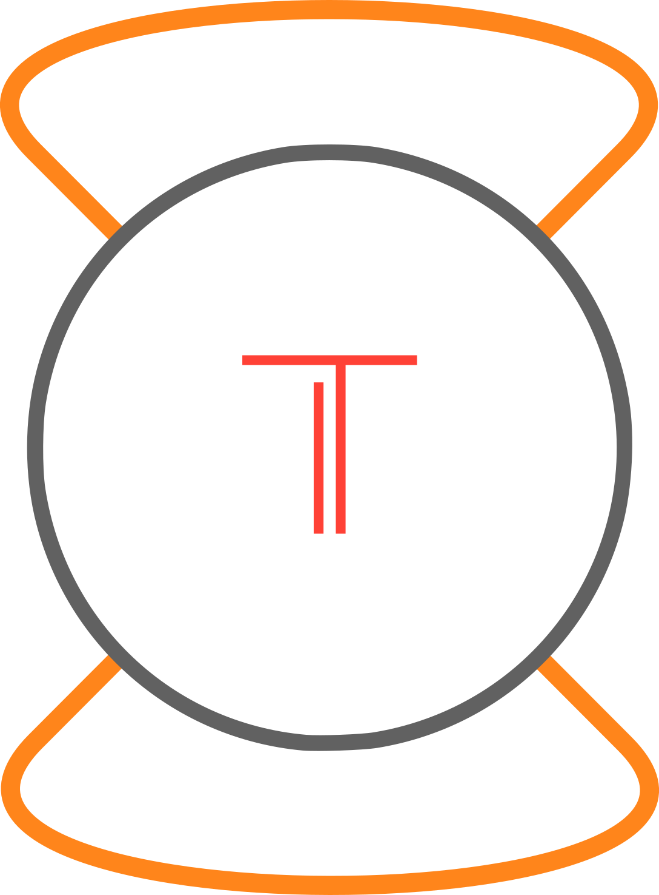
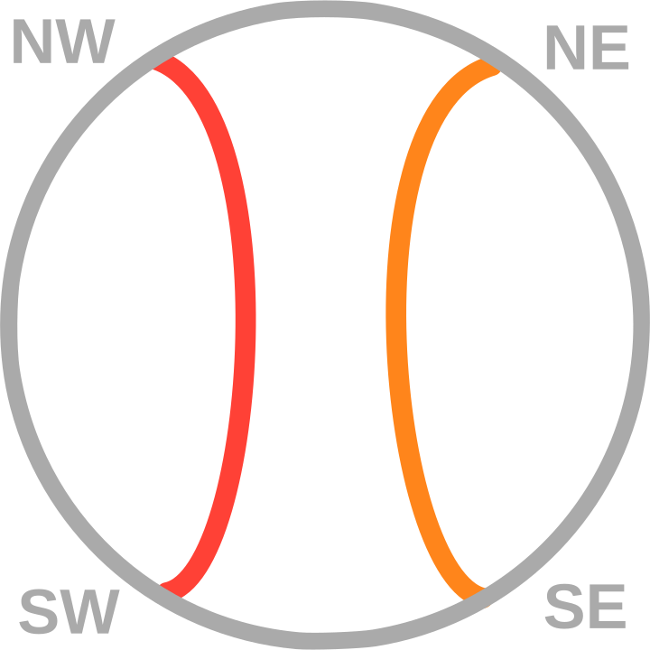
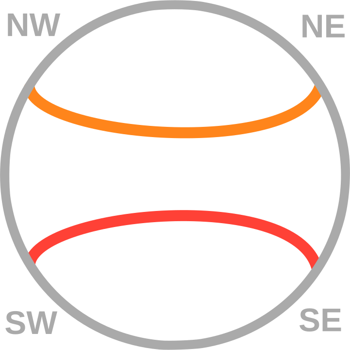
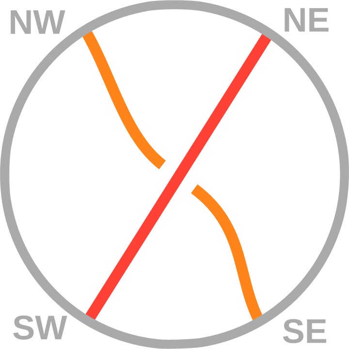

## Mathematical Description

The rational tangle computation module computes 3 pieces of data for a rational tangles; rational
number, parity, and algebraic equivalence of closures (numerical).

### Rational Number

In Conway's original tangle paper [@conwayEnumerationKnotsLinks1970] he states that rational tangles
and rational numbers are in one to one correspondence, this was later proven for tangles by Goldman
and Kauffman [@goldmanRationalTangles1997; @burdeKnots2013]. The correspondence comes from
interpreting the twist vector of a rational tangle as a finite continued fraction that is:

\[\LB a\ b\ c\RB=c+\frac{1}{b+\frac{1}{a}}\]

### Algebraic Equivalence

A tangle can be transformed into a knot by taking a closure, we will consider two forms of closure
the numerator and denominator.

>[!example] "Closures"
>
> { width="300"}
> /// caption
> The denominator closure of a tangle.
> ///
>
> { height="600"}
> /// caption
> The numerator closure of a tangle.
> ///

Taking the two closures of a tangle results in at most two knot equivalence classes. The resulting
knot classes are determined by the relationship between the numerator and denominator of the
rational number of the tangle. These were formalized by Schubert [@schubertKnotenMitZwei1956] as:

> [!theorem] "Schubert [@schubertKnotenMitZwei1956]"
>
> Suppose that rational tangles with fractions $\frac{p}{q}$ and $\frac{p^{\prime}}{q^{\prime}}$ are
> given ($p$ and $q$ are relatively prime and $0<p$. Similarly for $p^{\prime}$ and $q^{\prime}$).
> If $N\left(\frac{p}{q}\right)$ and $N\left(\frac{p^{\prime}}{q^{\prime}}\right)$ denote the
> corresponding rational knots obtained by taking numerator closures of these tangles, then
> $N\left(\frac{p}{q}\right)$ and $N\left(\frac{p^{\prime}}{q^{\prime}}\right)$ are topologically
> equivalent if and only if
>
> 1. $p=p^{\prime}$
> 1. $q \equiv q^{\prime}(\bmod p)$ or $q q^{\prime} \equiv 1(\bmod p)$.

where $N()$ indicates the numerator closure of the object tangle. The denominator case follows
identically but for the reciprocal.

### Parity

Every two string tangle comes equipped with four fixed points labeled NW, NE, SW, and SE. In every
tangle these fixed points are connected to each other in pairs by two strings. We classify these
connections by those present in the four basic tangles ($0$, $1$, $-1$, and $\infty$).

>[!example] "Parities"
>
> |  |  |       |
> | ----------------------------------- | --------------------------------- | --------------------------------------------- |
> |  |    |  |

For a rational tangle the connectivity can be determined by the relationship between the numerator
and denominator of its rational tangle. This relationship was formally described by Kauffman and
Lambropoulou [@kauffmanClassificationRationalKnots2002] as

> [!theorem] "Kauffman, Lambropoulou [@kauffmanClassificationRationalKnots2002]"
>
> A rational tangle $T$ has connectivity type $\asymp$ if and only if its fraction has parity e/o.
> $T$ has connectivity type $><$ if and only if its fraction has parity o/e. $T$ has connectivity
> type $\chi$ if and only if its fraction has parity o/o. (Note that the formal fraction of
> $[\infty]$ itself is $1 / 0$.) Thus the link $N(T)$ has two components if and only if $T$ has
> fraction $F(T)$ of parity e/o.

## Computational Considerations

For ease of implementation we will only support positive canonical twist vectors.
