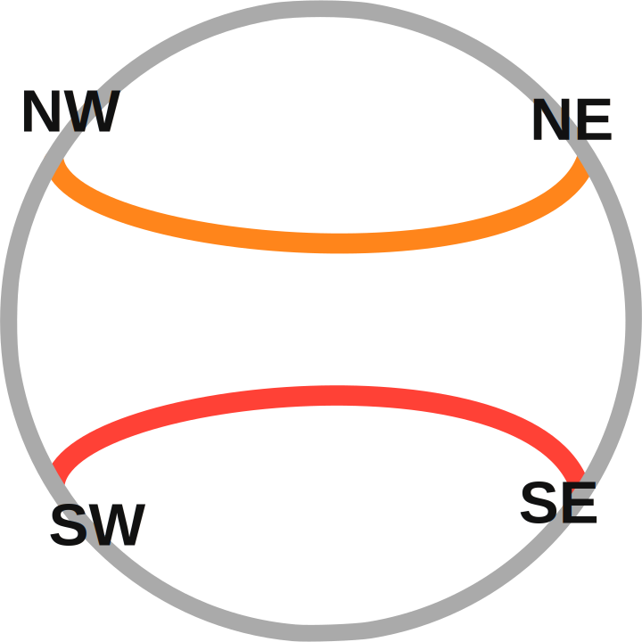

# Use Case

The rational tangle computation module computes 3 pieces of data for a rational tangle: rational
number, parity, and algebraic equivalence of closures.

## Rational Number

In Conway's original tangle paper {cite:p}`conwayEnumerationKnotsLinks1970` he states that rational
tangles and rational numbers are in one to one correspondence, this was later proven for tangles by
proved by Burde and Zieschang {cite:p}`burdeKnots2013`. Here we will discuss using the perspective
of Goldman and Kauffman {cite:p}`goldmanRationalTangles1997`. The correspondence comes from
interpreting the [twist vector](#note-twist_vector) of a rational tangle as a finite continued
fraction that is: $$\LB a\ b\ c\RB=c+\frac{1}{b+\frac{1}{a}}=\frac{p}{q}$$

### Parity

The parity of a rational tangle describes the relational connectivity of the fixed points

````{prf:example} Parities

```{table}
:widths: auto
:align: center


| {w=100px}   | {w=100px} | {w=100px}      |
|----------------------------------------|--------------------------------------|-------------------------------------------|
| {w=100px} | {w=100px}   | {w=100px} |

```
````

the connectivity, formally described by Kauffman and Lambropoulou
{cite:p}`kauffmanClassificationRationalKnots2002` as

```{prf:theorem} Kauffman and Lambropoulou Theorem 6
:class: theorem
A rational tangle $T$ has connectivity type $\asymp$ if and only if
its fraction has parity e/o. $T$ has connectivity type $><$ if and only if its
fraction has parity o/e. $T$ has connectivity type $\chi$ if and only if its
fraction has parity o/o. (Note that the formal fraction of $[\infty]$ itself
is $1 / 0$.) Thus the link $N(T)$ has two components if and only if $T$ has
fraction $F(T)$ of parity e/o.
```

## Knot Equivalence Classes

### Numerator closure

The numerator closure $\text{N}\LP T\RP$ of a tangle $T$ is produced by connecting the fixed points
as $\text{NW}\to\text{NE}$ and $\text{SW}\to\text{SE}$, these connections yield a knot.
Unfortunately, this closure process does not generally yield unique knots. When taking a numerator
closure of a rational tangle the knot class of that closure is determined by the following theorem
due to Schubert {cite:p}`Schubert1956`.

```{prf:theorem} Schubert
:label: thm-schubert

 Suppose that rational tangles with fractions $\frac{p}{q}$ and
 $\frac{p^{\prime}}{q^{\prime}}$ are given ( $p$ and $q$ are relatively prime
 and $0<p$. Similarly for $p^{\prime}$ and $q^{\prime}$). If
 $N\left(\frac{p}{q}\right)$ and $N\left(\frac{p^{\prime}}{q^{\prime}}\right)$
 denote the corresponding rational knots obtained by taking numerator closures
 of these tangles, then $N\left(\frac{p}{q}\right)$ and
 $N\left(\frac{p^{\prime}}{q^{\prime}}\right)$ are topologically equivalent if
 and only if
1. $p=p^{\prime}$
2. $q \equiv q^{\prime}(\bmod p)$ or $q q^{\prime} \equiv 1(\bmod p)$.
```

### Denominator closure

The denominator closure, $\text{D}\LP T\RP$ is constructed similarly to the numerator closure but
with fixed points connected following $\text{NW}\to\text{SW}$ and $\text{NE}\to\text{SE}$. Under the
denominator closure the knot equivalence is determined by the following {prf:ref}`thm-schubert`

## Bibliography

```{bibliography}
   :filter: docname in docnames
```

```{raw} latex
    \newpage
```
