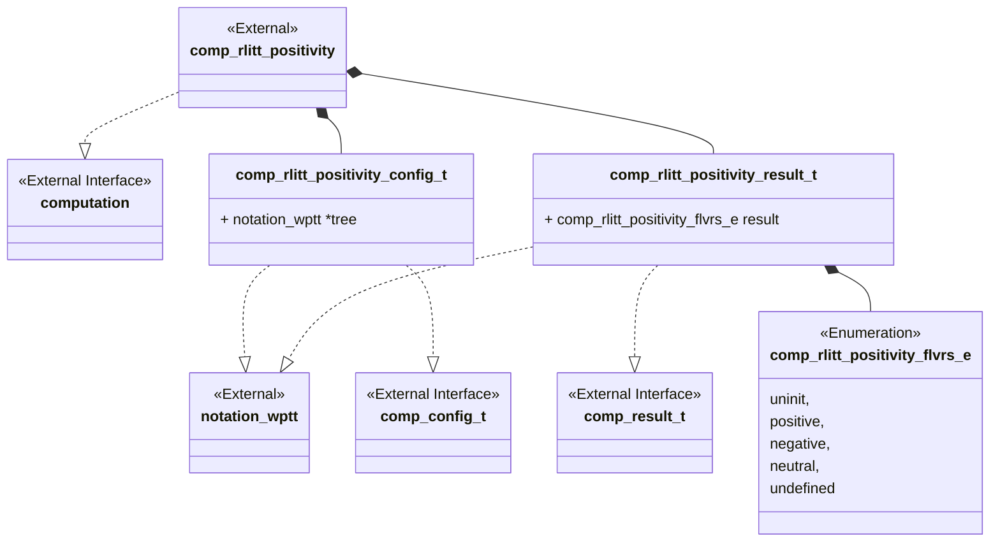
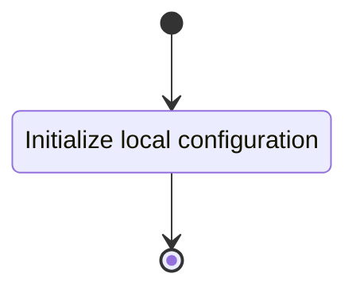
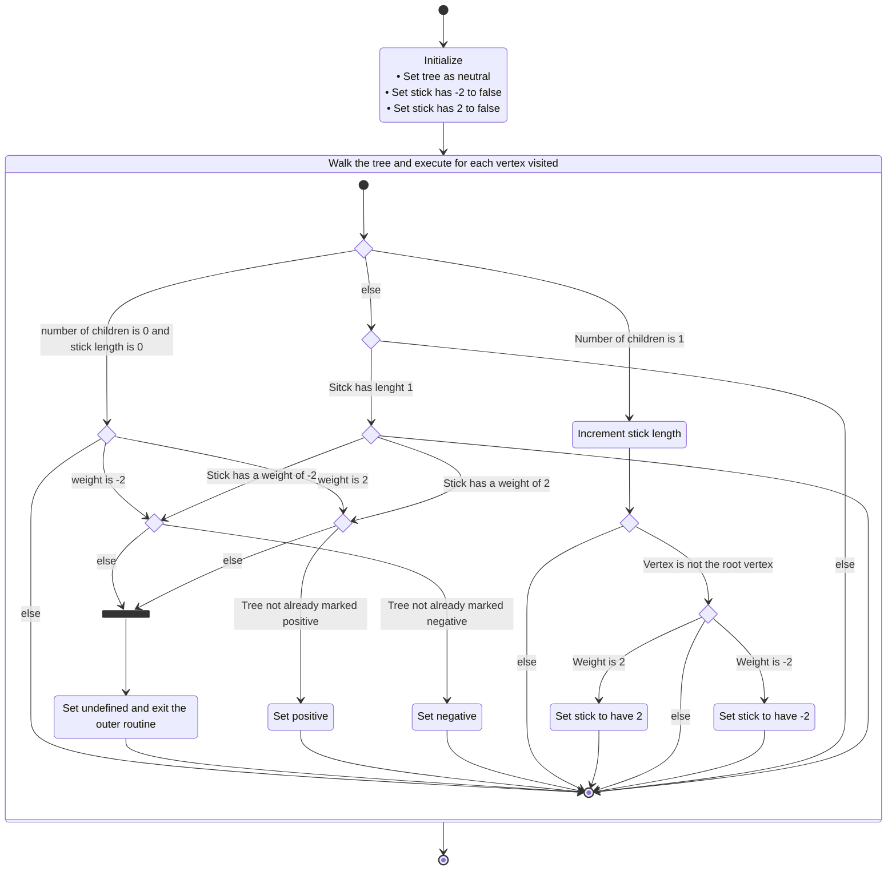

# Unit Description

## Class Diagram



## Language

C

## Implements

- [Computation Interface](#computation-interface)

## Uses

- [Notation Weighted Planar Tangle Tree](#note-wptt)

## Libraries

None

## Functionality

### Public Structures

#### Configuration Structure

The configuration structure contains the data needed for computing the positivity of an input WPTT.

This includes:

- A pointer to a read-only notation structure for a WPTT.

#### Result Structure

The result structure contains the enumerated value identifying the positivity of the input tree.

### Public Functions

#### Configuration Function

The configuration function sets the local configuration variable of the computation.

This process is described in the following state machines:



#### Compute Function

The compute function carries out the arborescent tangle positivity computation. The function may
contain sub-machines that can be broken out into functions in the implementation. The walk the tree
function should be implemented with a stack-based iterative approach.

This process is described in the following state machines:



#### Result Function

When this function is invoked, the result of the positivity computation process is reported.

## Validation

### Configuration Function

#### Positive Tests

```{test-card} Valid Configuration

A valid configuration for the computation is passed to the function.

**Inputs:**

- A valid configuration.

**Expected Output:**

A positive response.

```

#### Negative Tests

```{test-card} Null Configuration

A null configuration for the computation is passed to the function.

**Inputs:**

- A null configuration.

**Expected Output:**

A negative response.

```

```{test-card} Null configuration Parameters

A configuration with various null parameters is passed to the function.

**Inputs:**

- A configuration with null tree.

**Expected Output:**

A negative response.

```

### Compute Function

#### Positive Tests

```{test-card} A valid configuration

A valid configuration is set for the component. The computation is executed and
returns successfully. The result written to the write interface is correct.

**Inputs:**

- A valid configuration is set.

**Expected Output:**

- A positive response.
- A correct output on the write interface.

```

```{test-card} A valid configuration with null write interface

A valid configuration is set for the component with null write. The computation is
executed and returns successfully.

**Inputs:**

- A valid configuration is set.

**Expected Output:**

- A positive response.

```

```{test-card} Correct handling of the root

A valid configuration is set for the component. The computation is executed and
returns successfully. The result written to the write interface is correct.

**Inputs:**

- A valid configuration is set, the configured tree is integral with the following weights:
    - 2
    - -2
    - 3

**Expected Output:**

- A positive response.
- A correct output on the write interface.

```

```{test-card} Correct handling of a leaf vertex

A valid configuration is set for the component. The computation is executed and
returns successfully. The result written to the write interface is correct.

**Inputs:**

- A valid configuration is set, the following trees are configured:
    - i([2][3])
    - i([-2][3])
    - i([3][3])
    - i([2][-2])
    - i([2][-2 -2])

**Expected Output:**

- A positive response.
- A correct output on the write interface.

```

```{test-card} Correct handling of an internal vertex

A valid configuration is set for the component. The computation is executed and
returns successfully. The result written to the write interface is correct.

**Inputs:**

- A valid configuration is set, the following trees are configured:
    - i([3](([3][3])2))
    - i([3](([3][3])-2))
    - i([3](([3][3])3))
    - i((([3][3])2)(([3][3])-2))

**Expected Output:**

- A positive response.
- A correct output on the write interface.
```

#### Negative Tests

```{test-card} Not Configured

The compute interface is called before configuration.

**Inputs:**

- None.

**Expected Output:**

A negative response.

```

### Result Function

#### Positive Tests

```{test-card} A valid configuration and computation

A valid configuration is set for the component. The computation is executed and
returns successfully. The resulting value is correct when read from the result
interface.

**Inputs:**

- A valid configuration is set with the following trees:
    - i([2][3])
    - i([-2][3])
    - i([3][3])
    - i([2][-2])

**Expected Output:**

- A positve response.
- The result is correct.
```

#### Negative Tests

```{test-card} Computation not executed

The result interface is called before compute has been run.

**Inputs:**

- None.

**Expected Output:**

A negative response.

```

## Doxygen Documentation

```{doxygenfile} comp_rlitt_positivity.h

```

```{doxygenfile} comp_rlitt_positivity.c

```

## Bibliography

```{bibliography}
   :filter: docname in docnames
```

```{raw} latex
    \newpage
```
