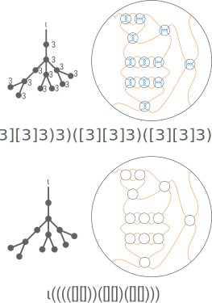

# Use Case

As described by the notation for [weighted planar tangle trees (WPTT)][note-wptt] we may linearize a
WPTT with a modified balanced parentheses tree notation strategy
[@munroSuccinctRepresentationBalanced2001].

<!-- prettier-ignore-start -->

!!! definition

    For a given WPTT linearization we construct the **pure vignette** for the WPTT by:

    1. expanding all sticks and ring subtrees with parentheses
    1. dropping all weights

!!! theorem

    The pure vignette of an [Right Leaning Identity Tangle Tree (RLITT)](https://thesis.joe-starr.com/tabulation/#subsec-rlitt) is invariant.

!!! proof

    Bonahon and Siebenmann [@bonahonNewGeometricSplittings2016] tell us that the abstract tree
    underlying a weighted planar tree is invariant (consequence of proposition 12.22). That is, two
    weighted planar trees resolve to the same knot type if and only if there is a tree isomorphism
    between their underlying abstract trees. This extends in the obvious way to WPTT with underlying
    rooted plane trees. Since RLITT are unique representatives of the isotopy class we have the desired
    result.

!!! example

    

    On the top we find an arborescent tangle with its tree and linearization. On the bottom we find
    the rooted plane tree as well as the pure vignette associated with the tangle.

!!! example

    

    On the top we find a rational tangle with its tree and linearization. On the bottom we find
    the rooted plane tree as well as the pure vignette associated with the tangle.

<!-- prettier-ignore-end -->
